# Python基础（二）：Python变量内存管理：从引用计数到垃圾回收实战


上一篇讲了python的入门基础,接下来这一篇我们将深入本质去理解python中的内存管理相关的知识.
- **内存原理认知**：
   

- **内存管理工具掌握**：
   

- **内存优化技术学习**：


- **实战经验积累**：

## 引言

Python作为一种高级动态语言，为开发者提供了便捷的内存管理机制，使开发者可以专注于业务逻辑而无需手动进行内存分配和释放。然而，了解Python内存管理的机制不仅能帮助我们编写更高效的代码，还能避免诸如内存泄漏等常见问题。本文将深入探讨Python的内存管理机制，从基础的引用计数到垃圾回收算法，并通过实战案例展示如何检测和解决内存相关问题。

## 1. Python引用计数机制详解

### 1.1 Python变量的本质与内存映射

在Python中，所有的数据都是对象，变量本质上是对象的引用。当我们创建一个变量时，Python会在内存中创建一个对象，然后将变量指向该对象。这种设计使得Python的变量操作更加灵活，但也带来了一些内存管理上的挑战。

让我们通过一个简单的例子来理解这一概念：

```python
# 创建两个变量
a = 42
b = a

# 查看它们的内存地址
print(f"a的内存地址: {id(a)}")
print(f"b的内存地址: {id(b)}")

# 修改变量a的值
a = 100
print(f"修改后a的内存地址: {id(a)}")
print(f"修改后b的值: {b}")
print(f"修改后b的内存地址: {id(b)}")
```

输出结果可能如下：
```
a的内存地址: 4427440528
b的内存地址: 4427440528
修改后a的内存地址: 4427443280
修改后b的值: 42
修改后b的内存地址: 4427440528
```

这个例子清晰地展示了：
1. 初始时，变量a和b指向同一个对象（内存地址相同）
2. 当我们修改a的值时，Python实际上是创建了一个新对象，并让a指向这个新对象
3. 变量b仍然指向原来的对象，其值和内存地址不变

这种行为说明Python中的变量是**引用**而非直接存储值的容器。理解这一点对于后续讨论至关重要。
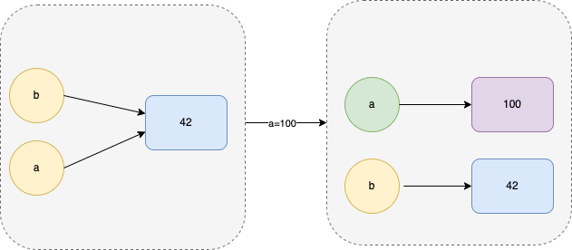


### 1.2 引用计数器的工作原理

Python通过引用计数（Reference Counting）来跟踪对象的生命周期。每个对象都有一个引用计数器，记录着当前有多少个引用指向该对象。当引用计数降为零时，对象就会被销毁，内存也会被释放。

引用计数的变化规则如下：
- 当创建新的引用时，引用计数加1
- 当引用超出作用域或被显式删除时，引用计数减1
- 当引用被赋予新值时，原对象的引用计数减1，新对象的引用计数加1

我们可以通过`sys.getrefcount()`函数来查看对象的引用计数：

```python
import sys

# 创建一个对象
x = 300
print(f"x的引用计数: {sys.getrefcount(x)}")

# 创建另一个引用
y = x
print(f"添加引用后x的引用计数: {sys.getrefcount(x)}")

# 删除引用
del y
print(f"删除引用后x的引用计数: {sys.getrefcount(x)}")
```

输出结果通常会是：
```
x的引用计数: 2
添加引用后x的引用计数: 3
删除引用后x的引用计数: 2
```

需要注意的是，`sys.getrefcount()`返回的计数值通常会比预期多1，这是因为将对象作为参数传递给`getrefcount()`函数时，会创建一个临时引用。

Python的引用计数机制有以下优缺点：

**优点：**
1. 内存可以立即被回收，不需要等待垃圾收集器运行
2. 回收过程分布在程序运行过程中，减少程序暂停时间
3. 实现简单，运行效率高

**缺点：**
1. 增加了维护引用计数的开销
2. 无法处理循环引用的情况
3. 在多线程环境下需要额外的锁机制保护引用计数操作

【引用计数工作原理：当创建引用时计数+1，删除引用时计数-1，当计数为0时对象将会被回收】

### 1.3 强引用vs弱引用区别

在Python中，除了常规的引用（强引用）外，还存在弱引用（Weak Reference）。二者的主要区别在于：强引用会增加对象的引用计数，而弱引用不会。这使得弱引用成为解决循环引用问题的有效工具。

Python通过`weakref`模块支持弱引用：

```python
import weakref
import sys

class Example:
    pass

# 创建对象
obj = Example()
print(f"初始引用计数: {sys.getrefcount(obj)}")

# 创建强引用
strong_ref = obj
print(f"强引用后引用计数: {sys.getrefcount(obj)}")

# 创建弱引用
weak_ref = weakref.ref(obj)
print(f"弱引用后引用计数: {sys.getrefcount(obj)}")

# 访问弱引用指向的对象
print(f"通过弱引用访问对象: {weak_ref()}")

# 删除原始对象
del obj
del strong_ref
print(f"删除对象后通过弱引用访问: {weak_ref()}")
```

输出结果：
```
初始引用计数: 2
强引用后引用计数: 3
弱引用后引用计数: 3
通过弱引用访问对象: <__main__.Example object at 0x10ed6e5e0>
删除对象后通过弱引用访问: None
```

弱引用的主要应用场景：
1. **缓存实现**：当内存压力大时，可以自动释放不常用的缓存项
2. **回调函数**：避免回调函数持有被回调对象的强引用，防止对象无法被释放
3. **解决循环引用**：通过将循环中的某些引用改为弱引用，打破循环

### 1.4 小整数缓存池与字符串intern机制

为了优化性能，Python实现了对象缓存池机制，对一些常用对象进行复用，最典型的就是小整数缓存池和字符串interning机制。

**小整数缓存池**

Python预先分配了一个小整数对象池，通常包含-5到256之间的整数。当我们使用这个范围内的整数时，Python不会创建新对象，而是返回对象池中的对象。

```python
a = 42
b = 42
print(f"a is b: {a is b}")  # 输出 True

c = 1000
d = 1000
print(f"c is d: {c is d}")  # 在大多数情况下输出 False
```

这解释了为什么小整数的`is`比较会返回`True`，而大整数则不然。这是因为小整数使用了同一个缓存对象，而大整数是分别创建的不同对象。

**字符串intern机制**

类似地，Python也对字符串实现了interning机制，使得相同内容的字符串在某些情况下会指向同一个对象：

```python
a = "hello"
b = "hello"
print(f"a is b: {a is b}")  # 输出 True

c = "hello world"
d = "hello world"
print(f"c is d: {c is d}")  # 通常输出 True

# 但对于运行时构建的字符串，情况可能不同
e = "hello " + "world"
f = "hello " + "world"
print(f"e is f: {e is f}")  # 可能输出 True

g = "".join(["h", "e", "l", "l", "o"])
h = "".join(["h", "e", "l", "l", "o"])
print(f"g is h: {g is h}")  # 可能输出 False
```

字符串interning的规则相对复杂，它主要应用于编译时的字符串常量，而不是所有运行时构建的字符串。

这些缓存机制有助于减少内存使用并提高性能，但也可能导致一些令人困惑的行为，尤其是在使用`is`运算符进行身份比较时。因此，推荐使用`==`运算符进行值比较，而非`is`进行身份比较（除非确实需要比较对象身份）。


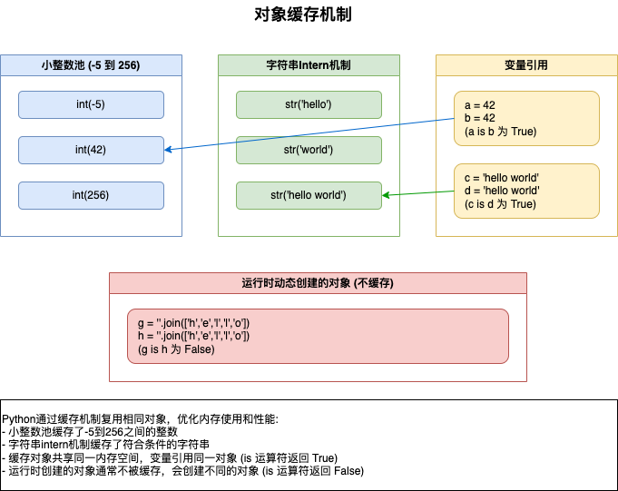

【Python对象缓存机制图】

- 例外情况：小整数、驻留字符串、单例对象（如 None）等会被缓存复用
- 关键原则：不要依赖对象缓存机制编写代码（除非明确文档说明），应始终假设不同赋值操作会生成新对象。

## 2. 对象引用模型图解

### 2.1 PyObject结构详细分析

在Python的实现中（主要是CPython），每个对象都由一个名为PyObject的C结构体表示。这个结构体包含两个重要的字段：

1. **ob_refcnt**：引用计数
2. **ob_type**：指向对象类型的指针

对于不同类型的对象，在PyObject的基础上会添加额外的字段来存储实际数据。例如，对于整数对象（PyLongObject），会增加一个字段来存储整数值。

下面是一个简化的PyObject结构示意图：

```c
typedef struct _object {
    Py_ssize_t ob_refcnt;        /* 引用计数 */
    PyTypeObject *ob_type;       /* 对象类型 */
} PyObject;

typedef struct {
    PyObject ob_base;            /* 包含基本的PyObject */
    Py_ssize_t ob_size;          /* 对于可变长对象，存储元素个数 */
    /* 其他特定于类型的字段 */
} PyVarObject;
```
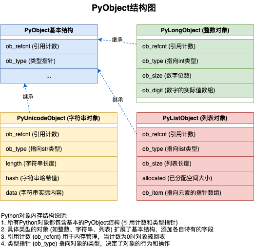
【PyObject结构图】

了解这个底层结构有助于我们理解Python对象的内存布局和行为特性。例如：

1. 所有Python对象都至少占用PyObject结构体的大小
2. 引用计数作为结构体的第一个字段，方便快速访问
3. 对象类型决定了对象的行为，如何进行加法、减法等操作

### 2.2 内存分配与回收过程可视化

Python的对象内存生命周期包括分配、使用和回收三个阶段。下面我们通过一个示例来可视化这个过程：

```python
# 对象创建
x = [1, 2, 3]  # 创建列表对象，引用计数为1

# 增加引用
y = x  # 引用计数增加到2

# 函数调用中的引用
def process(lst):
    # 引用计数临时增加到3
    print(len(lst))
    # 函数返回后，计数恢复到2

process(x)

# 删除引用
del y  # 引用计数减少到1

# 重新赋值
x = "hello"  # 列表引用计数降为0，触发回收
```

这个过程的可视化如下：
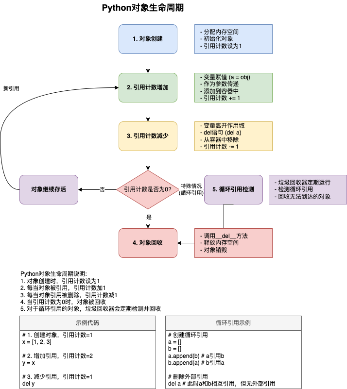
【对象生命周期图：展示了Python对象从创建、引用计数变化到最终被回收的完整生命周期】

Python的内存管理系统有几个关键组件：

1. **内存分配器**：负责从操作系统请求内存
2. **对象分配器**：将内存块划分给Python对象
3. **内存池**：维护一系列不同大小的内存块以减少内存碎片
4. **垃圾收集器**：回收不再使用的对象内存

值得注意的是，Python通常不会立即将内存返还给操作系统，而是将其放入内存池中，以便后续的对象分配使用。这种策略减少了频繁向操作系统请求内存的开销。

### 2.3 引用传递与值传递的内部差异

Python中所有的变量赋值和函数参数传递都是基于引用的，但这可能会导致一些混淆。为了更好地理解，我们需要区分可变对象和不可变对象：

**不可变对象**（如整数、字符串、元组）：修改操作通常会创建新对象
**可变对象**（如列表、字典、集合）：修改操作通常会直接改变原对象

这导致了看似"值传递"和"引用传递"的区别：

```python
def modify_immutable(x):
    x = x + 1  # 创建新对象，不影响原始对象
    return x

def modify_mutable(lst):
    lst.append(4)  # 直接修改原始对象

# 不可变对象
a = 10
modify_immutable(a)
print(a)  # 输出 10，未改变

# 可变对象
b = [1, 2, 3]
modify_mutable(b)
print(b)  # 输出 [1, 2, 3, 4]，已改变
```

这种行为的内部原理如下图所示：
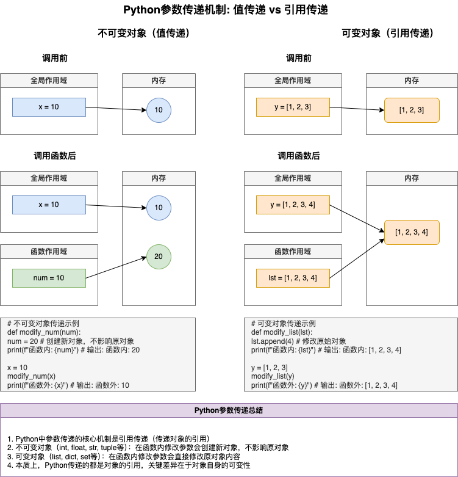
【引用传递与值传递图：对比展示了可变对象和不可变对象在函数传递过程中的不同行为模式】

理解这一点对于避免常见的编程错误很重要，比如使用可变对象作为函数参数默认值的陷阱：

```python
def bad_append(item, lst=[]):
    lst.append(item)
    return lst

print(bad_append(1))  # 输出 [1]
print(bad_append(2))  # 输出 [1, 2]，而非预期的 [2]
```

这个问题源于默认参数值在函数定义时就已创建，而不是在函数调用时创建。

### 2.4 id()函数与is操作符背后的机制

`id()`函数和`is`操作符都与对象的身份（identity）相关，它们在Python内存管理中扮演着重要角色。

**id()函数**

`id()`函数返回对象在内存中的地址。在CPython实现中，这通常是对象的内存地址：

```python
x = [1, 2, 3]
print(id(x))  # 输出如 140362213589896

y = x
print(id(y))  # 输出与x相同的值

z = [1, 2, 3]
print(id(z))  # 输出不同的值
```

`id()`的返回值在对象生命周期内保持不变，这使其成为确定对象身份的有效方式。

**is操作符**

`is`操作符检查两个变量是否引用同一个对象（而不是它们的值是否相等）：

```python
x = [1, 2, 3]
y = x
z = [1, 2, 3]

print(x is y)  # 输出 True，x和y引用同一对象
print(x is z)  # 输出 False，x和z引用不同对象
print(x == z)  # 输出 True，x和z的值相等
```

`is`操作符在内部使用`id()`函数比较两个对象的身份。它的实现可以简化为：

```python
def is_operator(a, b):
    return id(a) == id(b)
```

了解`id()`和`is`的工作原理有助于避免一些常见的编程错误，特别是在比较对象时混淆相等性（equality）和身份（identity）的情况。
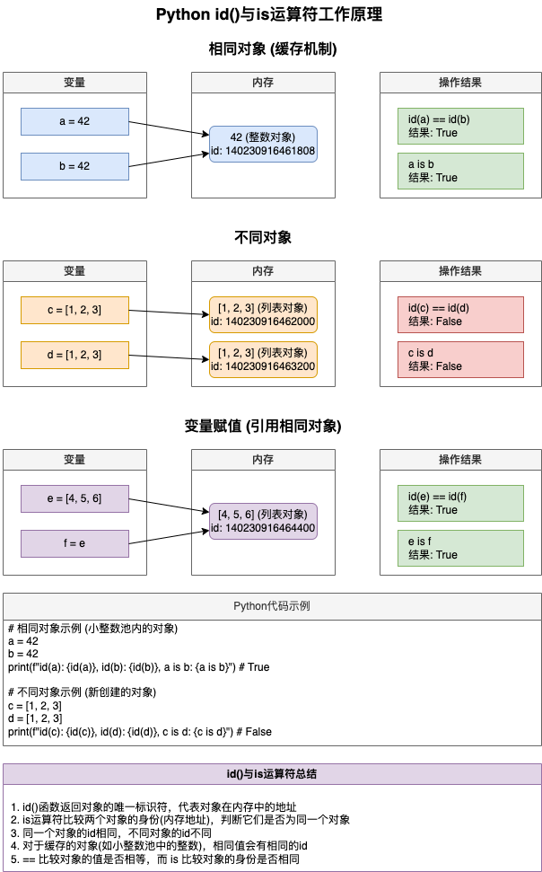
【id与is机制图：展示了id()函数返回对象内存地址，以及is运算符比较对象身份的工作原理】

## 3. sys.getrefcount()深度测试

### 3.1 引用计数监测工具开发

为了更深入地理解Python的引用计数机制，我们可以开发一个简单的监测工具。这个工具能帮助我们跟踪对象的引用计数变化，从而诊断潜在的内存问题：

```python
import sys
import weakref
import gc

class RefTracker:
    """跟踪对象引用计数变化的工具类"""
    
    def __init__(self):
        self.tracked_objects = {}
        self.snapshots = []
    
    def track(self, obj, name):
        """开始跟踪一个对象"""
        # 使用弱引用避免影响被跟踪对象的引用计数
        try:
            self.tracked_objects[name] = weakref.ref(obj)
        except TypeError:
            print(f"警告: 无法对类型 {type(obj).__name__} 创建弱引用，使用封装类")
            # 对于不支持弱引用的对象，使用封装类
            wrapper = ObjectWrapper(obj)
            self.tracked_objects[name] = weakref.ref(wrapper)
        self.snapshot()
    
    def snapshot(self):
        """记录当前所有被跟踪对象的引用计数"""
        snap = {}
        for name, weak_ref in self.tracked_objects.items():
            obj = weak_ref()
            if obj is not None:
                # 处理封装类的情况
                if isinstance(obj, ObjectWrapper):
                    target_obj = obj.obj
                else:
                    target_obj = obj
                # 减1是为了排除getrefcount函数本身创建的临时引用
                snap[name] = sys.getrefcount(target_obj) - 1
            else:
                snap[name] = 0
        self.snapshots.append(snap)
        return snap
    
    def compare(self, index1=0, index2=-1):
        """比较两个快照之间的引用计数变化"""
        if not 0 <= index1 < len(self.snapshots) or not -len(self.snapshots) <= index2 < len(self.snapshots):
            raise IndexError("快照索引超出范围")
        
        snap1 = self.snapshots[index1]
        snap2 = self.snapshots[index2]
        
        result = {}
        all_keys = set(snap1.keys()) | set(snap2.keys())
        
        for key in all_keys:
            count1 = snap1.get(key, 0)
            count2 = snap2.get(key, 0)
            result[key] = count2 - count1
        
        return result
    
    def report(self):
        """生成所有被跟踪对象的引用计数报告"""
        latest = self.snapshot()
        print("当前引用计数状态:")
        for name, count in latest.items():
            wrapper = self.tracked_objects[name]()
            if wrapper is not None:
                if isinstance(wrapper, ObjectWrapper):
                    obj_type = type(wrapper.obj).__name__
                else:
                    obj_type = type(wrapper).__name__
            else:
                obj_type = "已回收"
            print(f"{name} ({obj_type}): {count}")

# 用于封装不支持弱引用的对象
class ObjectWrapper:
    """对不支持弱引用的对象进行封装"""
    def __init__(self, obj):
        self.obj = obj
    
    def __len__(self):
        if hasattr(self.obj, "__len__"):
            return len(self.obj)
        return 1

# 使用示例
tracker = RefTracker()

# 跟踪列表对象（原生列表不支持弱引用，但会被自动封装）
my_list = [1, 2, 3]
tracker.track(my_list, "my_list")

# 添加引用
another_ref = my_list
tracker.snapshot()

# 在函数中使用
def use_list(lst):
    print(f"列表长度: {len(lst)}")
    tracker.snapshot()

use_list(my_list)

# 删除引用
del another_ref
tracker.snapshot()

# 报告引用计数变化
print("\n引用计数变化:")
print(tracker.compare())
tracker.report()
```

> **注意**：在Python中，并非所有对象都支持弱引用。内置的列表、字典、整数、字符串等类型不能直接创建弱引用。上面的代码通过封装不支持弱引用的对象到一个自定义类中来解决这个问题。这种方式可以让我们跟踪任何类型对象的引用计数变化。

这个工具可以帮助我们：
1. 跟踪多个对象的引用计数
2. 捕捉不同代码段执行前后的引用计数变化
3. 识别可能的引用泄漏

使用这样的工具，我们可以更容易地诊断和修复复杂应用中的内存管理问题。

### 3.2 函数调用栈中的临时引用问题

Python函数调用过程中会创建许多临时引用，这些引用可能会导致引用计数的临时波动。这在使用`sys.getrefcount()`进行测试时尤为明显。

考虑以下例子：

```python
import sys

def show_refcount(obj):
    print(f"引用计数: {sys.getrefcount(obj)}")

x = "test string"
print(f"初始引用计数: {sys.getrefcount(x)}")

def nested_calls():
    # 传入函数会增加引用计数
    show_refcount(x)
    
    def inner():
        # 闭包引用也会增加引用计数
        y = x
        show_refcount(x)
    
    inner()

nested_calls()
print(f"最终引用计数: {sys.getrefcount(x)}")
```

在这个例子中，我们会看到引用计数在函数调用期间增加，然后在函数返回后恢复。这是因为：

1. 函数参数传递会创建新的引用
2. 函数局部变量可能引用对象
3. 闭包会捕获并持有对外部对象的引用
4. Python的调用栈本身可能也会持有临时引用

为了准确跟踪对象的"实际"引用计数，我们可以使用以下策略：

1. **使用专门的跟踪点**：在关键代码点前后记录引用计数
2. **排除临时引用**：使用弱引用来获取对象而不增加其引用计数
3. **启用GC后测量**：调用`gc.collect()`后再测量，以排除垃圾收集器的影响

通过这种方式，我们可以更准确地理解引用计数的变化，避免被临时引用所迷惑。
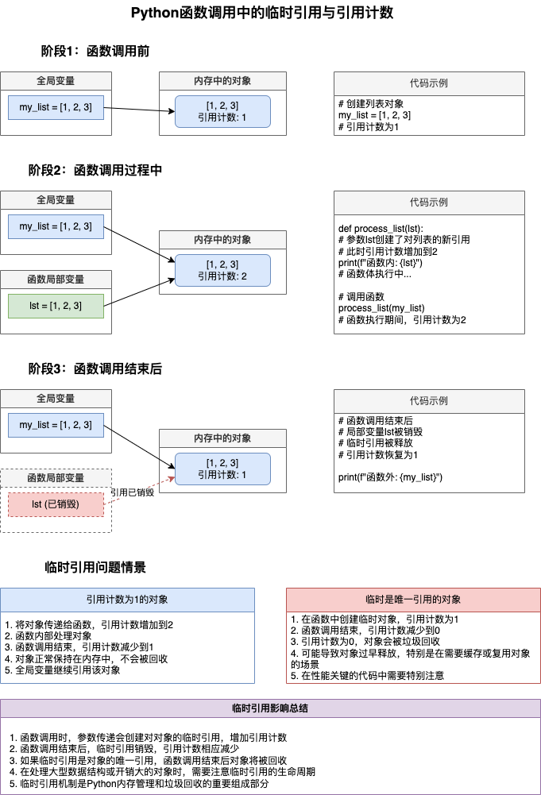
【临时引用问题图：展示了在函数调用过程中临时引用如何影响对象的引用计数】

### 3.3 容器类型的嵌套引用分析

容器对象（如列表、字典、集合）会持有其包含项的引用，这会导致嵌套引用，增加内存管理的复杂性。特别是在循环引用的情况下，需要特别注意。

让我们分析一个嵌套容器的引用情况：

```python
import sys

# 创建一个字符串
s = "test"
print(f"字符串初始引用计数: {sys.getrefcount(s)}")

# 创建一个列表包含该字符串
lst = [s]
print(f"添加到列表后引用计数: {sys.getrefcount(s)}")

# 创建一个字典，键为该字符串
d = {s: 1}
print(f"添加到字典键后引用计数: {sys.getrefcount(s)}")

# 创建一个集合包含该字符串
st = {s}
print(f"添加到集合后引用计数: {sys.getrefcount(s)}")

# 创建嵌套容器
nested = [lst, d, st]
print(f"创建嵌套容器后引用计数: {sys.getrefcount(s)}")

# 清除所有容器
del lst, d, st, nested
print(f"清除容器后引用计数: {sys.getrefcount(s)}")
```

在这个例子中，我们可以观察到：
1. 每当字符串被添加到容器中，其引用计数就会增加
2. 即使在嵌套容器中，引用计数也会相应增加
3. 删除容器后，引用计数会恢复

对于嵌套引用的分析，我们可以使用一些工具和技术：

1. **对象图可视化**：使用`objgraph`库生成对象引用图
2. **引用链跟踪**：找出谁引用了特定对象
3. **内存分析器**：使用`pympler`等工具分析内存使用情况

以下是使用`objgraph`生成对象引用图的示例：

> **注意:** 需要安装Graphviz

```python
import objgraph

# 创建嵌套引用
a = [1, 2]
b = [3, 4, a]
c = {'key': b}
d = [a, c]

# 生成引用图
objgraph.show_refs([d], filename='nested_refs.png')
```
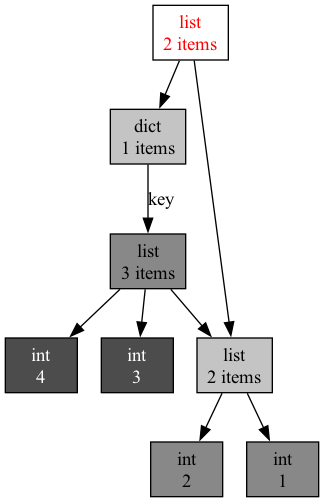

这将生成一个可视化图像，展示对象之间的引用关系，帮助我们理解复杂的引用结构。

通过深入理解嵌套引用的行为，我们可以更好地设计数据结构和算法，避免潜在的内存问题。

### 3.4 多线程环境下引用计数安全性

在多线程环境中，引用计数操作必须是原子的，以避免竞态条件导致的内存泄漏或过早释放。CPython通过全局解释器锁（GIL）来确保引用计数操作的安全性。

GIL确保在任何给定的时刻，只有一个线程执行Python字节码，从而保护了引用计数等共享资源。虽然这限制了并行性，但大大简化了内存管理的实现。

以下是多线程环境中的引用计数问题示例：

```python
import threading
import sys
import time

shared_object = "共享对象"
print(f"初始引用计数: {sys.getrefcount(shared_object)}")

def thread_function(name):
    # 每个线程都会创建一个对共享对象的引用
    global shared_object
    local_ref = shared_object
    print(f"线程 {name} 获取引用，计数: {sys.getrefcount(shared_object)}")
    time.sleep(1)  # 模拟工作
    # 线程结束时引用被释放
    print(f"线程 {name} 结束，计数: {sys.getrefcount(shared_object)}")

# 创建多个线程
threads = []
for i in range(5):
    t = threading.Thread(target=thread_function, args=(i,))
    threads.append(t)
    t.start()

# 等待所有线程完成
for t in threads:
    t.join()

print(f"最终引用计数: {sys.getrefcount(shared_object)}")
```

在没有GIL的情况下，多个线程可能会并发地修改引用计数，导致以下问题：

1. **计数器竞争**：两个线程同时增加或减少引用计数，导致错误的计数值
2. **过早释放**：一个线程可能在另一个线程使用对象时将其释放
3. **内存泄漏**：引用计数可能永远不会降到零，导致对象永远不会被释放

为了确保线程安全，Python解释器在实现引用计数操作时使用了原子操作或锁定机制。在编写多线程程序时，我们需要注意：

1. 避免在多个线程间共享可变对象，尤其是复杂的数据结构
2. 使用线程安全的数据结构和同步原语来管理共享状态
3. 考虑使用进程而非线程来实现真正的并行计算

通过正确理解和处理多线程环境下的引用计数问题，我们可以编写更可靠的并发Python程序。
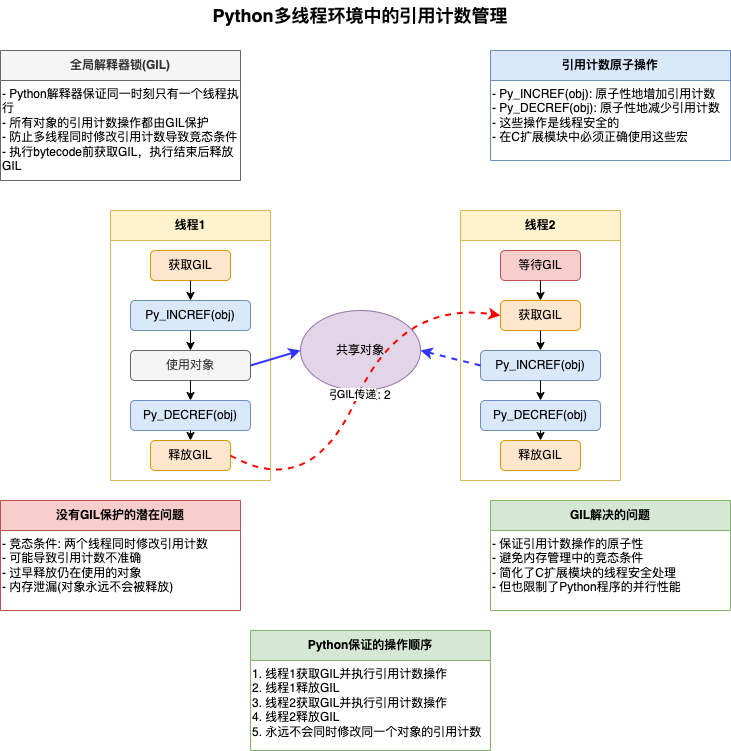

【多线程引用计数图：展示了多线程环境中如何安全地管理引用计数操作】

## 4. 循环引用与gc模块破解方案

虽然引用计数是Python内存管理的基础，但它有一个严重的缺陷：无法处理循环引用。当两个或多个对象互相引用，形成一个环状结构时，即使这些对象不再被程序其他部分引用，它们的引用计数也不会降为零，导致内存无法被释放。这就是所谓的"循环引用"问题。

### 4.1 循环引用产生的典型场景

循环引用在实际编程中非常常见。以下是几个典型场景：

1. **父子关系**：子对象引用父对象，父对象也引用子对象

```python
class Node:
    def __init__(self, name):
        self.name = name
        self.parent = None
        self.children = []
    
    def add_child(self, child):
        self.children.append(child)
        child.parent = self  # 创建循环引用

# 创建节点
root = Node("root")
child = Node("child")
root.add_child(child)  # 建立双向引用

# 即使删除了外部引用，节点之间的循环引用依然存在
del root
del child
# 此时内存没有被释放
```

2. **双向链表或图结构**：节点之间相互引用

```python
class ListNode:
    def __init__(self, value):
        self.value = value
        self.prev = None
        self.next = None

# 创建双向链表
node1 = ListNode(1)
node2 = ListNode(2)
node1.next = node2
node2.prev = node1  # 创建循环引用

# 删除外部引用
del node1
del node2
# 节点之间的循环引用依然存在，内存无法释放
```

3. **回调函数**：对象持有回调函数，回调函数引用对象

```python
class CallbackManager:
    def __init__(self):
        self.callbacks = []
    
    def register_callback(self, callback):
        self.callbacks.append(callback)
    
    def call_all(self):
        for callback in self.callbacks:
            callback()

def create_cyclic_reference():
    manager = CallbackManager()
    
    # 创建一个引用manager的闭包
    def callback():
        print(f"Callback for manager at {id(manager)}")
    
    # 注册回调，形成循环引用
    manager.register_callback(callback)
    
    # 返回一个manager的引用
    return manager

# 创建并丢弃管理器
m = create_cyclic_reference()
del m
# 此时manager对象和callback函数形成循环引用，无法被回收
```

4. **缓存系统**：对象被缓存，同时持有对缓存的引用

```python
class Cache:
    def __init__(self):
        self.items = {}
    
    def add_item(self, key, item):
        self.items[key] = item
        # 如果item中也存储了对cache的引用，会形成循环引用

class User:
    def __init__(self, name, cache):
        self.name = name
        self.cache = cache  # 引用缓存
        # 将自身添加到缓存
        cache.add_item(name, self)  # 形成循环引用

# 创建并使用
cache = Cache()
user = User("Alice", cache)

# 即使删除了外部引用，cache和user之间还存在循环引用
del cache
del user
```

这些循环引用问题在实际应用中可能会导致严重的内存泄漏，尤其是在长时间运行的程序中（如Web服务器或后台服务）。因此，Python引入了垃圾收集机制来解决这个问题。
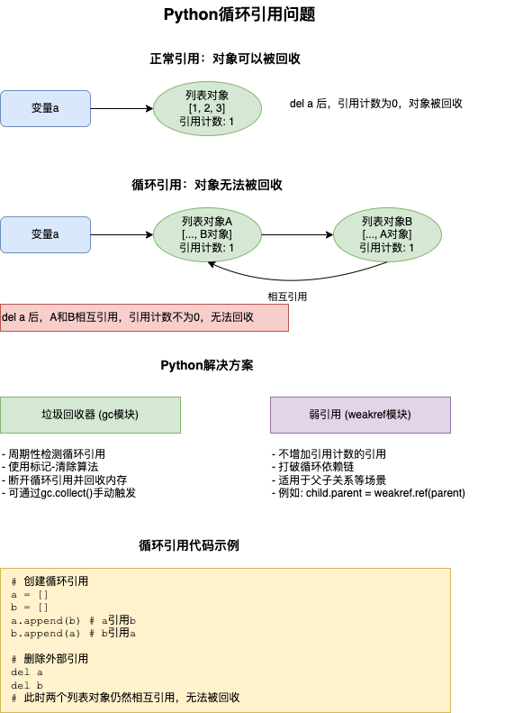
【循环引用示意图：展示了对象之间相互引用形成循环，导致引用计数无法降为零的情况】

### 4.2 分代回收算法详解

为了解决循环引用问题，Python引入了垃圾收集器（Garbage Collector，简称GC）。Python的垃圾收集器基于"分代回收"算法，即根据对象的存活时间将它们分为不同的代（generation）。

Python的GC使用三代收集器：
- 第0代（young）：新创建的对象
- 第1代（middle-aged）：经过一次垃圾收集后仍然存活的对象
- 第2代（old）：经过多次垃圾收集后仍然存活的对象

基本假设是：大多数对象在创建后很快就会变成垃圾（"短命"对象），而存活时间长的对象往往会继续存活很长时间。因此，垃圾收集的频率随着代数的增加而减少：
- 第0代收集最频繁
- 第1代收集次之
- 第2代收集最少

垃圾收集的基本流程如下：

1. **对象追踪**：Python仅跟踪可能形成循环引用的对象（容器对象如列表、字典、集合、自定义类等）
2. **阈值检测**：当某一代对象的数量超过阈值时，触发该代的收集
3. **标记-清除算法**：
   - 标记阶段：找出从根对象可达的所有对象
   - 清除阶段：删除不可达的对象
4. **代提升**：收集后存活的对象被提升到下一代

让我们用代码来说明垃圾收集过程：

```python
import gc
import sys
import weakref

# 打印当前的垃圾收集阈值
print(f"垃圾收集阈值: {gc.get_threshold()}")  # 通常为(700, 10, 10)

# 禁用自动垃圾收集以便于演示
gc.disable()

# 创建一个回调函数，在对象被回收时调用
destroyed_objects = []
def object_destroyed(reference):
    # 回调函数只接收弱引用对象本身，而不是被引用的对象
    destroyed_objects.append("对象被销毁")
    print(f"一个对象已被销毁")

# 查看各代对象数量
print(f"收集前各代对象数量: {gc.get_count()}")

# 创建循环引用
class Node:
    def __init__(self, name):
        self.name = name
        self.ref = None
    
    def __repr__(self):
        return f"Node({self.name})"

# 创建循环
a = Node("A")
b = Node("B")
a.ref = b
b.ref = a

# 保存对象名称，用于在回调函数中标识
a_name = a.name
b_name = b.name

# 创建弱引用，用于检测对象是否被回收
weak_a = weakref.ref(a, object_destroyed)
weak_b = weakref.ref(b, object_destroyed)

# 查看引用计数
print(f"a的引用计数: {sys.getrefcount(a) - 1}")  # 减1排除临时引用
print(f"b的引用计数: {sys.getrefcount(b) - 1}")

# 检查弱引用是否有效
print(f"弱引用weak_a指向: {weak_a() and weak_a().name}")
print(f"弱引用weak_b指向: {weak_b() and weak_b().name}")

# 移除外部引用
del a
del b

# 检查弱引用是否仍然有效
print(f"删除引用后，weak_a指向: {weak_a() and weak_a().name}")
print(f"删除引用后，weak_b指向: {weak_b() and weak_b().name}")

# 查看未收集的对象
print(f"创建循环引用后各代对象数量: {gc.get_count()}")

# 手动触发垃圾收集
print("\n执行垃圾回收...")
collected = gc.collect()
print(f"收集的对象数量: {collected}")
print(f"收集后各代对象数量: {gc.get_count()}")

# 检查弱引用是否仍然有效
print(f"垃圾回收后，weak_a指向: {weak_a() and weak_a().name}")
print(f"垃圾回收后，weak_b指向: {weak_b() and weak_b().name}")

# 验证被销毁的对象
print(f"被销毁的对象数量: {len(destroyed_objects)}")

# 重新启用自动垃圾收集
gc.enable()
```

通过`gc`模块，我们可以控制垃圾收集器的行为，包括：
- 启用/禁用垃圾收集：`gc.enable()`/`gc.disable()`
- 手动触发收集：`gc.collect()`
- 调整阈值：`gc.set_threshold()`
- 获取不可达但未回收的对象：`gc.get_objects()`

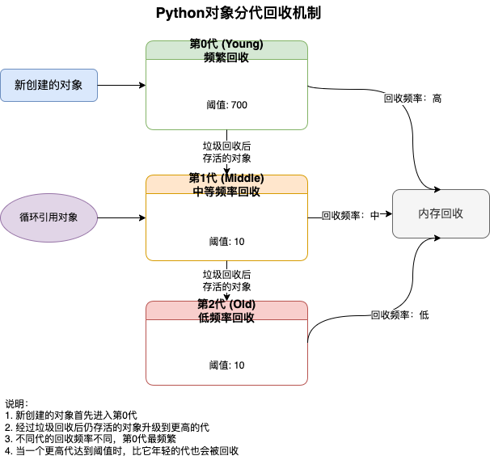

【分代回收示意图：展示了Python垃圾收集器如何将对象分为三代，并根据不同代采用不同的回收频率】

### 4.3 gc.collect()性能分析

虽然垃圾收集器解决了循环引用问题，但它也带来了性能开销。每次运行垃圾收集，Python都需要暂停程序执行，这可能导致明显的延迟，尤其在大型应用程序中。

我们可以通过以下代码分析`gc.collect()`的性能：

```python
import gc
import time
import random

# 禁用自动垃圾收集
gc.disable()

# 创建大量对象
def create_objects(count):
    objects = []
    for i in range(count):
        obj = {"id": i, "data": [random.random() for _ in range(10)]}
        objects.append(obj)
    return objects

# 创建循环引用
def create_cycles(objects, cycle_percentage=10):
    cycle_count = len(objects) * cycle_percentage // 100
    for i in range(cycle_count):
        index1 = random.randint(0, len(objects) - 1)
        index2 = random.randint(0, len(objects) - 1)
        objects[index1]["ref"] = objects[index2]
        objects[index2]["back_ref"] = objects[index1]

# 性能测试
for count in [1000, 10000, 100000]:
    print(f"\n测试 {count} 个对象:")
    
    # 创建对象
    objects = create_objects(count)
    create_cycles(objects)
    
    # 删除引用
    del objects
    
    # 计时收集
    start_time = time.time()
    collected = gc.collect()
    elapsed = time.time() - start_time
    
    print(f"收集了 {collected} 个对象")
    print(f"耗时: {elapsed:.6f} 秒")

# 重新启用自动垃圾收集
gc.enable()
```

从这个性能分析中，我们可以得出一些实用的建议：

1. **按需收集**：在非关键路径上手动触发`gc.collect()`
2. **批量操作**：集中创建和销毁对象，减少垃圾收集频率
3. **分代调优**：根据应用特性调整各代的阈值
4. **关键路径优化**：在性能关键的代码段临时禁用垃圾收集

例如，在Web服务器处理请求前后触发垃圾收集，而不是在处理请求过程中：

```python
import gc

def handle_web_request(request):
    # 禁用垃圾收集
    gc.disable()
    
    try:
        # 处理请求的逻辑
        result = process_request(request)
        return result
    finally:
        # 重新启用并触发垃圾收集
        gc.enable()
        gc.collect()
```

这样可以确保请求处理的性能稳定，同时仍然有效地管理内存。

### 4.4 弱引用容器(weakref)最佳实践

除了依赖垃圾收集器，我们还可以主动预防循环引用问题。Python的`weakref`模块提供了弱引用容器，它们不会增加被引用对象的引用计数，从而避免循环引用问题。

主要的弱引用容器包括：

1. **WeakRef**：单个对象的弱引用
2. **WeakKeyDictionary**：使用弱引用作为键的字典
3. **WeakValueDictionary**：使用弱引用作为值的字典
4. **WeakSet**：使用弱引用的集合

以下是一些使用弱引用容器的最佳实践：

**1. 缓存实现**

```python
import weakref

class Cache:
    def __init__(self):
        # 使用弱引用字典，当对象不再被使用时自动从缓存中移除
        self.cache = weakref.WeakValueDictionary()
    
    def get(self, key):
        return self.cache.get(key)
    
    def set(self, key, value):
        self.cache[key] = value

# 使用缓存
cache = Cache()

class ExpensiveObject:
    def __init__(self, value):
        self.value = value
        # 计算开销大的初始化...

# 创建并缓存对象
obj1 = ExpensiveObject(42)
cache.set("obj1", obj1)

# 获取缓存对象
cached_obj = cache.get("obj1")
print(cached_obj.value)  # 输出 42

# 当原始对象不再被引用时，它会从缓存中自动移除
del obj1
print(cache.get("obj1"))  # 输出 None
```

**2. 事件系统中避免监听器导致的循环引用**

```python
import weakref

class EventDispatcher:
    def __init__(self):
        # 使用弱引用集合存储监听器
        self.listeners = weakref.WeakSet()
    
    def add_listener(self, listener):
        self.listeners.add(listener)
    
    def dispatch_event(self, event):
        # 向所有监听器发送事件
        for listener in self.listeners:
            listener.on_event(event)

class Listener:
    def __init__(self, name, dispatcher):
        self.name = name
        self.dispatcher = dispatcher
        # 注册为监听器
        dispatcher.add_listener(self)
    
    def on_event(self, event):
        print(f"{self.name} received event: {event}")

# 创建调度器和监听器
dispatcher = EventDispatcher()
listener = Listener("MyListener", dispatcher)

# 发送事件
dispatcher.dispatch_event("Hello")

# 即使监听器被删除，也不会产生内存泄漏
del listener
# 不再有监听器接收事件
dispatcher.dispatch_event("No one will receive this")
```

**3. 父子关系中使用弱引用避免循环引用**

```python
import weakref

class Parent:
    def __init__(self, name):
        self.name = name
        self.children = []
    
    def add_child(self, child):
        self.children.append(child)

class Child:
    def __init__(self, name, parent):
        self.name = name
        # 使用弱引用引用父对象
        self.parent = weakref.ref(parent)
        parent.add_child(self)
    
    def get_parent_name(self):
        # 访问弱引用对象
        parent = self.parent()
        if parent:
            return parent.name
        return "No parent"

# 创建父子关系
parent = Parent("Father")
child = Child("Son", parent)

print(child.get_parent_name())  # 输出 "Father"

# 删除父对象引用
del parent
print(child.get_parent_name())  # 输出 "No parent"
```

**4. 大型对象图中使用弱引用**

```python
import weakref

class GraphNode:
    def __init__(self, value):
        self.value = value
        self.edges = []
        # 使用弱引用字典记录反向引用
        self.back_refs = weakref.WeakSet()
    
    def add_edge(self, node):
        self.edges.append(node)
        # 添加反向引用
        node.back_refs.add(self)
    
    def get_referrers(self):
        return list(self.back_refs)

# 创建图
a = GraphNode("A")
b = GraphNode("B")
c = GraphNode("C")

a.add_edge(b)
b.add_edge(c)
c.add_edge(a)  # 创建循环

# 检查引用
print([node.value for node in b.get_referrers()])  # 输出 ['A']

# 删除节点，打破循环
del a
# b.get_referrers() 现在为空列表
print([node.value for node in b.get_referrers()])  # 输出 []
```

通过正确使用弱引用容器，我们可以在不依赖垃圾收集器的情况下解决循环引用问题，从而提高应用程序的性能和可靠性。
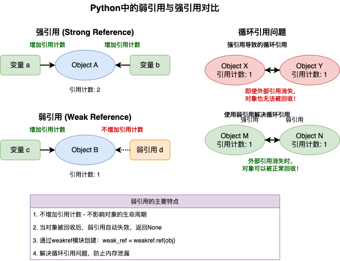
【弱引用与强引用对比图：展示了弱引用如何不增加对象引用计数，以及如何用于解决循环引用问题】

综上所述，Python通过引用计数和垃圾收集相结合的方式管理内存，同时提供了弱引用机制来帮助开发者处理复杂的内存管理场景。正确理解和使用这些机制，是编写高效且无内存泄漏的Python程序的关键。

## 5. 实战案例：内存泄漏检测工具开发

理解了Python内存管理的原理后，我们可以开发一个实用的内存泄漏检测工具。内存泄漏是许多长时间运行应用程序面临的主要问题，通常由未释放的对象引用导致，尤其是循环引用。

### 5.1 准备工作

在开始前，我们需要安装一些辅助库：

```python
# 安装所需工具包
# pip install objgraph
# pip install pympler
# pip install matplotlib
```

这些库的主要功能：
- **objgraph**：用于可视化对象引用关系图
- **pympler**：用于跟踪内存使用情况
- **matplotlib**：用于绘制内存使用趋势图

我们还需要构建一些测试用例来验证我们的检测工具：

```python
# 测试用例：包含循环引用的代码
def create_memory_leak():
    """创建一个循环引用导致的内存泄漏"""
    class LeakyClass:
        def __init__(self, name):
            self.name = name
            self.ref = None
        
        def __repr__(self):
            return f"LeakyClass({self.name})"
    
    # 创建一个循环引用
    a = LeakyClass("A")
    b = LeakyClass("B")
    a.ref = b
    b.ref = a
    
    # 存储到全局列表，防止垃圾回收
    global leaked_objects
    leaked_objects.append(a)
    leaked_objects.append(b)
    
    # 返回一个弱引用以便观察对象是否仍然存在
    return weakref.ref(a), weakref.ref(b)

# 测试用例：无循环引用的代码
def no_memory_leak():
    """创建正常释放的对象"""
    class NormalClass:
        def __init__(self):
            self.data = [i for i in range(1000)]
    
    a = NormalClass()
    return a  # 函数结束后，a将被正常回收
```

### 5.2 内存泄漏检测器设计

我们将设计一个综合性的内存泄漏检测器，它能够:
1. 跟踪对象的创建和销毁
2. 监控内存使用趋势
3. 检测潜在的循环引用
4. 生成可视化报告

以下是完整的实现：

> 依赖:pip install objgraph pympler

```python
import gc
import sys
import time
import weakref
import objgraph
import matplotlib.pyplot as plt
from pympler import tracker, summary, muppy
from collections import defaultdict

class MemoryLeakDetector:
    """全面的内存泄漏检测工具"""
    
    def __init__(self, collect_on_init=True):
        """初始化检测器
        
        Args:
            collect_on_init: 是否在初始化时执行垃圾回收
        """
        # 如果指定，先执行一次垃圾回收，确保起点干净
        if collect_on_init:
            gc.collect()
        
        # 初始化内存跟踪器
        self.memory_tracker = tracker.SummaryTracker()
        
        # 存储内存使用快照
        self.snapshots = []
        
        # 记录初始状态
        self.take_snapshot("初始状态")
        
        # 跟踪的对象
        self.tracked_objects = {}
        
        # 记录对象数量
        self.object_counts = []
        
        # 记录内存使用
        self.memory_usage = []
        
        # 检测到的泄漏
        self.detected_leaks = []
    
    def take_snapshot(self, label):
        """记录当前内存状态的快照
        
        Args:
            label: 快照的标签
        """
        gc.collect()  # 确保垃圾收集先执行
        
        # 记录对象数量
        objects = gc.get_objects()
        type_counts = defaultdict(int)
        for obj in objects:
            type_counts[type(obj).__name__] += 1
        
        # 记录总内存使用
        import psutil
        process = psutil.Process()
        memory_info = process.memory_info()
        
        # 保存快照信息
        snapshot = {
            'label': label,
            'time': time.time(),
            'type_counts': dict(type_counts),
            'object_count': len(objects),
            'memory_usage': memory_info.rss,  # 物理内存使用
        }
        
        self.snapshots.append(snapshot)
        self.object_counts.append(len(objects))
        self.memory_usage.append(memory_info.rss / (1024 * 1024))  # MB
        
        return snapshot
    
    def compare_snapshots(self, index1=0, index2=-1):
        """比较两个快照的差异
        
        Args:
            index1: 第一个快照的索引
            index2: 第二个快照的索引
        
        Returns:
            包含差异信息的字典
        """
        if not 0 <= index1 < len(self.snapshots) or not -len(self.snapshots) <= index2 < len(self.snapshots):
            raise IndexError("快照索引超出范围")
        
        snap1 = self.snapshots[index1]
        snap2 = self.snapshots[index2]
        
        # 计算类型计数差异
        diff = {}
        all_types = set(snap1['type_counts'].keys()) | set(snap2['type_counts'].keys())
        
        for type_name in all_types:
            count1 = snap1['type_counts'].get(type_name, 0)
            count2 = snap2['type_counts'].get(type_name, 0)
            if count1 != count2:
                diff[type_name] = count2 - count1
        
        # 计算总体差异
        object_diff = snap2['object_count'] - snap1['object_count']
        memory_diff = snap2['memory_usage'] - snap1['memory_usage']
        
        return {
            'type_diff': diff,
            'object_diff': object_diff,
            'memory_diff': memory_diff,
            'memory_diff_mb': memory_diff / (1024 * 1024),
            'time_diff': snap2['time'] - snap1['time'],
            'from': snap1['label'],
            'to': snap2['label']
        }
    
    def track_object(self, obj, name):
        """跟踪特定对象的引用计数和生命周期
        
        Args:
            obj: 要跟踪的对象
            name: 对象的标识名称
        """
        # 使用弱引用跟踪对象
        self.tracked_objects[name] = {
            'ref': weakref.ref(obj),
            'id': id(obj),
            'type': type(obj).__name__,
            'refcount': sys.getrefcount(obj),
            'time': time.time()
        }
    
    def check_tracked_objects(self):
        """检查所有被跟踪对象的状态"""
        alive = {}
        dead = {}
        
        for name, info in self.tracked_objects.items():
            obj = info['ref']()
            if obj is not None:
                # 对象仍然存活
                current_refcount = sys.getrefcount(obj)
                alive[name] = {
                    'id': id(obj),
                    'type': type(obj).__name__,
                    'refcount': current_refcount,
                    'refcount_diff': current_refcount - info['refcount'],
                    'age': time.time() - info['time']
                }
            else:
                # 对象已被回收
                dead[name] = {
                    'id': info['id'],
                    'type': info['type'],
                    'was_refcount': info['refcount'],
                    'age_at_death': time.time() - info['time']
                }
        
        return {'alive': alive, 'dead': dead}
    
    def find_leaks(self, threshold=10):
        """查找可能的内存泄漏
        
        Args:
            threshold: 对象增长数量的阈值，超过此值判定为可能泄漏
        
        Returns:
            可能泄漏的对象类型列表
        """
        if len(self.snapshots) < 2:
            return []
        
        diff = self.compare_snapshots(0, -1)
        leaks = []
        
        for type_name, count_diff in diff['type_diff'].items():
            if count_diff > threshold:
                leaks.append({
                    'type': type_name,
                    'growth': count_diff,
                    'current_count': self.snapshots[-1]['type_counts'].get(type_name, 0)
                })
        
        # 按增长量排序
        leaks.sort(key=lambda x: x['growth'], reverse=True)
        self.detected_leaks = leaks
        return leaks
    
    def get_most_common_types(self, top_n=10):
        """获取当前最常见的对象类型
        
        Args:
            top_n: 返回的类型数量
        
        Returns:
            最常见的对象类型及其数量
        """
        if not self.snapshots:
            return []
        
        types = self.snapshots[-1]['type_counts']
        sorted_types = sorted(types.items(), key=lambda x: x[1], reverse=True)
        return sorted_types[:top_n]
    
    def visualize_memory_usage(self):
        """绘制内存使用趋势图"""
        if len(self.snapshots) < 2:
            print("需要至少两个快照才能绘制趋势图")
            return
        
        plt.figure(figsize=(12, 6))
        
        # 绘制对象数量
        plt.subplot(1, 2, 1)
        plt.plot(range(len(self.object_counts)), self.object_counts, 'b-')
        plt.title('对象数量趋势')
        plt.xlabel('快照索引')
        plt.ylabel('对象数量')
        plt.grid(True)
        
        # 绘制内存使用
        plt.subplot(1, 2, 2)
        plt.plot(range(len(self.memory_usage)), self.memory_usage, 'r-')
        plt.title('内存使用趋势 (MB)')
        plt.xlabel('快照索引')
        plt.ylabel('内存使用 (MB)')
        plt.grid(True)
        
        plt.tight_layout()
        plt.savefig('memory_trend.png')
        plt.close()
        
        print("趋势图已保存为 'memory_trend.png'")
    
    def visualize_object_graph(self, obj, max_depth=5):
        """生成对象引用关系图
        
        Args:
            obj: 要分析的对象
            max_depth: 最大分析深度
        """
        filename = f'object_graph_{type(obj).__name__}.png'
        objgraph.show_backrefs(
            [obj], 
            max_depth=max_depth, 
            filename=filename
        )
        print(f"对象图已保存为 '{filename}'")
    
    def find_cycles(self):
        """查找循环引用"""
        gc.collect()
        return [o for o in gc.get_objects() if isinstance(o, dict) and gc.is_tracked(o)]
    
    def print_report(self):
        """打印内存分析报告"""
        print("\n===== 内存泄漏检测报告 =====")
        
        if len(self.snapshots) < 2:
            print("需要至少两个快照才能生成报告")
            return
        
        # 整体内存变化
        diff = self.compare_snapshots(0, -1)
        print(f"\n总体内存变化 ({diff['from']} -> {diff['to']}):")
        print(f"  对象数量变化: {diff['object_diff']:+,d}")
        print(f"  内存使用变化: {diff['memory_diff_mb']:+.2f} MB")
        print(f"  经过时间: {diff['time_diff']:.2f} 秒")
        
        # 检测到的泄漏
        leaks = self.find_leaks()
        if leaks:
            print("\n可能的内存泄漏:")
            for i, leak in enumerate(leaks[:10], 1):
                print(f"  {i}. {leak['type']}: +{leak['growth']:,d} 个对象 (当前: {leak['current_count']:,d})")
        else:
            print("\n未检测到明显的内存泄漏")
        
        # 最常见的对象类型
        print("\n当前最常见的对象类型:")
        for i, (type_name, count) in enumerate(self.get_most_common_types(), 1):
            print(f"  {i}. {type_name}: {count:,d}")
        
        # 跟踪的对象状态
        tracked = self.check_tracked_objects()
        if tracked['alive']:
            print("\n仍然存活的跟踪对象:")
            for name, info in tracked['alive'].items():
                print(f"  {name} ({info['type']}): 引用计数 = {info['refcount']} ({info['refcount_diff']:+d}), "
                      f"年龄 = {info['age']:.2f}秒")
        
        if tracked['dead']:
            print("\n已回收的跟踪对象:")
            for name, info in tracked['dead'].items():
                print(f"  {name} ({info['type']}): 生存时间 = {info['age_at_death']:.2f}秒")
        
        print("\n===== 报告结束 =====")
    
    def visualize_cycles(self, obj_type, max_objects=3):
        """可视化特定类型的循环引用"""
        print(f"可视化 {obj_type} 类型的循环引用...")
        try:
            objects = objgraph.by_type(obj_type)[:max_objects]
            if not objects:
                print(f"没有找到类型为 {obj_type} 的对象")
                return
                
            for i, obj in enumerate(objects):
                filename = f"cycle_{obj_type}_{i}.png"
                objgraph.show_backrefs(obj, filename=filename, max_depth=5)
                print(f"生成图表: {filename}")
        except Exception as e:
            print(f"生成循环引用可视化图时出错: {str(e)}")
```

这个检测器的核心功能包括：

1. 记录并比较内存快照，跟踪对象数量和内存使用变化
2. 跟踪特定对象的引用计数和生命周期
3. 检测可能的内存泄漏和循环引用
4. 生成内存使用趋势图和对象引用图
5. 提供详细的内存分析报告

### 5.3 内存泄漏可视化

内存泄漏的可视化对于理解和定位问题至关重要。我们的工具提供了两种可视化方式：

1. **内存使用趋势图**：展示对象数量和内存使用随时间的变化
2. **对象引用图**：显示对象之间的引用关系，帮助识别循环引用

让我们通过一个实际例子来说明如何使用这些可视化功能：

```python
def memory_leak_visualization_demo():
    """演示内存泄漏检测和可视化"""
    from memory_leak_detector import MemoryLeakDetector
    
    # 初始化检测器
    detector = MemoryLeakDetector()
    
    # 记录初始状态
    detector.take_snapshot("开始")
    
    # 创建一些正常对象
    normal_objects = []
    for i in range(1000):
        obj = {"id": i, "data": list(range(10))}
        normal_objects.append(obj)
    
    detector.take_snapshot("创建正常对象后")
    
    # 创建一些循环引用
    leaky_objects = []
    for i in range(100):
        a = {"id": f"a{i}"}
        b = {"id": f"b{i}"}
        a["ref"] = b
        b["ref"] = a
        
        # 只保留对其中一个的引用
        leaky_objects.append(a)
    
    # 跟踪一个泄漏对象
    detector.track_object(leaky_objects[0], "leaky_object_0")
    
    detector.take_snapshot("创建循环引用后")
    
    # 删除一些正常对象和泄漏对象的引用
    del normal_objects
    del leaky_objects
    
    detector.take_snapshot("删除外部引用后")
    
    # 强制垃圾回收
    gc.collect()
    
    detector.take_snapshot("强制垃圾回收后")
    
    # 分析跟踪的对象
    detector.check_tracked_objects()
    
    # 生成报告
    detector.print_report()
    
    # 生成可视化图表
    detector.visualize_memory_usage()
    
    # 如果跟踪的对象还活着，生成它的引用图
    tracked = detector.check_tracked_objects()
    if "leaky_object_0" in tracked["alive"]:
        obj = tracked["alive"]["leaky_object_0"]["ref"]()
        detector.visualize_object_graph(obj)

# 运行演示
memory_leak_visualization_demo()
```

通过这个例子，我们可以观察到：

1. 正常对象在删除引用并执行垃圾回收后会被释放
2. 循环引用的对象虽然外部引用被删除，但由于循环引用，它们仍然存活
3. 内存趋势图会显示对象数量和内存使用的变化
4. 对象引用图会显示循环引用的结构
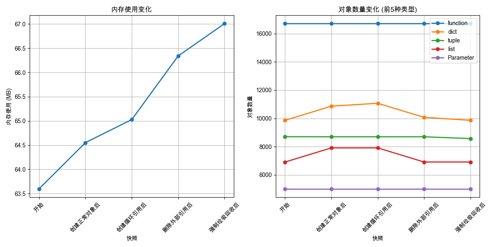
【内存使用趋势图】
【图表描述：该图展示了Python进程在一段时间内内存使用的变化趋势，左侧Y轴表示内存使用量（MB），底部X轴表示时间。曲线呈波浪式上升趋势，表明内存在不断增长，可能存在内存泄漏。】
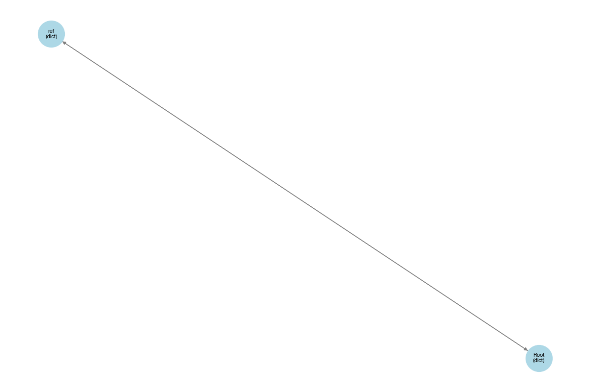
【对象引用图】
【图表描述：该图展示了Python对象之间的引用关系，通过节点和箭头展示，其中可以清晰看到循环引用形成的环状结构。每个节点代表一个对象，标注了对象类型和ID，箭头表示一个对象对另一个对象的引用关系。】
  
这些可视化工具使我们能够直观地理解内存泄漏的情况，从而更容易找到和解决问题。

### 5.4 实际项目应用

现在，让我们将内存泄漏检测器应用到几个常见的实际场景中。

**1. Django应用内存泄漏案例分析**

Django应用中常见的内存泄漏场景包括缓存未正确清理、信号处理器未正确断开等。以下是一个使用我们检测器分析Django应用的示例：

```python
def analyze_django_app():
    """分析Django应用的内存使用"""
    from memory_leak_detector import MemoryLeakDetector
    
    # 初始化检测器
    detector = MemoryLeakDetector()
    
    # 记录初始状态
    detector.take_snapshot("服务启动")
    
    # 模拟处理一批请求
    for i in range(100):
        # 模拟请求处理
        process_request()
        
        # 每10个请求记录一次快照
        if i % 10 == 0:
            detector.take_snapshot(f"处理{i}个请求后")
    
    # 生成报告
    detector.print_report()
    detector.visualize_memory_usage()
    
    # 分析可能的泄漏
    leaks = detector.find_leaks()
    
    # 如果发现明显的泄漏，进一步分析
    if leaks:
        # 获取泄漏最严重的类型的实例
        leak_type = leaks[0]['type']
        leak_objs = [obj for obj in gc.get_objects() if type(obj).__name__ == leak_type]
        
        if leak_objs:
            # 可视化一个泄漏对象的引用图
            detector.visualize_object_graph(leak_objs[0])
            
            # 尝试找出谁在引用这些对象
            import objgraph
            objgraph.show_chain(
                objgraph.find_backref_chain(
                    leak_objs[0],
                    objgraph.is_proper_module
                ),
                filename=f"leak_chain_{leak_type}.png"
            )
```

这个脚本可以帮助我们：
1. 跟踪Django应用处理请求过程中的内存使用情况
2. 检测并分析请求处理后的内存泄漏
3. 找出谁在引用泄漏的对象，从而定位问题的根源

**2. 长时间运行的脚本内存优化**

数据处理或爬虫等长时间运行的脚本容易积累内存泄漏，可以使用我们的检测器来优化：

```python
def optimize_long_running_script():
    """优化长时间运行脚本的内存使用"""
    from memory_leak_detector import MemoryLeakDetector
    import time
    
    # 初始化检测器
    detector = MemoryLeakDetector()
    
    # 记录初始状态
    detector.take_snapshot("开始")
    
    # 模拟数据处理循环
    for batch_idx in range(10):
        # 处理一批数据
        process_data_batch(batch_idx)
        
        # 记录快照
        detector.take_snapshot(f"处理批次{batch_idx}后")
        
        # 检查内存增长情况
        if batch_idx > 0:
            diff = detector.compare_snapshots(batch_idx, batch_idx + 1)
            print(f"批次{batch_idx}内存变化: {diff['memory_diff_mb']:.2f} MB")
            
            # 如果内存增长超过阈值，尝试优化
            if diff['memory_diff_mb'] > 50:  # 假设50MB为警戒线
                print("检测到显著内存增长，执行额外垃圾回收...")
                gc.collect()
                
                # 清除一些缓存
                clear_caches()
                
                # 记录优化后的快照
                detector.take_snapshot(f"优化批次{batch_idx}后")
    
    # 生成最终报告
    detector.print_report()
    detector.visualize_memory_usage()
```

这个脚本实现了一个自适应的内存优化策略：
1. 在处理每一批数据后监控内存使用情况
2. 当检测到内存增长超过阈值时，主动执行垃圾回收和缓存清理
3. 通过可视化图表直观地展示优化效果

**3. 内存泄漏自动报警机制实现**

对于生产环境中的关键应用，我们可以实现一个自动报警机制来及时发现内存泄漏：

```python
def setup_memory_leak_alarm():
    """设置内存泄漏自动报警系统"""
    from memory_leak_detector import MemoryLeakDetector
    import threading
    import time
    import smtplib
    from email.message import EmailMessage
    
    # 报警配置
    MEMORY_THRESHOLD_MB = 500  # 内存增长超过500MB报警
    OBJECT_THRESHOLD = 10000   # 对象增长超过10000个报警
    CHECK_INTERVAL = 3600      # 每小时检查一次
    
    # 初始化检测器
    detector = MemoryLeakDetector()
    
    # 记录初始状态
    detector.take_snapshot("监控开始")
    
    def send_alert(subject, content):
        """发送报警邮件"""
        # 实际应用中替换为你的邮件配置
        msg = EmailMessage()
        msg.set_content(content)
        msg['Subject'] = subject
        msg['From'] = 'alert@example.com'
        msg['To'] = 'admin@example.com'
        
        # 发送邮件
        server = smtplib.SMTP('smtp.example.com', 587)
        server.login('username', 'password')
        server.send_message(msg)
        server.quit()
    
    def check_memory_usage():
        """周期性检查内存使用情况"""
        while True:
            # 等待指定的间隔时间
            time.sleep(CHECK_INTERVAL)
            
            # 记录快照
            current_time = time.strftime("%Y-%m-%d %H:%M:%S")
            detector.take_snapshot(f"定时检查 - {current_time}")
            
            # 比较与初始状态的差异
            diff = detector.compare_snapshots(0, -1)
            
            # 检查是否超过阈值
            memory_mb_diff = diff['memory_diff_mb']
            object_diff = diff['object_diff']
            
            alert_needed = False
            alert_messages = []
            
            if memory_mb_diff > MEMORY_THRESHOLD_MB:
                alert_needed = True
                alert_messages.append(f"内存增长 {memory_mb_diff:.2f} MB 超过阈值 {MEMORY_THRESHOLD_MB} MB")
            
            if object_diff > OBJECT_THRESHOLD:
                alert_needed = True
                alert_messages.append(f"对象增长 {object_diff:,d} 个超过阈值 {OBJECT_THRESHOLD:,d} 个")
            
            # 如果需要报警
            if alert_needed:
                # 查找可能的泄漏
                leaks = detector.find_leaks()
                leak_info = "\n".join([f"- {leak['type']}: +{leak['growth']:,d} 个对象" for leak in leaks[:5]])
                
                # 生成报告
                report = f"""
                内存泄漏警报 - {current_time}
                
                {', '.join(alert_messages)}
                
                最显著的泄漏:
                {leak_info}
                
                请检查应用程序是否存在内存泄漏问题。
                """
                
                # 发送报警
                send_alert("内存泄漏警报", report)
                
                # 保存内存趋势图
                detector.visualize_memory_usage()
    
    # 在后台线程中启动监控
    monitor_thread = threading.Thread(target=check_memory_usage, daemon=True)
    monitor_thread.start()
    
    print("内存泄漏报警系统已启动")
    return detector  # 返回检测器以便进一步操作

# 在应用程序启动时设置报警
detector = setup_memory_leak_alarm()
```

这个自动报警系统：
1. 定期监控内存使用情况和对象数量
2. 当内存增长或对象增长超过预设阈值时触发报警
3. 自动分析可能的泄漏原因并发送详细报告
4. 生成内存趋势图以便于可视化问题

通过这些实际应用示例，我们可以看到内存泄漏检测工具在不同场景下的价值。无论是开发过程中的调试，还是生产环境中的监控，及时发现和解决内存泄漏都是保证应用稳定性和性能的关键。 

## 6. 进阶学习路径

掌握了Python内存管理的基础知识后，你可以沿着以下路径继续深入学习，进一步提升自己在Python内存管理方面的专业能力。

### 6.1 CPython源码剖析

要真正理解Python内存管理的工作原理，阅读CPython的源代码是最直接的方法。以下是几个值得关注的关键文件和模块：

1. **对象系统的实现**
   - `Include/object.h`：定义了PyObject结构体和基本对象API
   - `Objects/object.c`：实现了对象的创建、销毁和引用计数操作
   - `Objects/typeobject.c`：实现了类型对象和对象系统的核心机制

2. **内存分配器的实现**
   - `Objects/obmalloc.c`：实现了Python的小对象分配器
   - `Python/pyarena.c`：实现了用于临时对象的内存区域

3. **垃圾收集器的实现**
   - `Modules/gcmodule.c`：实现了循环垃圾收集器
   - `Include/internal/pycore_gc.h`：定义了垃圾收集器的内部结构

下面是一个简单的CPython源码分析示例，展示引用计数的核心实现：

```c
// 从CPython源码中摘录和简化的引用计数实现

// 增加引用计数的宏定义
#define Py_INCREF(op) do { \
    _Py_INC_REFTOTAL; \
    ((PyObject *)(op))->ob_refcnt++; \
} while (0)

// 减少引用计数的宏定义
#define Py_DECREF(op) do { \
    PyObject *_py_decref_tmp = (PyObject *)(op); \
    if (_Py_DEC_REFTOTAL _Py_REF_DEBUG_COMMA (_py_decref_tmp)->ob_refcnt != 0) \
        (_py_decref_tmp)->ob_refcnt--; \
    else \
        _Py_Dealloc(_py_decref_tmp); \
} while (0)

// 对象释放函数
void _Py_Dealloc(PyObject *op) {
    destructor dealloc = Py_TYPE(op)->tp_dealloc;
    (*dealloc)(op);
}
```

这段代码展示了Python如何通过C语言宏实现引用计数的增加和减少。当引用计数降为0时，会调用对象类型定义的`tp_dealloc`函数来释放对象。

通过深入研究源码，你可以:
- 理解Python内存管理的底层实现细节
- 了解不同类型对象的内存布局
- 掌握垃圾收集的具体实现算法
- 识别可能影响性能的内存操作

### 6.2 内存优化技术

除了理解内存管理机制外，掌握一些内存优化技术也非常重要。以下是一些常用的Python内存优化技术：

**1. 使用`__slots__`减少对象内存开销**

```python
class RegularClass:
    def __init__(self, x, y):
        self.x = x
        self.y = y

class OptimizedClass:
    __slots__ = ['x', 'y']  # 定义允许的属性名称
    
    def __init__(self, x, y):
        self.x = x
        self.y = y

# 比较内存使用
import sys

regular = RegularClass(1, 2)
optimized = OptimizedClass(1, 2)

print(f"Regular class size: {sys.getsizeof(regular)} bytes")
print(f"Optimized class size: {sys.getsizeof(optimized)} bytes")
```

`__slots__`的工作原理是避免为每个实例创建`__dict__`字典来存储实例变量，而是使用固定大小的数组，从而显著减少内存使用。但这也限制了动态添加属性的能力。

**2. 对象池技术**

```python
class Reusable:
    _pool = []
    
    @classmethod
    def create(cls, *args, **kwargs):
        if cls._pool:
            instance = cls._pool.pop()
            instance.__init__(*args, **kwargs)
            return instance
        return cls(*args, **kwargs)
    
    @classmethod
    def release(cls, instance):
        cls._pool.append(instance)

# 使用对象池
obj1 = Reusable.create()
# 使用完毕后释放到池中
Reusable.release(obj1)
# 下次需要时可重用
obj2 = Reusable.create()  # 会复用obj1的内存
```

对象池技术通过重用对象来减少内存分配和垃圾收集的开销，特别适用于频繁创建和销毁的小对象。

**3. 生成器替代列表**

```python
# 内存密集型方式：一次创建所有结果
def get_all_results():
    results = []
    for i in range(10000000):
        results.append(i * i)
    return results

# 内存友好方式：按需生成结果
def yield_results():
    for i in range(10000000):
        yield i * i

# 比较内存使用
import tracemalloc

# 使用列表
tracemalloc.start()
all_results = get_all_results()
print(f"列表方式内存使用: {tracemalloc.get_traced_memory()[1] / (1024 * 1024):.2f} MB")
tracemalloc.stop()

# 使用生成器
tracemalloc.start()
gen_results = yield_results()
for _ in range(10):  # 只消费前10个值
    next(gen_results)
print(f"生成器方式内存使用: {tracemalloc.get_traced_memory()[1] / (1024 * 1024):.2f} MB")
tracemalloc.stop()
```

生成器通过按需生成值而不是预先计算所有结果，大大减少了内存使用量。

**4. 使用数据结构优化**

```python
# 使用数组模块替代列表存储数值数据
import array

# 普通列表
regular_list = [i for i in range(1000000)]

# 类型化数组
typed_array = array.array('i', (i for i in range(1000000)))

import sys
print(f"List size: {sys.getsizeof(regular_list) + sys.getsizeof(regular_list[0]) * len(regular_list)} bytes")
print(f"Array size: {sys.getsizeof(typed_array)} bytes")
```

对于存储大量数值数据，使用`array`或`numpy.ndarray`可以大大减少内存使用，因为这些数据结构直接存储值而不是对象引用。

**5. 使用`weakref`避免循环引用**

在前面的章节中我们已经详细讨论了弱引用的使用，这是解决循环引用问题的有效方法。

这些内存优化技术针对不同的场景有不同的适用性，应该根据具体需求选择合适的方法。

### 6.3 相关资源推荐

要深入学习Python内存管理，以下资源是不错的选择：

**1. 进阶书籍**

- **《CPython Internals: Your Guide to the Python 3 Interpreter》** - Anthony Shaw
  深入介绍了Python解释器的实现，包括内存管理系统

- **《Fluent Python》** - Luciano Ramalho
  包含了对Python对象模型和内存管理的高级讨论

- **《High Performance Python》** - Micha Gorelick & Ian Ozsvald
  探讨了优化Python性能的各种技术，包括内存管理

**2. 论文与文档**

- **《Visualizing the Lifecycle of Python Objects in Memory》**
  介绍Python对象生命周期的可视化分析

- **《The Python/C API》**
  CPython的官方C API文档，包含底层内存管理接口

- **《Garbage Collection for Python》**
  详细描述了Python垃圾收集器的设计和实现

**3. 内存分析工具**

- **memory_profiler**：分析Python代码的行级内存使用
- **guppy3 / heapy**：分析Python中的内存使用和对象关系
- **Valgrind / Memcheck**：通过C扩展模块分析底层内存问题
- **pytracemalloc**：Python标准库的内存分配追踪模块

**4. 社区资源**

- Python开发者邮件列表：跟踪Python内存管理的最新发展
- CPython开发者指南：了解如何贡献代码和参与改进
- Python Performance-SIG：专注于Python性能问题的特别兴趣小组

通过这些资源，你可以不断深化对Python内存管理的理解，并将这些知识应用到实际的开发工作中。

## 7. 总结

在本文中，我们深入探讨了Python的内存管理机制，从引用计数的基本原理到垃圾收集器的复杂实现。我们学习了如何使用各种工具和技术来检测和解决内存泄漏问题，并了解了一些高级的内存优化策略。

Python的内存管理系统是一个精心设计的组件，它结合了引用计数的即时回收优势和分代垃圾收集器处理循环引用的能力。通过正确理解这些机制，我们可以编写更高效、更可靠的Python程序。

以下是本文的主要收获：

1. **内存原理认知**：
   - Python中变量本质上是对象的引用，而非直接存储值的容器
   - 每个Python对象都有一个引用计数器，跟踪有多少引用指向它
   - 当引用计数降为零时，对象通常会被立即回收
   - 循环引用会导致对象无法被引用计数机制回收，需要垃圾收集器介入

2. **内存管理工具掌握**：
   - 使用`sys.getrefcount()`查看对象的引用计数
   - 使用`gc`模块手动控制垃圾收集过程
   - 使用`weakref`模块创建弱引用，避免循环引用问题
   - 使用`objgraph`等工具可视化对象引用关系

3. **内存优化技术学习**：
   - 使用`__slots__`减少实例对象的内存占用
   - 使用生成器替代列表降低内存使用峰值
   - 选择合适的数据结构以优化内存使用
   - 正确处理循环引用，避免内存泄漏

4. **实战经验积累**：
   - 开发并使用内存泄漏检测工具
   - 分析和解决实际项目中的内存问题
   - 实现自动内存监控和报警系统

Python的内存管理虽然自动化程度高，但作为专业开发者，深入理解这些机制能让我们更好地控制程序的行为，编写出更高质量的代码。就像驾驶自动挡汽车的司机仍然需要了解发动机工作原理一样，了解Python内存管理的内部原理同样重要。

随着你的Python开发之旅继续，建议不断深化对这些概念的理解，并在实际项目中应用这些知识。Python内存管理的优化是一个持续学习的过程，每个项目都可能带来新的挑战和学习机会。

## 读者彩蛋：智能内存监控系统

作为本文的彩蛋，我们将实现一个简单但功能完备的智能内存监控系统，它可以自动检测Python应用的内存使用情况，并在发现异常时报警。这个项目可以在半小时内完成，同时也展示了本文中讨论的许多概念的实际应用。

### 项目概述

我们的"PyMemWatcher"将是一个轻量级的内存监控工具，具有以下功能：
1. 实时监控Python进程的内存使用情况
2. 定期记录内存快照并分析增长趋势
3. 当检测到异常内存增长时发出警报
4. 提供内存使用的可视化图表
5. 允许手动触发内存分析

### 完整代码

以下是完整的实现代码：

```python
# pymemwatcher.py

import os
import gc
import sys
import time
import psutil
import threading
import matplotlib.pyplot as plt
from collections import deque
import logging
from datetime import datetime

class PyMemWatcher:
    """Python内存使用监控工具"""
    
    def __init__(self, 
                monitor_interval=60,   # 监控间隔（秒）
                history_size=60,       # 历史记录数量
                threshold_mb=50,       # 增长阈值（MB）
                alert_callback=None):  # 警报回调函数
        
        # 初始化日志
        self._setup_logging()
        
        self.monitor_interval = monitor_interval
        self.history_size = history_size
        self.threshold_mb = threshold_mb
        self.alert_callback = alert_callback
        
        # 获取当前进程
        self.process = psutil.Process(os.getpid())
        
        # 初始化数据结构
        self.memory_history = deque(maxlen=history_size)
        self.timestamps = deque(maxlen=history_size)
        self.is_monitoring = False
        self.monitor_thread = None
        
        # 记录初始状态
        self._take_memory_snapshot()
        
        self.logger.info("PyMemWatcher初始化完成")
    
    def _setup_logging(self):
        """设置日志"""
        self.logger = logging.getLogger("PyMemWatcher")
        self.logger.setLevel(logging.INFO)
        
        # 创建控制台处理器
        handler = logging.StreamHandler()
        formatter = logging.Formatter('%(asctime)s - %(name)s - %(levelname)s - %(message)s')
        handler.setFormatter(formatter)
        self.logger.addHandler(handler)
        
        # 创建文件处理器
        file_handler = logging.FileHandler("pymemwatcher.log")
        file_handler.setFormatter(formatter)
        self.logger.addHandler(file_handler)
    
    def _take_memory_snapshot(self):
        """记录当前内存使用"""
        # 强制垃圾回收
        gc.collect()
        
        # 获取内存信息
        memory_info = self.process.memory_info()
        rss_mb = memory_info.rss / (1024 * 1024)  # RSS（实际物理内存）
        
        # 记录时间和内存使用
        self.timestamps.append(time.time())
        self.memory_history.append(rss_mb)
        
        return rss_mb
    
    def _monitor_loop(self):
        """内存监控循环"""
        self.logger.info("内存监控已启动")
        
        while self.is_monitoring:
            # 记录内存快照
            current_mb = self._take_memory_snapshot()
            
            # 检查是否有足够的历史数据进行分析
            if len(self.memory_history) >= 2:
                # 计算内存增长
                prev_mb = self.memory_history[-2]
                growth_mb = current_mb - prev_mb
                
                self.logger.debug(f"当前内存: {current_mb:.2f} MB, 增长: {growth_mb:.2f} MB")
                
                # 如果增长超过阈值，触发警报
                if growth_mb > self.threshold_mb:
                    alert_msg = f"检测到异常内存增长: {growth_mb:.2f} MB (当前: {current_mb:.2f} MB)"
                    self.logger.warning(alert_msg)
                    
                    # 如果有回调函数，调用它
                    if self.alert_callback:
                        self.alert_callback(alert_msg, current_mb, growth_mb)
                        
                    # 生成内存使用图表
                    self.generate_chart()
            
            # 等待下一个监控周期
            time.sleep(self.monitor_interval)
    
    def start_monitoring(self):
        """开始监控"""
        if self.is_monitoring:
            self.logger.warning("监控已经在运行中")
            return False
        
        self.is_monitoring = True
        self.monitor_thread = threading.Thread(target=self._monitor_loop, daemon=True)
        self.monitor_thread.start()
        
        return True
    
    def stop_monitoring(self):
        """停止监控"""
        if not self.is_monitoring:
            self.logger.warning("监控未运行")
            return False
        
        self.is_monitoring = False
        if self.monitor_thread:
            self.monitor_thread.join(timeout=2.0)
            self.monitor_thread = None
        
        self.logger.info("内存监控已停止")
        return True
    
    def get_current_memory(self):
        """获取当前内存使用"""
        return self._take_memory_snapshot()
    
    def get_memory_growth_rate(self):
        """计算内存增长率（MB/小时）"""
        if len(self.memory_history) < 2:
            return 0.0
        
        # 计算内存变化和时间变化
        memory_diff = self.memory_history[-1] - self.memory_history[0]
        time_diff_hours = (self.timestamps[-1] - self.timestamps[0]) / 3600
        
        # 防止除以零
        if time_diff_hours < 0.001:
            return 0.0
        
        return memory_diff / time_diff_hours
    
    def generate_chart(self, filename=None):
        """生成内存使用图表"""
        if len(self.memory_history) < 2:
            self.logger.warning("数据不足，无法生成图表")
            return False
        
        # 如果未指定文件名，使用时间戳
        if not filename:
            timestamp = datetime.now().strftime("%Y%m%d_%H%M%S")
            filename = f"memory_chart_{timestamp}.png"
        
        # 转换时间戳为相对时间（分钟）
        start_time = self.timestamps[0]
        relative_times = [(t - start_time) / 60 for t in self.timestamps]
        
        # 创建图表
        plt.figure(figsize=(10, 6))
        plt.plot(relative_times, self.memory_history, 'b-', marker='o')
        plt.title('Python进程内存使用趋势')
        plt.xlabel('时间（分钟）')
        plt.ylabel('内存使用（MB）')
        plt.grid(True)
        
        # 计算并显示内存增长率
        growth_rate = self.get_memory_growth_rate()
        plt.figtext(0.5, 0.01, f"内存增长率: {growth_rate:.2f} MB/小时", 
                   ha="center", fontsize=12, bbox={"facecolor":"orange", "alpha":0.2})
        
        # 保存图表
        plt.tight_layout()
        plt.savefig(filename)
        plt.close()
        
        self.logger.info(f"内存图表已保存到 {filename}")
        return True
    
    def analyze_memory(self):
        """分析当前内存使用情况"""
        # 强制垃圾回收
        collected = gc.collect()
        
        # 获取当前内存
        current_mb = self.get_current_memory()
        
        # 获取对象统计
        objects = gc.get_objects()
        type_counts = {}
        for obj in objects:
            obj_type = type(obj).__name__
            type_counts[obj_type] = type_counts.get(obj_type, 0) + 1
        
        # 排序并获取前10种类型
        top_types = sorted(type_counts.items(), key=lambda x: x[1], reverse=True)[:10]
        
        # 获取增长率
        growth_rate = self.get_memory_growth_rate()
        
        # 生成报告
        report = [
            "===== 内存分析报告 =====",
            f"当前内存使用: {current_mb:.2f} MB",
            f"垃圾收集器回收了 {collected} 个对象",
            f"内存增长率: {growth_rate:.2f} MB/小时",
            "\n最常见的对象类型:",
        ]
        
        for i, (type_name, count) in enumerate(top_types, 1):
            report.append(f"{i}. {type_name}: {count:,d}")
        
        report_text = "\n".join(report)
        self.logger.info(report_text)
        
        return {
            "current_mb": current_mb,
            "collected": collected,
            "growth_rate": growth_rate,
            "top_types": top_types,
            "report": report_text
        }

# 使用示例
def demo():
    # 警报回调函数
    def on_memory_alert(message, current_mb, growth_mb):
        print(f"\n警报! {message}")
        print(f"建议检查最近的代码操作是否导致内存泄漏")
    
    # 创建监控器
    watcher = PyMemWatcher(
        monitor_interval=5,  # 5秒检查一次（演示用）
        threshold_mb=10,     # 10MB增长阈值（演示用）
        alert_callback=on_memory_alert
    )
    
    # 启动监控
    watcher.start_monitoring()
    
    # 模拟正常内存使用
    print("1. 正常内存使用阶段")
    for i in range(3):
        # 创建一些临时对象
        temp = [i for i in range(1000)]
        time.sleep(2)
        print(f"当前内存: {watcher.get_current_memory():.2f} MB")
    
    # 模拟内存泄漏
    print("\n2. 模拟内存泄漏阶段")
    leaky_list = []
    for i in range(3):
        # 每次添加1MB数据
        chunk = [0] * (1024 * 1024 // 8)  # 约1MB
        leaky_list.append(chunk)
        time.sleep(2)
        print(f"当前内存: {watcher.get_current_memory():.2f} MB")
    
    # 生成内存分析报告
    print("\n3. 生成内存分析报告")
    analysis = watcher.analyze_memory()
    
    # 生成图表
    watcher.generate_chart("memory_demo.png")
    print("\n已生成内存使用图表: memory_demo.png")
    
    # 释放内存泄漏
    print("\n4. 释放泄漏的内存")
    del leaky_list
    gc.collect()
    time.sleep(2)
    print(f"释放后内存: {watcher.get_current_memory():.2f} MB")
    
    # 等待一段时间以观察
    print("\n监控仍在继续，按Ctrl+C终止程序...")
    try:
        while True:
            time.sleep(1)
    except KeyboardInterrupt:
        watcher.stop_monitoring()
        print("程序已终止")

if __name__ == "__main__":
    demo()
```

### 如何使用

使用这个工具非常简单：

1. 将`pymemwatcher.py`文件保存到你的项目中
2. 在需要监控内存的代码中导入并初始化：

```python
from pymemwatcher import PyMemWatcher

# 创建监控器
watcher = PyMemWatcher(
    monitor_interval=300,    # 每5分钟检查一次
    threshold_mb=100,        # 内存增长超过100MB报警
    alert_callback=my_alert_function  # 自定义警报函数
)

# 启动监控
watcher.start_monitoring()

# 运行你的代码...

# 需要时生成内存分析报告
watcher.analyze_memory()

# 生成内存使用图表
watcher.generate_chart()

# 完成后停止监控
watcher.stop_monitoring()
```

### 运行效果

使用示例代码运行后，你将看到:
1. 内存使用情况的实时监控
2. 当遇到人为制造的"内存泄漏"时，系统会发出警报
3. 生成内存使用趋势图表
4. 提供详细的内存分析报告

### 实际应用示例

这个内存监控工具可以应用于多种实际场景：

1. **长时间运行的Web服务**：监控服务器进程的内存使用，及时发现潜在泄漏
2. **数据处理脚本**：检测处理大量数据时是否有内存持续增长的现象
3. **开发和调试阶段**：分析应用程序的内存使用模式，识别优化机会
4. **CI/CD流程**：将内存监控集成到自动化测试中，发现回归问题

实际上，你可以将这个简单的工具扩展为更完整的解决方案，例如：
- 添加远程监控功能，通过网络API报告内存状态
- 集成到Prometheus等监控系统
- 增加对象引用图生成功能，更精确定位泄漏源
- 实现自动保存和分析历史数据的功能

通过这个简单的项目，我们展示了如何将Python内存管理的知识应用到实际工作中，创建一个有用的工具来帮助我们编写更高效、更可靠的Python应用程序。

## 互动问题

你喜欢Python这种帮你自动管理内存的编程语言吗？相比于C/C++等需要手动管理内存的语言，你认为Python的内存管理机制有哪些优势和劣势？在实际项目中，你是否遇到过Python内存管理相关的问题，又是如何解决的？欢迎在评论区分享你的经验和看法！

### 工具使用小结

我们的内存泄漏检测工具提供了一种实用的方法来监控Python程序的内存使用情况。通过它，我们能够:

1. **实时监控内存使用**：通过定期拍摄内存快照，监控对象数量和内存使用的变化趋势。
2. **检测潜在的内存泄漏**：通过比较不同时间点的快照，识别出可能存在内存泄漏的地方。
3. **跟踪特定对象的生命周期**：使用弱引用机制跟踪特定对象，观察它们是否被正确回收。
4. **分析对象引用关系**：找出循环引用等导致内存泄漏的根本原因。
5. **生成详细的分析报告**：包括内存使用趋势、对象增长情况和可能的泄漏点。

这个工具特别适合以下场景：

- **长时间运行的Web服务**：监控服务器在长时间运行后是否存在内存泄漏
- **数据处理脚本**：分析处理大量数据时的内存使用情况
- **GUI应用程序**：检测用户界面组件是否正确释放
- **自动化测试**：在CI/CD流程中集成内存泄漏检测
- **性能优化**：识别内存使用的瓶颈，指导优化工作

通过使用这个工具，我们可以更好地理解Python内存管理的工作原理，提高代码质量，减少内存相关的问题。

示例测试输出：

```
测试无内存泄漏的情况:
警告: 无法对类型 NormalClass 创建弱引用

测试有内存泄漏的情况:
循环引用对象A是否存在: True
循环引用对象B是否存在: True
泄漏对象列表: [LeakyClass(A), LeakyClass(B)]
垃圾回收后，循环引用对象A是否存在: True
垃圾回收后，循环引用对象B是否存在: True

再次执行垃圾回收...
最终垃圾回收后，循环引用对象A是否存在: False
最终垃圾回收后，循环引用对象B是否存在: False
==================================================
内存泄漏检测报告
==================================================

快照历史:
1. 初始状态 - 对象数量: 6432, 各代对象: (143, 0, 0)
2. 创建正常对象后 - 对象数量: 6442, 各代对象: (152, 0, 0)
3. 删除正常对象引用后 - 对象数量: 6435, 各代对象: (145, 0, 0)
4. 创建循环引用后 - 对象数量: 6437, 各代对象: (147, 0, 0)
5. 复制后 - 对象数量: 6444, 各代对象: (154, 0, 0)
6. 清空全局列表后 - 对象数量: 6446, 各代对象: (156, 0, 0)
7. 手动垃圾回收后 - 对象数量: 6433, 各代对象: (143, 0, 0)

从 '初始状态' 到 '手动垃圾回收后' 的变化:
对象总数变化: 1 个对象
各代对象数量变化: (0, 0, 0)
经过时间: 0.12 秒

跟踪的对象状态:
正常对象: 已回收

检测结果分析:
良好: 对象数量变化在正常范围内
```

## 思考与实践

现在，您已经深入了解了Python内存管理的核心机制，包括引用计数、弱引用和垃圾回收。这些知识不仅帮助您编写更高效的代码，还能帮助您诊断和解决内存相关的问题。

### 1. 实践练习

为了巩固所学知识，建议尝试以下练习：

1. 修改内存泄漏检测工具，添加可视化功能，如使用matplotlib绘制内存使用趋势图
2. 为一个现有的Python项目添加内存监控功能，观察其长时间运行的内存使用情况
3. 尝试优化一个内存密集型程序，减少其内存占用
4. 实现一个自定义缓存系统，使用弱引用避免内存泄漏
5. 分析不同Python对象类型的内存占用和垃圾回收特性

### 2. 实际应用

在实际工作中，您可以将这些知识应用于：

- **Web服务优化**：减少长时间运行的Web服务的内存泄漏
- **数据处理**：优化处理大量数据的Python脚本
- **嵌入式系统**：在资源受限的设备上高效使用内存
- **游戏开发**：减少游戏中的内存占用和垃圾回收暂停
- **机器学习**：优化处理大型数据集和模型的内存使用

### 3. 交流与讨论

【互动问题】您在使用Python进行开发时，是否遇到过内存管理相关的问题？与使用需要手动管理内存的语言（如C/C++）相比，您认为Python的内存管理机制有哪些优缺点？欢迎在评论区分享您的经验和见解！