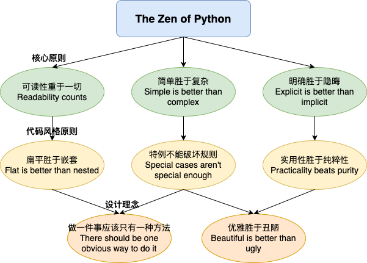

# 【2025技术前瞻】Python征服AI与大模型：从数据分析到全栈开发的无限可能

## 前言

在2025年大模型与AI技术飞速发展的时代，Python作为"AI第一语言"的地位正面临着前所未有的挑战与机遇。随着Java等传统企业级语言对AI领域的强势渗透，Python开发者需要不断拓展技能边界，掌握从数据分析到大模型应用的全栈开发能力，才能在技术变革中保持竞争力。

本文将带您深入探索Python这门语言从诞生到现在的演进历程，剖析其在AI时代的核心竞争力——简洁而强大的语法、丰富的生态系统、对多模态AI的天然支持以及与最新大模型技术的无缝融合能力。无论您是刚接触编程的新手，还是希望转型AI开发的资深工程师，这篇文章都将为您提供全面而深入的Python技术图谱。

我们将按照时间线和应用领域，从Python的诞生讲起，经过数据科学的崛起，到Web开发的革新，再到AI与机器学习的腾飞，最后探讨Python在自动化与系统领域的广泛应用。通过一个综合实战案例，我们将展示Python如何在单一工作流中无缝连接这些领域，打造一个从数据分析到AI预测的完整应用。

接下来我们一起揭开Python这门"最接近伪代码的编程语言"的神秘面纱，探索它如何重塑我们的数字世界。


## 1. Python语言的起源与演进

### 1.1 Python的创始理念：可读性与简洁性的完美结合

1989年的圣诞节假期，荷兰程序员吉多·范罗苏姆（Guido van Rossum）在阿姆斯特丹寻找一个编程项目来打发时间。彼时，他正在参与ABC语言的开发，但对这门语言的某些限制感到不满。于是，他决定创建一个新的脚本语言，这个语言要简单易学，同时又足够强大，能够实现系统编程的各种功能。

范罗苏姆从ABC语言中汲取了重要的设计理念，包括强调缩进和使代码易于阅读，但同时也避免了ABC语言的一些限制。Python的命名取自他喜爱的英国喜剧团体"Monty Python's Flying Circus"，体现了一个重要的理念：**编程应该是有趣的**。

**Python设计哲学的核心原则**

Python的设计哲学，也就是著名的"Python之禅"（可以通过`import this`在Python解释器中查看），强调了几个关键点：

1. **可读性重于一切**：Python认为代码的可读性是最重要的，因为代码读的次数远多于写的次数。这直接影响了Python的语法设计，包括强制缩进、简洁的表达式和清晰的命名约定。

2. **明确胜于隐晦**：Python倾向于使意图明确，而不是隐藏在复杂的语法或隐含的行为中。这使得Python代码通常更易于理解，即使对初学者也是如此。

3. **简单胜于复杂**：Python努力提供解决问题的最简单方法，避免不必要的复杂性。这使得Python成为快速开发和原型设计的理想选择。

4. **"电池已包含"（Batteries Included）**：Python标准库丰富而全面，包含了处理常见任务的模块，使开发者能够"开箱即用"地解决问题。这个理念大大减少了开发者对外部依赖的需求。

**闭坑指南：Python设计理念的实际应用**

初学者在接触Python时，可能会遇到以下几个理解上的"坑"：

1. **缩进即是结构**：不同于使用花括号的语言，Python使用缩进来定义代码块。这是Python强调可读性的具体体现，但初学者可能会遇到缩进不一致导致的语法错误。
   
   * **避坑技巧**：坚持使用一致的缩进（推荐4个空格），利用现代编辑器的自动缩进功能，避免混用制表符和空格。

2. **"一种方法"的误解**：有些人误解了"做一件事应该只有一种方法"这一原则，认为Python限制了编程自由。
   
   * **澄清**：这个原则实际上是指"应该有一种明显的方式"，而不是限制只能有一种实现方式。Python仍然提供了足够的灵活性，但优先考虑清晰和一致性。

3. **被误解的简洁性**：有时候，过于追求代码简洁可能导致可读性下降。
   
   * **经验之谈**：Python的简洁应该服务于可读性，而不是相反。一行能完成的代码不一定是最好的代码，特别是当它变得难以理解时。

```【Python设计哲学图：展示Python之禅的核心理念，包括可读性、简洁性和明确性等关键设计原则】```

### 1.2 Python版本的重要里程碑：从1.0到3.12的演进之路

Python的发展历程可以大致分为三个主要阶段：早期探索阶段、稳定成长阶段和现代转型阶段。每个阶段都带来了重要的变革，塑造了今天我们所使用的Python。

**早期探索阶段（1991-2000）**

这一阶段见证了Python从一个个人项目发展为一个具有社区支持的语言：

* **Python 0.9.0**（1991年2月）是首个公开发布版本，已包含类、函数、异常处理等核心特性，以及模块系统和垃圾回收机制。
* **Python 1.0**（1994年1月）引入了函数式编程工具，如lambda、map、filter和reduce，展示了Python融合多种编程范式的能力。
* **Python 1.5**（1998年1月）添加了更多面向对象特性，如描述符和弱引用，使Python的OOP支持更加完善。

**这一阶段的关键原理：模块系统与包管理**

Python的模块系统是其早期就确立的核心特性，它允许开发者将代码组织成可重用的文件（模块）和目录（包）。这种设计有几个深远的影响：

1. **命名空间隔离**：模块提供了独立的命名空间，避免了不同代码部分之间的名称冲突。
2. **代码组织**：包和模块使代码结构更加清晰，便于维护和协作。
3. **生态系统基础**：模块系统为后来的包管理工具（如pip）和生态系统的蓬勃发展奠定了基础。

**稳定成长阶段（2000-2010）**

这一时期Python逐渐成熟并获得了广泛应用：

* **Python 2.0**（2000年10月）引入了列表推导式、垃圾回收系统和Unicode支持，大大提升了语言的实用性。
* **Python 2.2**（2001年12月）统一了Python的类型和类系统，使得内置类型可以被继承，为后来的面向对象编程奠定了基础。
* **Python 2.4**（2004年11月）引入装饰器和生成器表达式，增强了语言的表达能力。
* **Python 2.7**（2010年7月）是Python 2系列的最后一个主要版本，直到2020年1月才正式结束支持。

**这一阶段的关键原理：生成器与迭代器模式**

Python 2.x时代引入的生成器是一个革命性特性，它改变了Python处理大量数据的方式：

1. **惰性求值**：生成器不会立即计算所有结果，而是按需生成，这在处理大数据集时极为重要。
2. **内存效率**：不需要在内存中一次保存所有结果，大大减少了内存占用。
3. **代码简洁**：使用`yield`关键字，可以用几行代码实现复杂的迭代逻辑。

**闭坑指南：生成器使用的常见陷阱**

1. **一次性消费**：生成器对象只能遍历一次，第二次遍历将不会产生任何值。
   * **解决方法**：如需多次遍历，可以将生成器转换为列表或其他容器类型，或者每次需要时重新创建生成器。

2. **调试困难**：由于惰性求值，生成器中的错误可能直到实际消费该值时才会出现。
   * **解决方法**：在开发阶段，可以先将生成器转换为列表来评估所有值，或使用更好的调试工具。

**现代转型阶段（2008至今）**

Python 3代表了语言的重大革新：

* **Python 3.0**（2008年12月）进行了重大的语言清理，不完全向后兼容，但修复了许多设计缺陷。
* **Python 3.4**（2014年3月）引入了pip作为默认包管理器，asyncio模块支持异步编程，大大简化了并发操作。
* **Python 3.5-3.6**（2015-2016年）添加了类型提示、async/await语法和f-strings，使代码更加清晰和现代化。
* **Python 3.7-3.9**（2018-2020年）进一步改进了数据类、字典操作和类型注解，提升了开发体验。
* **Python 3.10-3.12**（2021-2023年）引入了结构模式匹配、提升了错误信息的可读性，并大幅提升了性能。

**这一阶段的关键原理：Unicode字符串与异步编程**

1. **Unicode默认**：Python 3最重要的变革之一是默认使用Unicode字符串，这解决了Python 2中处理国际化文本的诸多问题。实际上，这一变化反映了更深层次的原理 - 程序应该能够正确处理全球各种语言的文本，而不仅仅是ASCII。

2. **异步编程模型**：从Python 3.4开始，官方标准库提供了`asyncio`，并在3.5中引入了`async/await`语法，这使Python能够高效处理I/O密集型任务：
   * 相比传统多线程，异步编程减少了上下文切换开销
   * 使用协程（coroutine）比使用回调更加直观，避免了所谓的"回调地狱"
   * 现代Web应用和微服务架构从这一模型中获益匪浅

**闭坑指南：Python 3迁移和异步编程常见问题**

1. **Python 2到3的迁移**：虽然Python 2已经停止支持，但仍有一些遗留系统在使用它。
   * **经验分享**：使用`2to3`工具和兼容库（如`six`）可以简化迁移，而不是手动重写所有代码。特别注意`print`语法、字符串处理和除法运算的变化。

2. **异步编程的常见误区**：
   * **误解异步与并行**：异步编程并不自动提供多核并行能力，它主要优化I/O等待时间。
   * **混合同步和异步代码**：在异步函数中调用阻塞操作会阻止整个事件循环，破坏异步的优势。
   * **解决方案**：使用`asyncio.run`作为程序入口点，确保I/O操作都是异步的，必要时使用线程池运行阻塞代码。

```【Python版本演进图：展示Python从早期版本到3.12的主要特性演进时间线，突出重要的特性和改进】```

### 1.3 Python与其他编程语言的对比：为何Python能脱颖而出？

Python在众多编程语言中能够脱颖而出，是多种因素共同作用的结果。下面我们从技术和生态系统角度分析Python成功的关键原因。

**语法优势：简洁而表达力强**

Python的语法设计是其成功的关键因素之一。相比Java、C++等语言，Python代码通常更短、更清晰，这不仅提高了开发效率，也降低了维护成本。

以一个简单的例子来说明，计算1到10的平方并打印结果：

Python：
```python
# 打印1到10的平方（只需一行代码）
print([x**2 for x in range(1, 11)])
```

相比之下，Java需要更多的样板代码：
```java
// Java需要更多的样板代码
import java.util.ArrayList;
import java.util.List;

public class Squares {
    public static void main(String[] args) {
        List<Integer> squares = new ArrayList<>();
        for (int i = 1; i <= 10; i++) {
            squares.add(i * i);
        }
        System.out.println(squares);
    }
}
```

**这一差异背后的原理**：Python的设计采用了"表达式优先"的理念，很多操作都可以表达为简洁的表达式，而不是冗长的语句。列表推导式、生成器表达式、字典和集合推导式都是这一理念的体现。这种设计使代码更接近问题的数学描述，而不是计算机的执行步骤。

**教育友好性：平缓的学习曲线**

Python被设计成"所见即所得"的语言，这使它特别适合初学者：

1. **无需理解复杂概念即可开始**：不像Java需要先理解类和对象，或C++需要理解内存管理，Python允许新手从简单的脚本开始。

2. **交互式解释器**：Python的REPL（Read-Eval-Print Loop）环境允许立即尝试代码并获得反馈，这对学习过程非常有价值。

3. **一致的设计原则**：Python的设计遵循一致的原则，一旦掌握了基础概念，学习新特性变得相对容易。

**多范式支持：灵活而不失一致性**

Python支持多种编程范式，包括：

1. **命令式和过程式编程**：基本的顺序、条件和循环结构。
2. **面向对象编程**：通过类和继承实现。
3. **函数式编程**：支持高阶函数、lambda表达式和纯函数概念。
4. **反射和元编程**：允许程序检查和修改自身结构。

这种灵活性意味着Python可以适应不同的问题领域和编程风格，同时，Python的设计确保了不同范式的使用方式保持一致和可理解。

**闭坑指南：避免多范式带来的陷阱**

1. **过度使用元编程**：Python的反射和元编程能力强大，但过度使用会降低代码可读性。
   * **最佳实践**：仅在真正需要动态行为时使用元编程，大多数情况下，明确的代码更好。

2. **混合范式导致的风格不一致**：在同一项目中混合多种编程范式可能导致维护困难。
   * **解决方法**：为项目选择一种主要范式，其他范式作为补充，并在团队中建立明确的编码规范。

**开放的生态系统：Python的真正力量**

Python成功的一个关键因素是其蓬勃发展的生态系统：

1. **PyPI（Python包索引）**：拥有超过40万个第三方包，几乎覆盖了所有应用领域。

2. **领域特定库**：每个领域都有高质量的专业库，如数据科学的NumPy和Pandas，Web开发的Django和Flask，以及AI的TensorFlow和PyTorch。

3. **社区驱动**：Python的发展由活跃的社区推动，这确保了语言和生态系统能够适应新兴技术和需求。

**经验总结：选择Python的决策因素**

在决定是否为项目选择Python时，可以考虑以下因素：

1. **开发速度vs运行速度**：如果快速开发和原型设计比极致性能更重要，Python是理想选择。

2. **团队熟悉度**：Python的学习曲线平缓，团队可以快速掌握。

3. **生态系统支持**：检查您的领域是否有强大的Python库支持。

4. **集成需求**：Python作为"胶水语言"，在需要集成多种系统和服务时特别有价值。

5. **性能要求**：对于性能关键的部分，可以使用Cython、NumPy或调用C/C++库来优化，而不必完全放弃Python的生产力优势。


```【Python生态系统图：展示Python丰富的生态系统，包括数据科学、Web开发、AI和系统自动化等主要应用领域及核心库】```

### 1.4 开源社区的贡献与PEP流程

Python的成功离不开其活跃的开源社区和治理模式。Python增强提案（PEP，Python Enhancement Proposal）流程是Python语言发展的核心机制，它提供了一种结构化、民主的方式来引入新特性和改进。

**PEP流程的工作原理**

PEP是一个设计文档，提供Python社区信息，或描述Python的新功能、流程或环境改变。PEP流程确保了Python发展的透明性和社区参与：

1. **创建阶段**：任何人都可以提出PEP，描述新特性或改变。提案者需要详细阐述动机、技术规范和实现细节。

2. **讨论阶段**：在python-dev邮件列表或其他论坛上进行广泛讨论，收集反馈和改进建议。这个阶段可能持续数周或数月，特别是对于重大变更。

3. **决策阶段**：最终由"指导委员会"（之前是由Python的"终身仁慈独裁者"Guido van Rossum）做出接受或拒绝的决定。

4. **实现阶段**：一旦PEP被接受，相关功能会被开发并集成到Python中。

这种流程确保了Python在保持创新的同时，不会因为草率的决策而损害其设计完整性。

**重要的PEP示例**

一些特别重要的PEP塑造了Python的发展方向：

- **PEP 8**：Python代码风格指南，成为Python世界的编码规范标准。
- **PEP 20**：Python之禅，以简短的格言总结了Python的设计哲学。
- **PEP 257**：Docstring约定，规范了Python文档字符串的格式。
- **PEP 484**：引入类型提示，允许开发者指定变量、参数和返回值的类型，提高代码可维护性。
- **PEP 3000**：定义了Python 3.0的目标和主要变化，开启了Python 3时代。

**社区贡献的价值**

Python社区的贡献远不止于代码：

1. **教育资源**：大量的教程、书籍和在线课程使Python更容易学习。
2. **解决方案共享**：Stack Overflow和GitHub上的代码示例解决了无数实际问题。
3. **本地化支持**：全球各地的Python社区提供了多语言支持和文档翻译。
4. **企业支持**：大型科技公司投入资源支持Python的开发和维护。

**闭坑指南：参与Python社区**

1. **贡献前先熟悉规范**：在提交代码或文档贡献前，确保熟悉PEP 8等相关标准。
   * **经验建议**：使用工具如`flake8`或`black`自动检查和格式化代码，确保符合规范。

2. **避免重复造轮子**：
   * **最佳实践**：在开发新库或工具前，彻底检索PyPI和GitHub，了解现有解决方案。
   * **如何贡献**：发现现有项目时，考虑贡献改进而不是从头开始。

3. **版本兼容性**：
   * **常见问题**：许多贡献者没有考虑不同Python版本的兼容性。
   * **解决方法**：使用CI/CD工具（如GitHub Actions）在多个Python版本上测试代码。

### 1.5 Python的核心优势与常见挑战

Python作为一种主流编程语言，有着明显的优势，同时也面临一些挑战。理解这些可以帮助开发者更好地利用Python的长处，同时避开或缓解其短处。

**Python的核心优势**

1. **可读性与维护性**：

   Python的清晰语法和强制缩进使代码易于阅读和理解。这种可读性带来的好处不仅仅是审美上的：
   
   * **降低维护成本**：研究表明，程序员花在阅读代码上的时间远多于编写代码，可读性高的语言可以大幅减少理解代码所需的时间。
   * **减少错误**：清晰可读的代码更不容易引入bug，因为逻辑问题更容易被发现。
   * **改善协作**：团队成员更容易理解彼此的代码，促进知识共享和集体所有权。

2. **生产力与开发速度**：

   Python允许开发者用更少的代码实现更多功能：
   
   * **更少的样板代码**：Python减少了声明变量类型、管理内存等方面的样板代码。
   * **丰富的标准库**："电池已包含"的理念意味着许多常见任务不需要额外库。
   * **快速迭代**：解释型语言省去了编译步骤，加快了开发-测试循环。

3. **可扩展性**：

   虽然Python本身是解释型语言，但它的生态系统提供了多种方式来实现性能优化：
   
   * **C/C++扩展**：性能关键部分可以用C/C++编写，然后通过Python的C API集成。
   * **专业化库**：如NumPy提供了底层优化的数组操作，大大加速了数值计算。
   * **即时编译**：PyPy等实现提供了JIT编译器，可以显著提高性能。

4. **多功能性**：

   Python从Web开发到科学计算，从系统脚本到人工智能，应用范围极广：
   
   * **领域适应性**：Python可以作为"粘合剂"连接不同技术和系统。
   * **全栈能力**：一个团队可以使用同一种语言处理从数据库到前端的各种任务。
   * **技能迁移**：开发者可以将Python技能应用到不同领域，提高职业灵活性。

**常见挑战与解决方案**

1. **执行速度**：

   作为解释型语言，Python通常比编译型语言如C++或Java慢。这一挑战的根本原因在于Python的动态特性和运行时类型检查，它们提供了灵活性但牺牲了性能。

   **解决方案与原理**：
   
   * **使用PyPy**：PyPy实现了即时编译（JIT），可以分析代码运行模式并优化热点路径。
   * **Numba加速**：Numba使用LLVM将Python代码编译为优化的机器代码，特别适合数值计算。
   * **Cython整合**：Cython允许添加类型声明并编译为C，解决了动态类型带来的开销。
   * **向量化操作**：使用NumPy等库进行向量化计算，避免Python循环的开销。
   
   **闭坑指南**：
   
   * **先分析后优化**：使用`cProfile`等工具识别真正的性能瓶颈，避免过早优化。
   * **选择合适的工具**：数值计算用Numba，通用优化考虑Cython，如果兼容性不是问题则考虑PyPy。
   * **保持代码可读性**：性能优化不应以牺牲代码清晰度为代价，除非绝对必要。

2. **全局解释器锁（GIL）**：

   GIL是Python解释器中的一个互斥锁，它防止多个线程同时执行Python字节码。这意味着即使在多核系统上，标准CPython也不能真正并行执行Python代码。

   **原理探究**：
   
   * **为什么存在GIL**：GIL简化了内存管理并防止了竞态条件，特别是在处理非线程安全的C扩展时。
   * **影响范围**：GIL主要影响CPU密集型任务，I/O密集型任务受影响较小，因为线程在等待I/O时会释放GIL。
   
   **解决方案**：
   
   * **多进程并行**：使用`multiprocessing`库可以启动多个Python进程，每个进程有自己的GIL。
   * **异步编程**：使用`asyncio`进行异步操作，在等待I/O时执行其他任务。
   * **替代解释器**：某些Python实现（如JPython或IronPython）没有GIL限制。
   
   **经验总结**：
   
   * 对于CPU密集型任务，多进程通常是最佳选择。
   * 对于I/O密集型任务，多线程或异步编程已经足够高效。
   * 混合使用策略：计算密集部分用多进程，I/O密集部分用异步或多线程。

3. **内存使用**：

   Python对象通常比对应的C/C++对象占用更多内存，这在处理大数据集时可能成为限制因素。

   **原理解析**：
   
   * **对象开销**：Python中的每个对象都有类型信息、引用计数等元数据。
   * **动态特性**：为支持动态特性，Python必须存储额外信息。
   * **内存碎片**：Python的垃圾收集可能导致内存碎片。
   
   **解决方案**：
   
   * **使用生成器**：生成器允许数据流式处理，避免一次加载全部数据。
   * **利用NumPy**：NumPy数组比Python列表更内存高效，因为它们存储同质数据。
   * **使用更小的数据类型**：例如，用`numpy.float32`代替`float`可以减少内存使用。
   * **内存映射**：对于超大数据集，使用`mmap`或`numpy.memmap`直接操作磁盘文件。
   
   **闭坑指南**：
   
   * **监控内存使用**：使用工具如`memory_profiler`识别内存占用大的操作。
   * **分批处理数据**：对大数据集，采用批处理而不是一次加载全部。
   * **使用弱引用**：适当情况下使用`weakref`模块避免循环引用导致的内存泄漏。

4. **打包与部署**：

   将Python应用分发给最终用户可能比编译型语言更复杂，因为需要确保目标环境有适当的Python解释器和依赖项。

   **解决方案**：
   
   * **创建独立可执行文件**：使用PyInstaller、cx_Freeze或Nuitka将Python应用打包成独立的可执行文件。
   * **容器化**：使用Docker容器封装应用及其所有依赖，确保一致的运行环境。
   * **Web应用**：将应用作为Web服务提供，用户通过浏览器访问，避免本地安装问题。
   
   **经验总结**：
   
   * **依赖管理关键**：使用`requirements.txt`或`environment.yml`明确记录所有依赖。
   * **考虑目标环境**：部署策略应基于目标用户的技术能力和环境限制。
   * **测试部署包**：在干净的环境中测试部署包，确保所有依赖都被正确包含。

通过理解这些挑战和解决方案，开发者可以更有效地利用Python的优势，同时减轻其局限性带来的影响。Python的设计权衡使其成为一个高生产力的语言，即使它在某些领域可能不是最快的选择。

## 2. Python在数据科学领域的崛起

在2000年代中期，Python在科学计算和数据分析社区中快速崛起，最终超越了当时的主流工具如MATLAB和R语言。这一转变并非偶然，而是由几个关键库和生态系统的发展推动的。

### 2.1 NumPy：科学计算的基石

NumPy（Numerical Python）是Python数据科学生态系统的基础，它于2005年首次发布，由Travis Oliphant开发，基于更早的Numeric和Numarray项目。

**NumPy的核心创新：n维数组对象**

NumPy的核心是ndarray（n维数组）对象，它彻底改变了Python处理数值数据的方式。与Python的内置列表相比，NumPy数组具有以下根本性优势：

1. **内存效率**：NumPy数组在内存中是连续存储的，每个元素占用相同的字节数。这与Python列表形成鲜明对比，Python列表存储的是对象引用，每个元素可能指向不同类型和大小的对象。这种连续存储带来两个关键好处：
   * 减少了内存开销，特别是对于大型数据集
   * 改善了CPU缓存利用率，因为连续内存访问模式更符合现代CPU的设计

2. **计算效率**：NumPy操作被转换为预编译的C代码执行，绕过了Python解释器的开销。这一优化的核心在于：
   * 循环在C层面执行，避免了Python循环的高解释开销
   * 利用了SIMD（单指令多数据）等底层优化
   * 可以利用高度优化的BLAS和LAPACK等数学库

3. **向量化操作**：NumPy的设计鼓励"向量思维"——整体操作数据集，而不是单个元素：
   * 通过消除显式循环，代码变得更简洁
   * 表达复杂的数学运算变得更直观
   * 使算法表述更接近数学符号，提高可读性

**广播机制：NumPy的数学魔法**

NumPy的广播（broadcasting）机制是它最强大也最容易被误解的特性之一。广播允许对不同形状的数组进行算术运算，自动扩展较小的数组以匹配较大的数组。

**广播的工作原理**：

1. **规则一**：如果两个数组的维度数不同，较低维度的数组会被"前缀"一个长度为1的维度，直到两个数组的维度数相同。

2. **规则二**：如果两个数组在某个维度上的大小不匹配，但其中一个维度的大小为1，则该维度会被"拉伸"以匹配另一个数组的大小。

3. **规则三**：如果两个数组在某个维度上的大小既不相等，也不为1，则无法广播，会引发错误。

这种机制极大简化了数据操作代码。例如，可以轻松地将一组温度从摄氏度转换为华氏度，同时处理多个城市和多个时间点：

```python
# 假设temperatures_c形状为(days, cities)
# 广播允许我们对整个数组应用转换公式
temperatures_f = temperatures_c * 9/5 + 32
```

这行代码同时处理了所有城市所有天的温度，无需显式循环，既高效又清晰。

**闭坑指南：NumPy使用中的常见陷阱**

1. **复制vs视图的混淆**

   NumPy操作有时返回数组的视图，有时返回复制，这可能导致意外的行为。

   **原理**：视图共享底层数据，而复制创建独立数据。切片通常创建视图，而布尔索引和高级索引通常创建复制。

   **避坑技巧**：
   * 使用`arr.copy()`明确创建副本，避免意外修改
   * 使用`arr.flags.writeable = False`将重要数组设为只读，防止意外修改
   * 理解哪些操作创建视图，哪些创建复制

2. **维度理解错误**

   处理多维数组时，容易混淆维度的含义和顺序。

   **避坑技巧**：
   * 使用命名变量跟踪维度（如`time_axis = 0, country_axis = 1`）
   * 使用`np.newaxis`或`None`明确添加维度
   * 利用`reshape`和`transpose`调整维度顺序

3. **内存使用规划不当**

   NumPy可以处理大型数据集，但需要谨慎管理内存。

   **经验分享**：
   * 优先使用内置函数而非自定义循环
   * 使用合适的数据类型（如`float32`代替`float64`）可以减少一半内存
   * 对超大数组，考虑内存映射（`np.memmap`）
   * 处理大数据时，先在小样本上测试代码逻辑


```【NumPy性能对比图：展示NumPy数组与Python原生列表在不同规模数据集上的性能对比，突出NumPy的计算效率优势】```

### 2.2 Pandas：让数据分析变得直观高效

Pandas于2008年由Wes McKinney开发，旨在提供高性能、易于使用的数据结构和数据分析工具。它已经成为数据清洗、转换和分析的标准工具，被称为"Python的Excel"。

**Pandas的核心数据结构及其设计原理**

Pandas的设计围绕两个主要数据结构：Series和DataFrame。这些结构的设计融合了关系数据库、统计软件和电子表格的概念：

1. **Series**：一维标签化数组，可以看作是带索引的NumPy数组。它的创新在于：
   * 结合了数组的高效存储和字典的灵活索引
   * 支持数值、字符串甚至混合类型数据
   * 内置处理缺失值的能力（NaN表示）

2. **DataFrame**：二维表格结构，可以看作是多个Series共享同一索引。DataFrame的设计理念是：
   * 将数据组织成类似关系数据库表的形式
   * 每列可以有不同的数据类型
   * 既支持按行索引，也支持按列索引
   * 提供SQL和电子表格式的数据操作方法

**Pandas的数据模型与关系数据库的对比**

Pandas DataFrames与关系数据库表有许多相似之处，但也有重要区别：

| 特性 | Pandas DataFrame | 关系数据库表 |
|------|-----------------|------------|
| 内存位置 | 通常在内存中 | 通常在磁盘上 |
| 数据量限制 | 受RAM限制 | 可以非常大 |
| 查询语言 | Python表达式 | SQL |
| 事务支持 | 无 | 有 |
| 索引速度 | 非常快 | 取决于索引设计 |
| 灵活性 | 高度灵活 | 受模式限制 |

这种设计使Pandas成为探索性数据分析的理想工具，它结合了SQL的强大查询能力与电子表格的交互式体验。

**数据操作与转换的核心原理**

Pandas的数据操作哲学可以概括为"拆分-应用-组合"范式：

1. **拆分**：根据某些条件将数据拆分成组（使用`groupby`）
2. **应用**：对每个组应用函数（使用`agg`、`apply`等）
3. **组合**：将结果重新组合成新的数据结构

这一范式使得复杂的数据转换变得简单直观。例如，计算每个部门的平均薪资：

```python
# 拆分-应用-组合的简单示例
average_salary_by_dept = df.groupby('department')['salary'].mean()
```

**高效数据处理的经验法则**

1. **向量化操作是关键**

   Pandas的设计理念是避免Python循环，优先使用向量化操作。这不仅使代码更简洁，也能显著提升性能。

   **原理**：向量化操作将计算转移到底层优化的C代码，避免了Python解释器的开销。

   **经验总结**：
   * 使用DataFrame的列操作代替行迭代
   * 利用条件选择代替条件循环
   * 熟悉Pandas的函数式API（如`apply`、`map`），但记住它们通常比纯向量操作慢

2. **选择正确的数据访问方法**

   Pandas提供多种访问数据的方法，选择合适的方法对性能影响很大。

   **常见方法比较**：
   * `loc`：基于标签的访问，适合按名称选择
   * `iloc`：基于位置的访问，适合按位置选择
   * `[]`操作符：速度快但语义可能模糊
   * `query()`：字符串表达式查询，适合复杂条件

   **闭坑指南**：
   * 避免混用不同的索引方法，保持一致性
   * 对大型DataFrames，`query()`可能比布尔索引更高效
   * 提前计算和存储频繁使用的索引，避免重复计算

3. **处理大数据集的策略**

   当数据超出内存限制时，Pandas提供了几种应对策略：

   **经验分享**：
   * 使用`chunksize`参数分块读取文件
   * 应用数据类型优化（如使用`categories`类型存储重复字符串）
   * 考虑使用专门的大数据工具，如Dask或Spark，它们提供了类似Pandas的API但支持分布式计算
   * 对于简单任务，有时基于SQL的解决方案更高效

**闭坑指南：Pandas数据分析常见陷阱**

1. **链式操作导致的性能问题**

   连续的方法调用可能导致创建多个中间DataFrame，消耗大量内存。

   **解决方法**：
   * 使用`inplace=True`（谨慎使用，可能导致代码难以理解）
   * 将多个操作组合到一个表达式中
   * 使用`pipe()`方法链接自定义函数

2. **索引操作的隐含成本**

   重新索引或排序可能导致数据复制，特别是对大型DataFrames。

   **避坑技巧**：
   * 在导入数据后立即设置正确的索引，减少后续重新索引
   * 谨慎使用`set_index()`和`reset_index()`，尤其对大型数据集
   * 了解哪些操作会触发重新排序或复制

3. **处理缺失值的常见错误**

   不恰当地处理缺失值会导致数据分析偏差或错误结果。

   **最佳实践**：
   * 理解不同类型的"缺失"：`None`、`np.nan`、`pd.NA`、`pd.NaT`等
   * 在分析前明确检查和处理缺失值
   * 根据具体情况选择合适的缺失值策略（删除、填充均值、插值等）
   * 记录并报告缺失值处理方法，确保分析的透明度


```【Pandas数据处理流程图：展示从原始数据导入到清洗、转换、分析和可视化的完整数据处理流程，强调Pandas在各阶段的作用】```

### 2.3 Matplotlib与数据可视化工具链

数据可视化是数据分析的关键部分，帮助分析师理解数据模式和传达洞察。Python拥有丰富的可视化库，从低级别的Matplotlib到高级别的交互式工具。

**Matplotlib：Python可视化的基础**

Matplotlib是最古老和最基础的Python可视化库，提供了类似MATLAB的绘图API：

```python
import matplotlib.pyplot as plt
import numpy as np

# 创建一些数据
x = np.linspace(0, 2*np.pi, 100)
y = np.sin(x)

# 创建一个简单的图表
plt.figure(figsize=(10, 6))
plt.plot(x, y, label='sin(x)')
plt.plot(x, np.cos(x), label='cos(x)')
plt.title('正弦和余弦函数')
plt.xlabel('x (弧度)')
plt.ylabel('y')
plt.grid(True)
plt.legend()
plt.savefig('trig_functions.png', dpi=300)
plt.show()
```

**Seaborn：统计数据可视化的高级抽象**

Seaborn建立在Matplotlib之上，提供了更高级的统计图表接口：

```python
import seaborn as sns
import matplotlib.pyplot as plt
import pandas as pd
import numpy as np

# 设置风格
sns.set(style="whitegrid")

# 加载示例数据集
tips = sns.load_dataset("tips")

# 创建一个多面板图
g = sns.FacetGrid(tips, col="time", row="sex", margin_titles=True)
g.map(sns.histplot, "total_bill", bins=15)
g.fig.suptitle('按性别和用餐时间划分的账单分布', y=1.05)
plt.tight_layout()
plt.show()

# 创建一个复杂的关系图
plt.figure(figsize=(10, 8))
sns.jointplot(
    data=tips,
    x="total_bill",
    y="tip",
    kind="reg",
    height=8,
    ratio=5,
    marginal_kws=dict(bins=20)
)
plt.suptitle('账单金额与小费关系', y=1.05)
plt.tight_layout()
plt.show()
```

**交互式可视化：面向Web的动态图表**

随着数据分析从桌面向Web迁移，交互式可视化库变得越来越重要：

```python
import plotly.express as px
import pandas as pd

# 加载示例数据
df = px.data.gapminder()

# 创建一个交互式动画散点图
fig = px.scatter(
    df, x="gdpPercap", y="lifeExp", 
    animation_frame="year", animation_group="country",
    size="pop", color="continent", hover_name="country",
    log_x=True, size_max=55, range_x=[100, 100000], range_y=[25, 90],
    title='各国人均GDP与预期寿命关系(1952-2007)'
)

# 显示图表（在Jupyter中）或保存为HTML文件
fig.write_html("gapminder.html")
```

**数据可视化最佳实践**

1. **选择正确的图表类型**：根据数据特性和要传达的信息选择合适的可视化方法。
   - 分类比较：条形图、箱线图
   - 分布：直方图、密度图
   - 关系：散点图、热图
   - 时间序列：线图、面积图

2. **减少认知负担**：简化复杂可视化，突出关键信息。
   - 移除视觉噪音（如过多网格线）
   - 使用清晰的标题和标签
   - 限制使用颜色，确保色彩有目的性

3. **考虑可视化的受众**：为不同的受众调整复杂度和专业术语。


### 2.4 Jupyter生态系统：重塑数据分析工作流

Jupyter项目彻底改变了Python数据分析的工作流程，将代码、输出、可视化和解释性文本整合到单一环境中。

**Jupyter Notebook的革命性影响**

```python
# 这是一个Jupyter Notebook单元格示例
import pandas as pd
import matplotlib.pyplot as plt
import seaborn as sns

# 加载和查看数据
df = pd.read_csv('sample_data.csv')
df.head()  # 在Notebook中直接显示表格输出

# 数据分析
summary = df.describe()
summary  # 直接显示统计摘要

# 可视化
plt.figure(figsize=(10, 6))
sns.histplot(df['value'], kde=True)
plt.title('数据分布')
plt.show()  # 图表直接嵌入在Notebook中
```

Jupyter Notebook创造了一种新的"叙事性数据分析"方法，其中分析和解释密切结合。这种方法的主要优势包括：

1. **探索性编程**：立即看到结果，快速迭代和调整分析。
2. **自文档化**：分析步骤和结果并排，提高可复现性。
3. **知识共享**：轻松分享完整分析过程，而不仅仅是结果。
4. **交互式学习**：理想的教学和学习环境，可以看到代码和结果的直接关系。

**现代Jupyter生态系统**

Jupyter生态系统已经扩展到原始Notebook之外：

1. **JupyterLab**：下一代基于Web的集成开发环境，提供更灵活的界面。
2. **Jupyter Book**：将Notebook转换为静态网站和在线书籍的工具。
3. **Voilà**：将Notebook转换为独立交互式应用程序。
4. **JupyterHub**：多用户Jupyter Notebook服务器，适用于教室和团队。

**实战经验：高效使用Jupyter的技巧**

1. **使用魔法命令**：Jupyter的特殊命令，增强功能。

```python
# 测量执行时间
%%time
import numpy as np
result = np.random.rand(1000000).sum()

# 显示Matplotlib图表
%matplotlib inline

# 在单元格中运行shell命令
!ls -la
```

2. **使用丰富的输出**：超出纯文本的表示。

```python
from IPython.display import HTML, display

# 显示格式化HTML
display(HTML('<h1 style="color:blue;">漂亮的标题</h1>'))

# 创建交互式小部件
from ipywidgets import interact
import matplotlib.pyplot as plt
import numpy as np

@interact(frequency=(1, 10))
def plot_sine(frequency):
    plt.figure(figsize=(10, 4))
    x = np.linspace(0, 10, 1000)
    plt.plot(x, np.sin(frequency * x))
    plt.title(f"正弦波: {frequency} Hz")
    plt.show()
```

3. **结构化Notebook**：保持组织和可维护性。

```python
# 1. 使用Markdown结构化文档
# %%使用单元格魔法将单元格类型更改为Markdown
# %%markdown
# # 数据分析项目
# ## 1. 数据加载与清洗
# 在这一部分，我们将加载数据并处理缺失值。

# 2. 将常用函数放在单独的模块中
# my_utils.py中定义函数
# 在Notebook中导入
from my_utils import preprocess_data, create_features

# 3. 使用目录扩展
# !pip install jupyter_contrib_nbextensions
# !jupyter contrib nbextension install --user
# 然后启用"Table of Contents"扩展
```

通过Jupyter生态系统，Python在数据科学领域的应用变得更加直观和高效，使得数据分析过程更加透明和可重现，这也是Python成为数据科学首选语言的重要原因。 

## 3. Python在Web开发中的地位

Python在Web开发领域的崛起是其多功能性的又一体现。从早期的CGI脚本到现代的高性能异步框架，Python Web开发生态系统经历了显著的演变，成为构建从简单网站到复杂Web应用的强大工具。

### 3.1 早期Web框架的发展：从CGI脚本到现代框架

**CGI时代**：Python Web开发始于20世纪90年代末，当时开发者主要使用CGI（通用网关接口）脚本处理Web请求。

```python
#!/usr/bin/env python
# 早期CGI脚本示例
print("Content-Type: text/html\n")
print("<html><body>")
print("<h1>Hello, Web!</h1>")
print("</body></html>")
```

这种方法简单但效率低下，每个请求都需要启动一个新的Python进程。

**WSGI的革命**：2003年，Python Web服务器网关接口（WSGI，PEP 333）标准化了Web服务器与Python应用程序之间的接口，为现代Web框架奠定了基础。

```python
# 简单的WSGI应用示例
def simple_app(environ, start_response):
    """一个简单的WSGI应用"""
    status = '200 OK'
    headers = [('Content-type', 'text/plain; charset=utf-8')]
    start_response(status, headers)
    
    # 环境变量包含请求信息
    path = environ.get('PATH_INFO', '')
    query = environ.get('QUERY_STRING', '')
    
    response = f"Hello, WSGI!\nPath: {path}\nQuery: {query}"
    return [response.encode('utf-8')]

# 使用示例
if __name__ == '__main__':
    from wsgiref.simple_server import make_server
    httpd = make_server('', 8000, simple_app)
    print("Serving on port 8000...")
    httpd.serve_forever()
```

WSGI成为了Python Web生态系统的关键转折点，使Web框架可以专注于应用逻辑而非服务器接口。

### 3.2 Django：完美主义者的Web框架

Django于2005年首次发布，由Lawrence Journal-World报纸的Web团队开发，旨在满足新闻编辑室的快节奏需求。它很快成为Python中最流行的Web框架，以其"包含电池"的哲学和"不重复自己"(DRY)原则著称。

**Django的核心组件**

1. **ORM（对象关系映射）**：将数据库表映射到Python类。

```python
# models.py - Django数据模型示例
from django.db import models

class Article(models.Model):
    title = models.CharField(max_length=200)
    content = models.TextField()
    published_date = models.DateTimeField(auto_now_add=True)
    views = models.IntegerField(default=0)
    
    def __str__(self):
        return self.title
    
    def summary(self):
        """返回文章内容的摘要"""
        return self.content[:200] + '...' if len(self.content) > 200 else self.content
```

2. **模板系统**：用于生成HTML的强大而灵活的系统。

```html
<!-- base.html - Django模板示例 -->
<!DOCTYPE html>
<html>
<head>
    <title>My Blog</title>
</head>
<body>
    <header>
        <h1>My Tech Blog</h1>
        <nav>
            <a href="">Home</a>
            <a href="">Articles</a>
        </nav>
    </header>
    
    <main>
        
        <!-- 将由子模板填充 -->
        
    </main>
    
    <footer>
        &copy;  My Blog
    </footer>
</body>
</html>
```

3. **URL路由**：将URL模式映射到视图函数。

```python
# urls.py - Django URL路由示例
from django.urls import path
from . import views

app_name = 'blog'
urlpatterns = [
    path('', views.article_list, name='article_list'),
    path('article/<int:pk>/', views.article_detail, name='article_detail'),
    path('article/new/', views.article_new, name='article_new'),
    path('article/<int:pk>/edit/', views.article_edit, name='article_edit'),
]
```

4. **表单处理**：简化HTML表单的处理和验证。

```python
# forms.py - Django表单示例
from django import forms
from .models import Article

class ArticleForm(forms.ModelForm):
    class Meta:
        model = Article
        fields = ('title', 'content')
        
    def clean_title(self):
        """自定义表单验证"""
        title = self.cleaned_data.get('title')
        if len(title) < 5:
            raise forms.ValidationError("标题太短，至少需要5个字符")
        return title
```

5. **管理接口**：自动生成的后台管理界面。

```python
# admin.py - Django管理界面配置
from django.contrib import admin
from .models import Article

@admin.register(Article)
class ArticleAdmin(admin.ModelAdmin):
    list_display = ('title', 'published_date', 'views')
    list_filter = ('published_date',)
    search_fields = ('title', 'content')
    date_hierarchy = 'published_date'
```

**Django的主要优势**

1. **全栈解决方案**：Django提供从数据库到模板的全栈Web开发解决方案。
2. **安全性**：内置保护机制，防止常见安全漏洞如SQL注入、XSS和CSRF攻击。
3. **可扩展性**：丰富的第三方插件生态系统，覆盖从认证到支付处理的各种功能。
4. **文档完善**：详尽的官方文档和活跃的社区支持。

**Django实战案例：构建博客应用的核心功能**

```python
# views.py - Django视图示例
from django.shortcuts import render, get_object_or_404, redirect
from django.contrib.auth.decorators import login_required
from .models import Article
from .forms import ArticleForm

def article_list(request):
    """显示所有文章列表"""
    articles = Article.objects.order_by('-published_date')
    return render(request, 'blog/article_list.html', {'articles': articles})

def article_detail(request, pk):
    """显示单篇文章详情"""
    article = get_object_or_404(Article, pk=pk)
    # 更新文章浏览量
    article.views += 1
    article.save()
    return render(request, 'blog/article_detail.html', {'article': article})

@login_required
def article_new(request):
    """创建新文章"""
    if request.method == "POST":
        form = ArticleForm(request.POST)
        if form.is_valid():
            article = form.save(commit=False)
            article.author = request.user
            article.save()
            return redirect('blog:article_detail', pk=article.pk)
    else:
        form = ArticleForm()
    return render(request, 'blog/article_edit.html', {'form': form})

@login_required
def article_edit(request, pk):
    """编辑现有文章"""
    article = get_object_or_404(Article, pk=pk)
    if request.method == "POST":
        form = ArticleForm(request.POST, instance=article)
        if form.is_valid():
            article = form.save()
            return redirect('blog:article_detail', pk=article.pk)
    else:
        form = ArticleForm(instance=article)
    return render(request, 'blog/article_edit.html', {'form': form})
```

**Django开发的最佳实践**

1. **项目结构化**：将代码分割为小型、专注的应用，而非单一庞大应用。
2. **测试驱动开发**：利用Django的测试框架确保代码质量。
3. **安全最佳实践**：始终使用Django的安全功能，如表单验证和CSRF保护。
4. **数据库优化**：使用select_related()和prefetch_related()减少数据库查询。

```python
# 优化数据库查询示例
# 未优化 - 会导致N+1查询问题
articles = Article.objects.all()
for article in articles:
    print(article.author.username)  # 每次循环都会查询数据库

# 优化 - 使用select_related预先获取关联对象
articles = Article.objects.select_related('author').all()
for article in articles:
    print(article.author.username)  # 不会产生额外查询
```

### 3.3 Flask：轻量级Web框架的成功范式

Flask于2010年发布，由Armin Ronacher创建，采用"微框架"的理念，提供Web开发的核心功能，同时允许开发者选择他们偏好的组件和扩展。

**Flask的核心设计**

1. **极简主义**：核心仅提供路由、请求/响应处理和模板。
2. **可扩展性**：通过扩展机制添加功能，如数据库集成、表单验证和用户认证。
3. **Werkzeug和Jinja2**：基于这两个强大的库构建，提供WSGI工具集和模板引擎。

```python
# 简单的Flask应用示例
from flask import Flask, render_template, request, redirect, url_for

app = Flask(__name__)

# 内存中的简单数据存储
todos = [
    {'id': 1, 'task': '学习Flask基础', 'done': True},
    {'id': 2, 'task': '构建RESTful API', 'done': False},
    {'id': 3, 'task': '部署Web应用', 'done': False}
]

@app.route('/')
def index():
    """显示待办事项列表"""
    return render_template('index.html', todos=todos)

@app.route('/add', methods=['POST'])
def add():
    """添加新待办事项"""
    task = request.form.get('task')
    if task:
        new_id = max(todo['id'] for todo in todos) + 1 if todos else 1
        todos.append({'id': new_id, 'task': task, 'done': False})
    return redirect(url_for('index'))

@app.route('/toggle/<int:todo_id>')
def toggle(todo_id):
    """切换待办事项的完成状态"""
    for todo in todos:
        if todo['id'] == todo_id:
            todo['done'] = not todo['done']
            break
    return redirect(url_for('index'))

@app.route('/delete/<int:todo_id>')
def delete(todo_id):
    """删除待办事项"""
    global todos
    todos = [todo for todo in todos if todo['id'] != todo_id]
    return redirect(url_for('index'))

if __name__ == '__main__':
    app.run(debug=True)
```

**Flask与SQLAlchemy集成示例**

```python
# 使用SQLAlchemy的Flask应用
from flask import Flask, render_template, request, redirect, url_for
from flask_sqlalchemy import SQLAlchemy

app = Flask(__name__)
app.config['SQLALCHEMY_DATABASE_URI'] = 'sqlite:///todos.db'
app.config['SQLALCHEMY_TRACK_MODIFICATIONS'] = False
db = SQLAlchemy(app)

class Todo(db.Model):
    id = db.Column(db.Integer, primary_key=True)
    task = db.Column(db.String(200), nullable=False)
    done = db.Column(db.Boolean, default=False)
    
    def __repr__(self):
        return f'<Todo {self.id}: {self.task}>'

with app.app_context():
    db.create_all()

@app.route('/')
def index():
    todos = Todo.query.all()
    return render_template('index.html', todos=todos)

@app.route('/add', methods=['POST'])
def add():
    task = request.form.get('task')
    if task:
        new_todo = Todo(task=task)
        db.session.add(new_todo)
        db.session.commit()
    return redirect(url_for('index'))

@app.route('/toggle/<int:todo_id>')
def toggle(todo_id):
    todo = Todo.query.get_or_404(todo_id)
    todo.done = not todo.done
    db.session.commit()
    return redirect(url_for('index'))

@app.route('/delete/<int:todo_id>')
def delete(todo_id):
    todo = Todo.query.get_or_404(todo_id)
    db.session.delete(todo)
    db.session.commit()
    return redirect(url_for('index'))

if __name__ == '__main__':
    app.run(debug=True)
```

**Flask的优势**

1. **学习曲线平缓**：简单的API，易于入门和理解。
2. **灵活性**：可以根据项目需求选择组件，避免不必要的复杂性。
3. **适合API开发**：轻量级设计使其非常适合构建RESTful API。
4. **适合小型到中型项目**：对于原型设计和中小型应用程序特别有效。

**Flask开发的最佳实践**

1. **应用工厂模式**：使用工厂函数创建应用实例，有助于测试和管理配置。

```python
# app/__init__.py
from flask import Flask
from config import config

def create_app(config_name='default'):
    app = Flask(__name__)
    app.config.from_object(config[config_name])
    
    # 初始化扩展
    from . import db
    db.init_app(app)
    
    # 注册蓝图
    from .main import main as main_blueprint
    app.register_blueprint(main_blueprint)
    
    return app
```

2. **蓝图组织代码**：使用蓝图将应用分割为逻辑组件。

```python
# app/main/__init__.py
from flask import Blueprint

main = Blueprint('main', __name__)

from . import views, errors
```

3. **适当使用扩展**：为常见功能使用社区认可的扩展，如Flask-Login用于用户认证。

```python
# 使用Flask-Login进行用户认证
from flask_login import LoginManager, UserMixin, login_user, logout_user

login_manager = LoginManager()
login_manager.init_app(app)

@login_manager.user_loader
def load_user(user_id):
    return User.query.get(int(user_id))
```


```【Python_Web开发框架对比图：比较两个框架的设计理念、应用场景和开发方式，突出各自的优缺点】```

### 3.4 异步框架的兴起：从Tornado到FastAPI

随着Web应用的规模和复杂性增长，对更高性能和并发处理能力的需求催生了Python异步Web框架的兴起。

**异步编程的基础**

Python 3.4引入的asyncio库为异步编程提供了基础：

```python
import asyncio

async def hello_world():
    print("Hello")
    await asyncio.sleep(1)  # 非阻塞等待
    print("World")

# 运行协程
asyncio.run(hello_world())
```

**Tornado：早期的异步Web框架**

Tornado是Python最早的异步Web框架之一，最初由FriendFeed开发（后被Facebook收购）：

```python
# Tornado异步Web应用示例
import tornado.ioloop
import tornado.web
import tornado.httpclient
import json

class MainHandler(tornado.web.RequestHandler):
    async def get(self):
        self.write("Hello, World!")

class WeatherHandler(tornado.web.RequestHandler):
    async def get(self, city):
        # 异步HTTP请求
        http_client = tornado.httpclient.AsyncHTTPClient()
        response = await http_client.fetch(
            f"https://api.example.com/weather/{city}"
        )
        weather_data = json.loads(response.body)
        self.write(f"Weather in {city}: {weather_data['temperature']}°C")

def make_app():
    return tornado.web.Application([
        (r"/", MainHandler),
        (r"/weather/([^/]+)", WeatherHandler),
    ])

if __name__ == "__main__":
    app = make_app()
    app.listen(8888)
    tornado.ioloop.IOLoop.current().start()
```

**FastAPI：现代异步Web框架**

FastAPI是一个相对较新（2018年）但快速流行的框架，结合了高性能、类型提示和自动文档生成：

```python
# FastAPI示例
from fastapi import FastAPI, HTTPException, Depends, status
from pydantic import BaseModel
from typing import List, Optional
import httpx

app = FastAPI(title="Task API")

# 数据模型
class TaskBase(BaseModel):
    title: str
    description: Optional[str] = None
    completed: bool = False

class TaskCreate(TaskBase):
    pass

class Task(TaskBase):
    id: int
    
    class Config:
        orm_mode = True

# 数据存储
tasks_db = [
    Task(id=1, title="学习FastAPI", completed=True),
    Task(id=2, title="构建REST API", completed=False),
]

@app.get("/tasks/", response_model=List[Task])
async def read_tasks(skip: int = 0, limit: int = 100):
    return tasks_db[skip : skip + limit]

@app.get("/tasks/{task_id}", response_model=Task)
async def read_task(task_id: int):
    for task in tasks_db:
        if task.id == task_id:
            return task
    raise HTTPException(status_code=404, detail="Task not found")

@app.post("/tasks/", response_model=Task, status_code=status.HTTP_201_CREATED)
async def create_task(task: TaskCreate):
    new_id = max(t.id for t in tasks_db) + 1 if tasks_db else 1
    new_task = Task(id=new_id, **task.dict())
    tasks_db.append(new_task)
    return new_task

@app.get("/weather/{city}")
async def get_weather(city: str):
    """异步调用外部API示例"""
    async with httpx.AsyncClient() as client:
        response = await client.get(f"https://api.example.com/weather/{city}")
        if response.status_code != 200:
            raise HTTPException(status_code=response.status_code, 
                               detail="Weather service error")
        return response.json()
```

**异步框架的主要优势**

1. **高并发处理**：能够以较少的资源处理更多的并发连接。
2. **改进的响应时间**：非阻塞I/O操作减少了请求等待时间。
3. **资源效率**：与多线程或多进程相比，异步编程的内存占用更小。

**异步Web开发的挑战与最佳实践**

1. **心智模型复杂性**：异步编程需要不同的思维方式。

```python
# 异步思维陷阱示例
async def get_user_data():
    # 错误：在异步函数中使用阻塞I/O
    import requests  # 阻塞库
    response = requests.get('https://api.example.com/users')  # 这会阻塞事件循环!
    return response.json()

# 正确的方式
async def get_user_data_correctly():
    import httpx  # 支持异步的HTTP客户端
    async with httpx.AsyncClient() as client:
        response = await client.get('https://api.example.com/users')
        return response.json()
```

2. **混合同步和异步代码**：需要谨慎处理。

```python
# 混合同步和异步代码的技巧
import asyncio
from concurrent.futures import ThreadPoolExecutor

# 将同步函数包装为异步函数
async def run_in_executor(func, *args, **kwargs):
    loop = asyncio.get_event_loop()
    executor = ThreadPoolExecutor()
    return await loop.run_in_executor(
        executor,
        lambda: func(*args, **kwargs)
    )

# 使用示例
def cpu_bound_task(x):
    # 同步CPU密集型任务
    result = 0
    for i in range(10**7):
        result += i * x
    return result

async def main():
    # 在单独的线程中运行CPU密集型任务
    result = await run_in_executor(cpu_bound_task, 2)
    print(f"计算结果: {result}")

asyncio.run(main())
```

3. **调试复杂性**：异步代码的调试通常更具挑战性。

### 3.5 Python Web生态系统的现状与未来趋势

Python Web开发生态系统继续演进，几个明显的趋势正在塑造其未来：

**微服务架构**：将单体应用分解为独立服务的趋势。

```python
# FastAPI微服务示例
from fastapi import FastAPI, HTTPException
import httpx

app = FastAPI(title="Product Service")

@app.get("/products/{product_id}")
async def get_product(product_id: int):
    # 产品服务的核心功能
    product = {"id": product_id, "name": "示例产品", "price": 99.99}
    
    # 与其他微服务通信
    async with httpx.AsyncClient() as client:
        # 调用库存服务
        try:
            inventory_response = await client.get(
                f"http://inventory-service/inventory/{product_id}",
                timeout=2.0
            )
            inventory = inventory_response.json()
            product["in_stock"] = inventory["available"] > 0
        except (httpx.RequestError, httpx.HTTPStatusError):
            # 服务降级 - 返回默认值
            product["in_stock"] = None
    
    return product
```

**API优先设计**：构建面向API的应用程序作为前端和移动应用的后端。

**无服务器架构**：使用AWS Lambda等服务部署Python Web功能，无需管理服务器。

```python
# AWS Lambda函数示例
import json

def lambda_handler(event, context):
    """
    AWS Lambda处理函数，响应API Gateway请求
    """
    # 解析请求参数
    path_parameters = event.get('pathParameters', {})
    product_id = path_parameters.get('productId') if path_parameters else None
    
    if not product_id:
        return {
            'statusCode': 400,
            'body': json.dumps({'error': '缺少产品ID'})
        }
    
    # 实际应用中，这里会查询数据库
    product = {
        'id': product_id,
        'name': f'产品 {product_id}',
        'price': 99.99,
        'description': '这是一个示例产品'
    }
    
    return {
        'statusCode': 200,
        'headers': {
            'Content-Type': 'application/json'
        },
        'body': json.dumps(product)
    }
```

**GraphQL的采用**：作为REST API的替代方案，允许客户端指定所需的确切数据。

```python
# 使用Strawberry实现的GraphQL API
import strawberry
import typing

@strawberry.type
class Book:
    id: int
    title: str
    author: str
    published_year: int

# 内存中的图书数据库
books_db = [
    Book(id=1, title="Python编程", author="张三", published_year=2020),
    Book(id=2, title="Web开发实战", author="李四", published_year=2021),
    Book(id=3, title="数据科学入门", author="王五", published_year=2019)
]

@strawberry.type
class Query:
    @strawberry.field
    def books(self) -> typing.List[Book]:
        return books_db
    
    @strawberry.field
    def book(self, book_id: int) -> typing.Optional[Book]:
        for book in books_db:
            if book.id == book_id:
                return book
        return None

schema = strawberry.Schema(query=Query)

# 在FastAPI中使用
from fastapi import FastAPI
from strawberry.fastapi import GraphQLRouter

graphql_app = GraphQLRouter(schema)

app = FastAPI()
app.include_router(graphql_app, prefix="/graphql")
```

**Web Assembly集成**：允许在浏览器中运行高性能Python代码。

Python Web开发的未来将继续由这些趋势和框架的演进驱动，提供更高的性能、更好的开发者体验和更广泛的应用场景。 

## 4. Python在AI与机器学习领域的腾飞

Python在人工智能和机器学习领域的主导地位是其发展历史中最引人注目的成就之一。这一领域Python成为首选语言并非偶然，而是由多种因素共同促成的结果。

### 4.1 机器学习生态系统：从Scikit-learn到深度学习框架

Python在机器学习领域的崛起始于Scikit-learn库的出现，并随着深度学习的爆发而达到巅峰。这一演进过程展示了Python如何逐渐成为AI开发的主要语言。

**Scikit-learn：统一的机器学习接口**

Scikit-learn于2007年首次发布，由David Cournapeau作为Google Summer of Code项目开发，后来由INRIA等机构的研究人员接手维护。它的设计哲学基于几个关键原则：

1. **一致的API设计**：所有算法遵循相同的接口模式（fit/transform/predict），使开发者可以轻松切换不同算法，而无需重写大量代码。

2. **完整的机器学习流程支持**：从特征提取、预处理、模型选择到模型评估，Scikit-learn提供了完整的工具链。

3. **不依赖深度学习**：专注于传统机器学习算法，如线性模型、决策树、支持向量机等，为数据科学提供了坚实基础。

**典型机器学习工作流的原理解析**

一个标准的机器学习项目通常包含以下步骤，每个步骤都有其深层次的原理：

1. **数据准备**：原始数据很少直接适用于机器学习，通常需要清洗和转换。
   * **原理**：确保数据质量和特征相关性，减少噪声和偏差。
   * **关键技术**：缺失值处理、异常值检测、特征编码和标准化。

2. **特征工程**：将原始数据转换为机器学习算法可以有效利用的特征。
   * **原理**：好的特征可以简化模型复杂度并提高泛化能力。
   * **方法**：特征选择、降维、多项式扩展等。

3. **模型训练与评估**：选择合适的算法并评估其性能。
   * **原理**：不同算法有不同的归纳偏置，适合不同类型的问题。
   * **关键概念**：交叉验证、偏差-方差权衡、过拟合预防。

4. **模型部署**：将训练好的模型集成到实际应用中。
   * **原理**：模型需要在生产环境中可靠高效地运行。
   * **考虑因素**：计算需求、延迟、可维护性和监控。

**闭坑指南：机器学习项目常见陷阱**

1. **数据泄露（Data Leakage）**

   **问题**：测试数据的信息不当地泄露到训练过程中，导致模型评估过于乐观。
   
   **原因**：常见原因包括在整个数据集上进行特征标准化，或使用未来信息训练模型。
   
   **避坑方法**：
   * 严格分离训练、验证和测试数据
   * 在交叉验证的每个折叠内独立进行特征工程
   * 使用时间序列交叉验证处理时间相关数据
   
   ```python
   # 错误示例：在分割前进行标准化
   X_scaled = StandardScaler().fit_transform(X)
   X_train, X_test = train_test_split(X_scaled, y)
   
   # 正确方法：先分割，再标准化
   X_train, X_test, y_train, y_test = train_test_split(X, y)
   scaler = StandardScaler().fit(X_train)
   X_train_scaled = scaler.transform(X_train)
   X_test_scaled = scaler.transform(X_test)
   ```

2. **特征选择陷阱**

   **问题**：错误的特征选择方法可能导致过拟合或丢失重要信息。
   
   **原理**：特征选择应该基于数据的内在特性和与目标变量的关系，而不仅仅是统计相关性。
   
   **经验建议**：
   * 结合领域知识和统计方法选择特征
   * 使用多种特征选择技术并比较结果
   * 考虑特征间的相互作用，而不仅是单独评估
   * 在验证集上评估特征选择的影响

3. **评估指标选择不当**

   **问题**：选择不适合问题特性的评估指标，导致模型优化偏离实际目标。
   
   **原理**：不同的评估指标反映模型性能的不同方面，应根据业务需求选择。
   
   **闭坑经验**：
   * 对不平衡分类问题，准确率可能误导，考虑精确率、召回率、F1值或AUC
   * 对回归问题，MSE对异常值敏感，可考虑MAE或MAPE
   * 将模型评估与业务影响联系起来，不仅关注统计指标
   * 使用多个互补的评估指标全面评估模型

**深度学习框架的崛起：从Theano到TensorFlow和PyTorch**

深度学习在2010年代的爆发式增长极大地改变了AI领域，也巩固了Python的主导地位。这一发展历程可以追溯到几个关键框架：

1. **Theano**（2008）：最早的符号计算框架之一，由蒙特利尔大学开发，为后来的框架奠定了基础。

2. **TensorFlow**（2015）：由Google开发的端到端机器学习平台，引入了静态计算图的概念，专注于生产部署和扩展性。

3. **PyTorch**（2016）：由Facebook AI Research开发，采用动态计算图，更加注重灵活性和易用性，特别受研究社区欢迎。

4. **其他框架**：包括Keras（现已集成到TensorFlow）、MXNet和JAX等，各有特点和应用场景。

**深度学习框架的核心原理对比**

不同深度学习框架在设计理念上有明显差异，理解这些差异有助于选择适合特定项目的工具：

| 特性 | TensorFlow | PyTorch |
|------|------------|---------|
| 计算图 | 最初是静态（定义后执行），TF 2.0后支持动态 | 动态（边定义边执行） |
| 调试难度 | 早期版本较难，2.0后改善 | 相对简单，类似普通Python代码 |
| 部署便利性 | 非常强大，支持多平台 | 改进中，但不如TF成熟 |
| 研究友好度 | 较好 | 极佳 |
| 社区支持 | 庞大，特别是工业界 | 迅速增长，学术界尤为活跃 |

**计算图原理**：深度学习框架的核心是计算图，即将数学运算表示为有向图，节点是操作，边是数据流。

* **静态图**（TensorFlow 1.x）：先定义整个计算图，然后一次性执行。优点是可优化整个图的执行，缺点是灵活性受限。
* **动态图**（PyTorch，TF 2.x Eager）：操作立即执行，图在运行时构建。优点是直观、易调试，缺点是可能失去某些优化机会。

**经验总结：框架选择指南**

1. **项目需求导向**：
   * 研究项目和快速原型设计 → PyTorch
   * 生产部署和跨平台应用 → TensorFlow
   * 需兼顾研究和生产 → 两者都可以考虑

2. **团队经验**：与其追求"最新最好"的框架，不如选择团队已熟悉的工具。

3. **生态系统考量**：评估模型共享、预训练资源和专业领域库的可用性。
   


### 4.2 神经网络与深度学习基础

神经网络是深度学习的核心，它从人脑的结构中获取灵感，通过组合简单的计算单元（神经元）来模拟复杂的函数。虽然概念早在20世纪40年代就已提出，但直到近年来计算能力的提升和算法的改进，深度神经网络才实现了突破性的成功。

**神经网络的基本原理：从感知机到多层网络**

神经网络的演进可以追溯到以下几个关键阶段：

1. **感知机**（1958）：最早的神经网络模型，由Frank Rosenblatt提出，只能学习线性可分的问题。
   * **原理**：单个神经元接收多个输入，每个输入有一个权重，神经元将输入与权重的加权和传递给激活函数，产生输出。
   * **局限性**：无法解决XOR等非线性问题，这一局限在1969年由Minsky和Papert指出，导致神经网络研究一度停滞。

2. **多层感知机（MLP）**：通过添加隐藏层克服了感知机的局限。
   * **原理**：多个神经元层叠加，使网络能够学习非线性映射。
   * **反向传播算法**：1986年由Rumelhart等人正式提出，解决了如何训练多层网络的关键问题。
   * **工作机制**：利用链式法则计算损失函数对每个权重的梯度，然后使用梯度下降逐步调整权重。

**反向传播的深层原理**

反向传播是神经网络训练的核心算法，其核心思想看似简单，但实现细节复杂而精妙：

1. **前向传播**：输入数据通过网络前向传递，每一层根据上一层的输出和当前层的权重计算激活值。

2. **损失计算**：比较网络输出与期望输出，计算损失（如均方误差或交叉熵）。

3. **反向传播**：从输出层开始，向输入层反向计算每个权重对损失的影响（梯度）：
   * 利用链式法则将损失对输出的梯度传播到每个权重
   * 关键在于每一步都可以重用前一步的计算结果，使算法高效可行
   * 这一过程本质上是解决了"信用分配问题"——确定每个权重对最终错误的贡献

4. **权重更新**：使用优化器（如SGD、Adam等）根据梯度更新权重：
   * w_new = w_old - learning_rate * gradient

**神经网络的构建块：理解不同层的功能与原理**

现代神经网络由多种特殊功能的层组成，每种层都有独特的数学原理和用途：

1. **全连接层（Dense）**：最基本的层类型，每个输入连接到每个输出。
   * **原理**：实现线性变换 y = Wx + b，其中W是权重矩阵，b是偏置向量
   * **应用**：通常用于网络的最后几层，执行最终的特征整合和分类

2. **激活函数**：引入非线性，使网络能学习复杂模式。
   * **常见选择**：ReLU（修正线性单元）、Sigmoid、Tanh等
   * **选择原则**：ReLU计算高效且缓解梯度消失问题，现已成为隐藏层的默认选择；Sigmoid/Softmax常用于输出层

3. **卷积层**：专为处理网格状数据（如图像）设计。
   * **原理**：利用局部感受野和权重共享，显著减少参数数量
   * **工作机制**：使用滑动窗口（卷积核）在输入上移动，执行点积操作
   * **优势**：能有效捕捉空间结构和局部特征，对位置变化具有一定不变性

4. **池化层**：减少空间维度，提高计算效率和鲁棒性。
   * **原理**：在局部区域内执行下采样操作（如最大值或平均值）
   * **作用**：减少参数量，控制过拟合，增加位置不变性

5. **批归一化层**：稳定训练过程，加速收敛。
   * **原理**：将每个批次的输入标准化为均值0、方差1，然后进行线性变换
   * **好处**：减轻内部协变量偏移问题，允许使用更高的学习率，减少对初始化的敏感性

**闭坑指南：神经网络训练的常见问题及解决方案**

1. **梯度消失/爆炸**

   **问题**：在深层网络中，梯度可能变得极小（消失）或极大（爆炸），导致训练停滞或不稳定。
   
   **原理**：反向传播中，梯度通过链式法则相乘，当网络很深时，多个小于1的数相乘会趋近于0，多个大于1的数相乘会趋近于无穷大。
   
   **解决方法**：
   * 使用ReLU及其变体（Leaky ReLU、ELU等）代替Sigmoid激活函数
   * 采用残差连接（ResNet）或密集连接（DenseNet）
   * 实施批归一化或层归一化
   * 使用梯度裁剪防止梯度爆炸
   * 采用合适的权重初始化方法（如He初始化、Xavier初始化）

2. **过拟合**

   **问题**：模型在训练数据上表现极佳，但泛化能力差。
   
   **原因**：模型复杂度过高，参数过多，或训练数据不足。
   
   **解决策略**：
   * 使用正则化技术：L1/L2正则化、Dropout
   * 数据增强：对训练数据应用随机变换
   * 提前停止：当验证错误不再改善时停止训练
   * 减少模型复杂度：使用更少的层或神经元
   * 使用集成方法：结合多个模型的预测

3. **学习率选择不当**

   **问题**：学习率过大导致不稳定，过小导致收敛缓慢。
   
   **原理**：学习率控制每次梯度更新的步长，影响优化过程的收敛速度和稳定性。
   
   **经验总结**：
   * 使用学习率调度策略：学习率预热、阶梯式下降、余弦退火等
   * 采用自适应优化器（Adam、RMSprop等）减轻对学习率选择的敏感性
   * 实施学习率搜索（如学习率范围测试）找到最佳起始值

4. **批次大小选择**

   **问题**：批次大小影响训练稳定性、速度和最终精度。
   
   **权衡考量**：
   * 大批次：计算效率高，梯度估计准确，但可能陷入锐利的局部最小值
   * 小批次：训练更不稳定，但往往具有更好的泛化性能
   * 内存限制：大批次需要更多GPU内存
   
   **实用建议**：
   * 从中等大小开始（32-256），根据资源和结果调整
   * 使用积累梯度技术模拟更大批次
   * 当增大批次大小时，考虑适当增加学习率

## 5. Python在自动化和系统开发中的应用

除了在数据科学、Web开发和AI领域的广泛应用外，Python也是自动化脚本和系统开发的理想选择。其简洁的语法和丰富的库使得Python成为系统管理员和开发运维（DevOps）工程师的首选工具。

### 5.1 系统脚本与自动化

Python的跨平台特性和强大的标准库使其成为系统自动化的理想选择。

**文件系统操作**

Python提供了丰富的文件和目录操作功能：

```python
import os
import shutil
import glob

# 列出目录内容
files = os.listdir('.')
print(f"当前目录文件: {files}")

# 创建目录
os.makedirs('backup/data', exist_ok=True)

# 复制文件
shutil.copy2('config.ini', 'backup/config.ini')

# 使用模式匹配查找文件
log_files = glob.glob('logs/*.log')
print(f"日志文件: {log_files}")

# 批量重命名文件
for i, filename in enumerate(glob.glob('data/*.txt')):
    new_name = f'data/file_{i:03d}.txt'
    os.rename(filename, new_name)
    print(f"重命名: {filename} -> {new_name}")
```

**自动化系统任务**

Python可以执行系统命令并处理其输出：

```python
import subprocess
import platform

# 获取系统信息
print(f"操作系统: {platform.system()} {platform.release()}")
print(f"Python版本: {platform.python_version()}")

# 执行系统命令
if platform.system() == 'Windows':
    result = subprocess.run(['ipconfig'], capture_output=True, text=True)
else:
    result = subprocess.run(['ifconfig'], capture_output=True, text=True)

print("网络配置信息:")
print(result.stdout)

# 高级命令执行
proc = subprocess.Popen(
    ['ping', 'google.com', '-c', '3'],
    stdout=subprocess.PIPE,
    text=True
)

# 实时处理输出
for line in proc.stdout:
    print(f"Ping结果: {line.strip()}")
```

**定时任务和监控**

使用Python创建定时任务和监控系统状态：

```python
import time
import psutil
import schedule
import logging
from datetime import datetime

# 配置日志
logging.basicConfig(
    level=logging.INFO,
    format='%(asctime)s - %(levelname)s - %(message)s',
    filename='system_monitor.log'
)

def monitor_system():
    """监控系统资源使用情况并记录"""
    cpu = psutil.cpu_percent(interval=1)
    memory = psutil.virtual_memory().percent
    disk = psutil.disk_usage('/').percent
    
    logging.info(f"CPU: {cpu}% | 内存: {memory}% | 磁盘: {disk}%")
    
    # 如果资源使用过高，发出警告
    if cpu > 90 or memory > 90 or disk > 90:
        logging.warning(f"资源使用率高! CPU: {cpu}% | 内存: {memory}% | 磁盘: {disk}%")

def cleanup_temp_files():
    """清理临时文件"""
    count = 0
    for file in glob.glob('/tmp/*.tmp'):
        if (datetime.now().timestamp() - os.path.getctime(file)) > 86400:  # 24小时
            os.remove(file)
            count += 1
    logging.info(f"已清理{count}个过期临时文件")

# 设置定时任务
schedule.every(5).minutes.do(monitor_system)
schedule.every().day.at("01:00").do(cleanup_temp_files)

print("系统监控已启动，按Ctrl+C停止...")
try:
    while True:
        schedule.run_pending()
        time.sleep(1)
except KeyboardInterrupt:
    print("系统监控已停止")
```

### 5.2 DevOps与基础设施自动化

Python已成为DevOps工程师的重要工具，帮助自动化部署、配置和监控。

**配置管理**

使用Python读取和修改配置文件：

```python
import configparser
import json
import yaml

# 处理INI配置文件
config = configparser.ConfigParser()
config.read('app_config.ini')

# 读取配置
database_host = config['Database']['Host']
database_port = config.getint('Database', 'Port')
print(f"数据库连接: {database_host}:{database_port}")

# 修改配置
config['Database']['MaxConnections'] = '100'
with open('app_config.ini', 'w') as f:
    config.write(f)

# 处理JSON配置
with open('config.json', 'r') as f:
    json_config = json.load(f)

print(f"API端点: {json_config['api']['endpoint']}")
json_config['api']['timeout'] = 30

with open('config.json', 'w') as f:
    json.dump(json_config, f, indent=2)

# 处理YAML配置
with open('config.yaml', 'r') as f:
    yaml_config = yaml.safe_load(f)

print(f"日志级别: {yaml_config['logging']['level']}")
yaml_config['logging']['file'] = 'app.log'

with open('config.yaml', 'w') as f:
    yaml.dump(yaml_config, f)
```

**容器化与自动部署**

使用Python操作Docker容器：

```python
import docker

# 连接到Docker
client = docker.from_env()

# 列出所有容器
containers = client.containers.list(all=True)
print("当前容器:")
for container in containers:
    print(f"ID: {container.short_id} | 名称: {container.name} | 状态: {container.status}")

# 启动容器
try:
    container = client.containers.run(
        "nginx:latest",
        name="web-server",
        ports={'80/tcp': 8080},
        detach=True
    )
    print(f"已启动Nginx容器: {container.short_id}")
except docker.errors.APIError as e:
    print(f"启动容器失败: {e}")

# 监控容器状态
for container in client.containers.list():
    stats = container.stats(stream=False)
    print(f"容器 {container.name} CPU: {stats['cpu_stats']['cpu_usage']['total_usage']}")
    
# 停止并移除容器
for container in client.containers.list(filters={"name": "web-server"}):
    print(f"停止容器: {container.name}")
    container.stop()
    container.remove()
    print(f"容器已移除: {container.name}")
```

**CI/CD自动化**

使用Python创建简单的CI/CD流程：

```python
import os
import subprocess
import requests
import time

def run_tests():
    """运行单元测试"""
    print("正在运行测试...")
    result = subprocess.run(['pytest', '-xvs'], capture_output=True, text=True)
    if result.returncode != 0:
        print("测试失败:")
        print(result.stdout)
        return False
    print("测试通过!")
    return True

def build_package():
    """构建软件包"""
    print("正在构建软件包...")
    result = subprocess.run(['python', 'setup.py', 'sdist'], capture_output=True, text=True)
    if result.returncode != 0:
        print("构建失败:")
        print(result.stdout)
        return False
    print("构建成功!")
    return True

def deploy_to_staging():
    """部署到测试环境"""
    print("正在部署到测试环境...")
    # 模拟部署过程
    time.sleep(2)
    print("已部署到测试环境!")
    return True

def run_integration_tests():
    """运行集成测试"""
    print("正在运行集成测试...")
    # 向测试环境发送测试请求
    try:
        response = requests.get('http://staging-server/health')
        if response.status_code == 200 and response.json()['status'] == 'ok':
            print("集成测试通过!")
            return True
        else:
            print(f"集成测试失败! 状态码: {response.status_code}")
            return False
    except Exception as e:
        print(f"集成测试失败! 错误: {e}")
        return False

def deploy_to_production():
    """部署到生产环境"""
    print("正在部署到生产环境...")
    # 模拟生产部署
    time.sleep(3)
    print("已部署到生产环境!")
    return True

def ci_cd_pipeline():
    """完整的CI/CD流程"""
    print("启动CI/CD流程...")
    
    # CI部分: 测试和构建
    if not run_tests():
        print("CI/CD失败: 单元测试未通过")
        return False
    
    if not build_package():
        print("CI/CD失败: 构建失败")
        return False
    
    # CD部分: 部署和验证
    if not deploy_to_staging():
        print("CI/CD失败: 部署到测试环境失败")
        return False
    
    if not run_integration_tests():
        print("CI/CD失败: 集成测试未通过")
        return False
    
    if not deploy_to_production():
        print("CI/CD失败: 部署到生产环境失败")
        return False
    
    print("CI/CD流程成功完成!")
    return True

# 执行CI/CD流程
if __name__ == "__main__":
    ci_cd_pipeline()
```

### 5.3 网络编程与API集成

Python提供了强大的网络编程能力，使其成为API集成和网络自动化的理想选择。

**HTTP客户端与API交互**

```python
import requests
import json

# 基本GET请求
response = requests.get('https://api.github.com/users/python')
user_data = response.json()
print(f"用户名: {user_data['login']}")
print(f"仓库数: {user_data['public_repos']}")

# 带参数的GET请求
params = {'q': 'python', 'sort': 'stars', 'order': 'desc'}
response = requests.get('https://api.github.com/search/repositories', params=params)
search_results = response.json()
print(f"找到{search_results['total_count']}个仓库")

# 前5个最受欢迎的Python仓库
for i, repo in enumerate(search_results['items'][:5], 1):
    print(f"{i}. {repo['name']} - ⭐ {repo['stargazers_count']} - {repo['html_url']}")

# POST请求
headers = {'Content-Type': 'application/json'}
data = {'title': 'Python测试', 'body': '这是使用Python创建的测试内容', 'labels': ['test']}
response = requests.post(
    'https://api.github.com/repos/username/repo/issues',
    headers=headers,
    data=json.dumps(data),
    auth=('username', 'token')  # 实际使用中替换为你的凭据
)

if response.status_code == 201:
    issue = response.json()
    print(f"已创建Issue #{issue['number']}: {issue['title']}")
else:
    print(f"创建Issue失败: {response.status_code} - {response.text}")
```

**WebSocket和实时通信**

```python
import asyncio
import websockets
import json

# WebSocket服务器
async def chat_server(websocket, path):
    """简单的WebSocket聊天服务器"""
    # 注册新客户端
    clients.add(websocket)
    try:
        async for message in websocket:
            # 解析消息
            data = json.loads(message)
            # 广播消息给所有客户端
            for client in clients:
                await client.send(json.dumps({
                    'sender': data.get('name', 'Anonymous'),
                    'message': data.get('message', ''),
                    'timestamp': time.time()
                }))
    except websockets.exceptions.ConnectionClosed:
        print("客户端断开连接")
    finally:
        # 移除断开连接的客户端
        clients.remove(websocket)

# 客户端集合
clients = set()

# 启动WebSocket服务器
async def main():
    async with websockets.serve(chat_server, "localhost", 8765):
        print("聊天服务器已启动在ws://localhost:8765")
        await asyncio.Future()  # 运行直到被取消

# WebSocket客户端
async def chat_client():
    """简单的WebSocket聊天客户端"""
    uri = "ws://localhost:8765"
    async with websockets.connect(uri) as websocket:
        # 发送消息的任务
        async def send_messages():
            while True:
                message = input("> ")
                await websocket.send(json.dumps({
                    'name': 'Python用户',
                    'message': message
                }))
                if message.lower() == 'exit':
                    break
        
        # 接收消息的任务
        async def receive_messages():
            while True:
                try:
                    message = await websocket.recv()
                    data = json.loads(message)
                    print(f"\n{data['sender']}: {data['message']}")
                    print("> ", end="", flush=True)
                except websockets.exceptions.ConnectionClosed:
                    break
        
        # 并发运行发送和接收任务
        send_task = asyncio.create_task(send_messages())
        receive_task = asyncio.create_task(receive_messages())
        
        # 等待任一任务完成
        done, pending = await asyncio.wait(
            [send_task, receive_task],
            return_when=asyncio.FIRST_COMPLETED
        )
        
        # 取消未完成的任务
        for task in pending:
            task.cancel()

# 运行服务器或客户端
if __name__ == "__main__":
    import sys
    if len(sys.argv) > 1 and sys.argv[1] == 'client':
        asyncio.run(chat_client())
    else:
        asyncio.run(main())
```

**自动化网络操作**

使用Python自动化网络设备配置：

```python
from netmiko import ConnectHandler
import getpass
import csv

def configure_devices(device_list, commands):
    """配置多个网络设备"""
    results = []
    
    for device in device_list:
        print(f"正在连接到 {device['host']}...")
        try:
            # 建立SSH连接
            connection = ConnectHandler(**device)
            connection.enable()  # 进入特权模式
            
            # 执行配置命令
            output = connection.send_config_set(commands)
            connection.save_config()  # 保存配置
            
            print(f"✅ {device['host']} 配置成功")
            results.append({
                'device': device['host'],
                'status': 'success',
                'output': output
            })
            
            connection.disconnect()
        except Exception as e:
            print(f"❌ {device['host']} 配置失败: {str(e)}")
            results.append({
                'device': device['host'],
                'status': 'failed',
                'error': str(e)
            })
    
    return results

def backup_device_config(device):
    """备份设备配置"""
    try:
        # 建立SSH连接
        connection = ConnectHandler(**device)
        connection.enable()
        
        # 获取当前配置
        config = connection.send_command("show running-config")
        
        # 保存到文件
        filename = f"{device['host']}_backup.cfg"
        with open(filename, 'w') as file:
            file.write(config)
        
        print(f"✅ {device['host']} 配置已备份到 {filename}")
        connection.disconnect()
        return True
    except Exception as e:
        print(f"❌ {device['host']} 备份失败: {str(e)}")
        return False

# 主程序示例
if __name__ == "__main__":
    # 从CSV文件加载设备列表
    devices = []
    with open('network_devices.csv', 'r') as file:
        reader = csv.DictReader(file)
        for row in reader:
            # 设置设备连接参数
            device = {
                'device_type': row['device_type'],
                'host': row['host'],
                'username': row['username'],
                'password': getpass.getpass(f"请输入 {row['host']} 的密码: "),
                'secret': getpass.getpass(f"请输入 {row['host']} 的enable密码: "),
            }
            devices.append(device)
    
    # 配置命令
    config_commands = [
        'interface GigabitEthernet0/1',
        'description Python自动配置',
        'ip address 192.168.1.1 255.255.255.0',
        'no shutdown'
    ]
    
    # 执行配置
    results = configure_devices(devices, config_commands)
    
    # 备份配置
    for device in devices:
        backup_device_config(device)
    
    # 生成报告
    with open('configuration_report.csv', 'w', newline='') as file:
        writer = csv.writer(file)
        writer.writerow(['Device', 'Status', 'Details'])
        for result in results:
            writer.writerow([
                result['device'],
                result['status'],
                result.get('error', 'Success')
            ])
    
    print("配置任务完成，报告已保存到 configuration_report.csv")
```


## 6. 综合实战案例：从数据分析到AI预测的新闻情感分析系统

本节将通过一个完整的案例，展示Python如何在单一项目中无缝整合数据科学、Web开发和AI技术。我们将构建一个新闻情感分析系统，该系统能够从各种来源获取新闻数据，进行分析和可视化，训练情感分析模型，并通过Web界面提供互动体验。

### 6.1 项目概述与架构设计

**项目目标**

构建一个端到端的系统，实现以下功能：
1. 自动获取和处理新闻数据
2. 分析新闻情感倾向
3. 可视化情感分布和趋势
4. 训练机器学习模型预测新闻情感
5. 提供Web界面允许用户查询和分析新闻

**系统架构**

该项目采用模块化设计，分为四个主要组件：

1. **数据获取与处理模块**：负责从各种来源收集新闻，并进行文本预处理。
2. **数据分析与可视化模块**：分析新闻数据的各种特征和模式，生成可视化结果。
3. **机器学习模块**：构建和训练情感分析模型，用于预测新闻情感倾向。
4. **Web界面模块**：为用户提供直观的交互界面，展示分析结果和模型预测。

**技术栈选择原理**

在选择技术栈时，我们考虑了以下因素：

1. **数据处理**：选择Pandas进行数据操作，因为它提供了丰富的数据转换功能和高效的数据结构。

2. **文本处理**：使用jieba进行中文分词，它针对中文文本优化，分词精度高且支持自定义词典。

3. **机器学习**：采用scikit-learn构建模型，它提供了一致的API和丰富的算法选择。对于本项目，选择逻辑回归模型是因为：
   * 训练速度快，适合文本分类任务
   * 模型简单，不易过拟合
   * 输出概率解释性强，便于理解预测结果

4. **Web框架**：选择Flask作为Web框架，因为：
   * 轻量级，易于集成其他组件
   * 上手简单，不需要复杂配置
   * 足够灵活，适合构建API和网页界面

**架构设计的原则与考量**

1. **松耦合设计**：各模块之间通过定义良好的接口交互，减少相互依赖。
2. **可扩展性**：系统设计考虑了未来可能的扩展，如添加新的数据源或分析方法。
3. **可测试性**：每个组件都可以独立测试，便于发现和修复问题。
4. **性能考量**：对于可能的性能瓶颈（如文本处理），采用了向量化操作和缓存策略。


### 6.2 数据获取与处理：从原始文本到结构化数据

数据是任何分析系统的基础。在本项目中，数据获取和处理阶段涉及多个关键步骤，每个步骤都有其特定的目标和技术考量。

**数据获取策略**

在真实环境中，新闻数据可以通过多种方式获取：

1. **API访问**：许多新闻网站和聚合服务提供API，允许程序化访问内容。
2. **Web爬虫**：对于没有API的网站，可以构建爬虫提取内容。
3. **RSS订阅**：许多新闻站点提供RSS feed，可以自动获取更新。
4. **数据购买**：对于商业应用，可以考虑购买专业数据服务。

在本项目中，我们模拟新闻数据生成，但设计上考虑了从真实数据源获取数据的需求。

**文本预处理流程与原理**

文本预处理是将原始文本转换为机器学习模型可用格式的关键步骤：

1. **清洗文本**：
   * 去除HTML标签、URL、特殊字符等无关信息
   * 统一格式（如大小写、标点符号）
   * 处理编码问题
   
   **原理**：减少噪声和不规则性，提高后续处理的一致性

2. **分词**：
   * 使用jieba将中文文本切分为单词/词组
   * 针对新闻领域优化词典
   * 处理专有名词和技术术语
   
   **原理**：中文不像英文有明确的词分隔符，分词是将文本转换为词序列的必要步骤

3. **去除停用词**：
   * 过滤掉对分析无实质帮助的常见词（如"的"、"是"、"在"等）
   * 自定义停用词列表适配新闻领域
   
   **原理**：停用词在语义分析中提供很少信息，去除它们可以减少维度和计算量

4. **特征提取**：
   * 使用TF-IDF（词频-逆文档频率）转换文本为向量
   * 提取关键词
   * 计算文本长度、词汇多样性等元特征
   
   **原理**：TF-IDF平衡了词频和稀有性，能更好地表示词语的重要性

**闭坑指南：文本处理的常见陷阱**

1. **汉字编码问题**
   
   **问题**：不同编码（UTF-8、GBK等）混用导致乱码。
   
   **解决方法**：
   * 在文件开头明确指定编码：`# -*- coding: utf-8 -*-`
   * 读取文件时指定编码：`open(file, 'r', encoding='utf-8')`
   * 使用`chardet`库自动检测编码
   
   **经验分享**：始终在项目初始就统一编码标准，避免后期修复成本。

2. **中文分词挑战**
   
   **问题**：通用分词器可能对特定领域术语分词不准确。
   
   **解决策略**：
   * 构建领域专用词典，加载到jieba中
   * 使用`jieba.add_word()`添加未收录的术语
   * 对分词结果进行人工抽样检查，不断优化
   
   ```python
   # 添加领域特定词汇示例
   import jieba
   
   # 加载自定义词典
   jieba.load_userdict("news_terms.txt")
   
   # 动态添加词汇
   jieba.add_word("人工智能")
   jieba.add_word("机器学习")
   ```

3. **特征提取效率问题**
   
   **问题**：大规模文本的特征提取可能非常耗时和内存密集。
   
   **优化方法**：
   * 使用`max_features`参数限制词汇表大小
   * 对长文本考虑分块处理
   * 使用增量学习方式处理大数据集
   * 利用多进程加速处理
   
   **经验总结**：在处理大型文本语料前，先用小样本测试内存占用和处理时间，再调整参数。

### 6.3 数据分析与可视化：揭示新闻文本的模式

数据分析和可视化是理解数据、发现模式和传达洞察的重要环节。在新闻情感分析系统中，我们通过多种方式分析和可视化数据，以揭示新闻文本中的情感倾向和相关模式。

**情感分布分析原理**

情感分析的第一步是了解整体情感分布情况：

1. **分类统计**：计算正面、负面和中性新闻的比例。
   * **原理**：了解基本情感分布，识别整体倾向。
   * **实现**：使用Pandas的`value_counts()`和`groupby()`函数快速汇总。

2. **跨类别比较**：分析不同新闻类别（如财经、科技、政治）的情感差异。
   * **原理**：探索类别与情感的相关性，发现潜在模式。
   * **方法**：使用交叉表（crosstab）计算条件概率，了解每个类别的情感分布。

3. **时间序列分析**：研究情感随时间的变化趋势。
   * **原理**：识别情感的周期性和趋势，预测未来可能的变化。
   * **技术**：使用时间序列分解、移动平均等方法揭示长期趋势与短期波动。

**文本特征与情感关系的挖掘**

除了基本统计，我们还可以深入分析文本特征与情感之间的关系：

1. **关键词分析**：
   * **频率分析**：计算不同情感类别中词语出现的频率。
   * **TF-IDF分析**：识别对每类情感特别具有区分力的词语。
   * **共现分析**：研究词语之间的共现关系，构建概念网络。

2. **文本长度和结构**：
   * 分析文本长度与情感的相关性
   * 研究句子复杂度与情感的关系
   * 探索标题与正文情感一致性

3. **元数据关联**：
   * 来源与情感的关系：不同媒体来源的情感偏好
   * 发布时间模式：一天中的不同时段发布的内容情感差异
   * 作者风格：特定作者的情感倾向

**数据可视化的最佳实践**

有效的可视化不仅展示数据，更能讲述数据背后的故事。以下是一些关键原则：

1. **选择合适的图表类型**：
   * 分类数据：条形图、饼图
   * 时间序列：折线图、面积图
   * 关系数据：散点图、热力图
   * 文本数据：词云、网络图

2. **设计考量**：
   * 颜色使用：选择有意义且易区分的配色方案
   * 标签清晰：确保所有轴、标题和图例清晰可读
   * 简化设计：避免图表杂乱，专注于关键信息
   * 交互元素：添加鼠标悬停、缩放等功能提升用户体验

3. **叙事技巧**：
   * 按逻辑顺序组织多个可视化
   * 添加解释性文本指导观众理解
   * 强调关键发现和异常值
   * 提供背景和比较点

**闭坑指南：数据分析和可视化陷阱**

1. **误解相关性与因果关系**
   
   **问题**：观察到的相关性被错误地解释为因果关系。
   
   **避坑方法**：
   * 始终考虑潜在的混淆变量
   * 使用适当的统计检验评估显著性
   * 谨慎使用因果性语言，除非有充分证据
   * 考虑进行A/B测试或自然实验验证假设

2. **可视化中的误导**
   
   **问题**：不当的设计选择可能导致对数据的误解。
   
   **常见误导和修正**：
   * **截断Y轴**：可能夸大差异，应从零开始或明确标注
   * **不适当的颜色**：使用对比鲜明但不会混淆或误导的配色
   * **3D效果**：通常会扭曲感知，除非必要否则避免使用
   * **不均匀的比例**：确保比例尺反映真实的数据关系

3. **遗漏上下文**
   
   **问题**：缺乏背景信息使分析结果难以正确解读。
   
   **最佳实践**：
   * 提供基准或比较点（如行业平均水平）
   * 包括适当的时间范围捕捉季节性和趋势
   * 说明数据来源和处理方法
   * 讨论结果的局限性和适用范围


### 6.4 机器学习模型构建：训练情感分析模型

机器学习是自动情感分析系统的核心。在本项目中，我们构建一个情感分类模型，能够自动预测新闻文本的情感倾向。这一过程涉及多个重要步骤，每个步骤都需要仔细考量和优化。

**特征工程：将文本转化为机器可理解的形式**

机器学习算法无法直接处理原始文本，需要将文本转换为数值特征。这一过程称为特征工程，是模型性能的关键决定因素。

1. **词袋模型（Bag of Words）与TF-IDF**：

   **原理**：将文本表示为词频向量，忽略词序，但保留词频信息。TF-IDF进一步考虑词的稀有性，降低常见词的权重。
   
   **数学表达**：
   * TF(t,d) = (t在文档d中出现的次数) / (文档d中的词总数)
   * IDF(t) = log(文档总数 / 含t的文档数)
   * TF-IDF(t,d) = TF(t,d) × IDF(t)
   
   **优缺点**：
   * 优点：简单高效，易于实现和理解
   * 缺点：忽略词序和语义，维度可能很高

2. **文本特征优化**：

   **选择适当的特征数量**：过多的特征会导致维度灾难和过拟合，过少则可能丢失重要信息。
   
   **优化方法**：
   * 使用`max_features`参数限制词汇表大小
   * 应用卡方检验等特征选择方法保留最有区分力的词
   * 考虑使用PCA或t-SNE等降维技术
   
   **闭坑经验**：
   * 避免过早剪枝特征，先从较大的特征集开始，然后逐步优化
   * 权衡模型复杂性和解释性，考虑业务需求
   * 使用交叉验证评估特征选择的影响

**模型选择与评估**

对于情感分析任务，有多种机器学习算法可以考虑，每种都有其优缺点：

1. **逻辑回归**：
   * **原理**：将线性模型与Sigmoid函数结合，输出概率预测。
   * **优势**：训练速度快，可解释性强，参数少，不易过拟合。
   * **劣势**：表达能力有限，可能无法捕捉复杂模式。
   * **适用场景**：特征工程良好、数据量中等的文本分类任务。

2. **支持向量机（SVM）**：
   * **原理**：寻找最大化类别间隔的决策边界，支持非线性分类。
   * **优势**：在高维空间表现良好，适合文本分类。
   * **劣势**：训练慢，参数调优复杂，解释性较差。
   * **适用场景**：要求高准确率且特征数大于样本数的情况。

3. **朴素贝叶斯**：
   * **原理**：基于贝叶斯定理和特征条件独立假设。
   * **优势**：训练非常快，对小数据集有效，自然处理类别特征。
   * **劣势**：假设较严格（特征独立性），可能不够精确。
   * **适用场景**：文本分类的快速基线，特别是短文本分类。

4. **深度学习方法**：
   * **类型**：LSTM、GRU、Transformer等。
   * **优势**：自动提取特征，捕捉序列和上下文信息。
   * **劣势**：需要大量数据，训练耗时，易过拟合。
   * **适用场景**：大规模数据集，复杂文本理解任务。

**模型评估方法**：

评估模型性能需要选择合适的指标和验证策略：

1. **评估指标**：
   * **准确率**：正确预测的比例，但在不平衡数据上可能误导。
   * **精确率、召回率和F1分数**：平衡检测能力和准确性。
   * **AUC-ROC**：评估模型在不同阈值下的表现。
   * **混淆矩阵**：详细了解各类别的预测情况。

2. **验证策略**：
   * **k折交叉验证**：更可靠地估计模型性能，避免偶然性。
   * **时间序列分割**：对于时序数据，使用前后时间段作为训练集和测试集。
   * **分层抽样**：确保各折中类别分布一致。

**模型部署与集成**

将训练好的模型投入使用需要考虑以下几个方面：

1. **模型序列化**：使用`pickle`或`joblib`保存模型及其参数。

2. **预测接口设计**：
   * 创建简洁清晰的API
   * 确保输入预处理与训练时一致
   * 返回预测结果及概率

3. **性能优化**：
   * 批量处理提高吞吐量
   * 预计算或缓存常见查询
   * 考虑模型压缩技术减小模型大小

**闭坑指南：机器学习实践中的常见问题**

1. **训练-测试不一致**
   
   **问题**：训练时的预处理流程与预测时不一致，导致性能下降。
   
   **解决方法**：
   * 创建预处理管道，确保训练和预测使用相同流程
   * 使用scikit-learn的Pipeline功能封装预处理和模型
   * 保存词汇表和转换器，确保一致性
   
   ```python
   # 使用Pipeline确保一致性示例
   from sklearn.pipeline import Pipeline
   
   # 创建处理管道
   text_clf = Pipeline([
       ('vect', TfidfVectorizer()),
       ('clf', LogisticRegression())
   ])
   
   # 训练
   text_clf.fit(X_train, y_train)
   
   # 预测（自动应用相同的预处理）
   predictions = text_clf.predict(X_test)
   ```

2. **类别不平衡**
   
   **问题**：当某些情感类别样本远多于其他类别时，模型可能偏向多数类。
   
   **解决策略**：
   * 使用不同的类别权重（`class_weight='balanced'`）
   * 采用过采样（SMOTE）或欠采样技术
   * 选择对不平衡不敏感的评估指标（如F1分数）
   * 调整决策阈值优化特定类别的预测

3. **特征泄露**
   
   **问题**：测试数据的信息不当地影响了模型训练。
   
   **避坑指南**：
   * 严格分离特征工程和模型训练步骤
   * 使用交叉验证而非单一划分
   * 对时序数据使用时间分割，而非随机分割
   * 检查特征是否包含未来信息

4. **过拟合**
   
   **问题**：模型在训练数据上表现极佳，但在新数据上表现不佳。
   
   **实用技巧**：
   * 增加训练数据或减少特征数量
   * 使用正则化（L1或L2）控制模型复杂度
   * 采用交叉验证调整超参数
   * 监控训练曲线，实施早期停止

完整代码已上传至GitHub：[案例](https://github.com/yourusername/MiniWeatherAssistant)


```【Python机器学习工作流程图】```

## 7. 总结与展望

### 7.1 Python的成功因素

通过对Python的历史、特性和应用领域的全面探索，我们可以总结出Python成为全球最受欢迎的编程语言之一的关键因素：

1. **平滑的学习曲线**：Python的简洁语法和明确的设计理念使初学者能够快速上手。范罗苏姆（Guido van Rossum）"仁慈的独裁者"角色确保了语言的一致性和连贯性。

2. **多功能性**：Python不仅仅是一种专业领域的语言，它在从Web开发到数据科学，从系统脚本到AI研究的各个领域都表现出色。这种多功能性使开发者可以使用单一语言解决各种问题。

3. **强大的生态系统**：Python拥有庞大的标准库和第三方包生态系统。PyPI（Python包索引）现在拥有超过40万个包，几乎覆盖了所有可能的应用场景。

4. **开源社区**：Python的开源性质和活跃的社区贡献确保了语言的持续发展和改进。PEP（Python增强提案）流程提供了一个结构化的方式来引入新特性。

5. **企业支持**：Google、Microsoft、Facebook等科技巨头的支持推动了Python在企业环境中的采用。这些公司不仅使用Python，还积极贡献工具和框架回馈社区。

### 7.2 Python的挑战与未来展望

尽管Python取得了巨大成功，但它仍然面临一些挑战，这些挑战也塑造了其未来的发展方向：

**当前挑战**：

1. **性能问题**：作为解释型语言，Python在性能密集型任务中通常比编译型语言慢。全局解释器锁（GIL）也限制了其在多线程环境中的性能。

2. **移动开发**：Python在移动应用开发中的采用相对较少，这是其生态系统中的一个明显空白。

3. **打包和部署**：与一些其他语言相比，Python应用的打包和部署可能更复杂，特别是在跨平台场景中。

**未来展望**：

1. **性能优化**：Python 3.11已经带来了显著的性能改进，未来版本有望继续这一趋势。项目如PyPy和Numba通过JIT编译提供性能优化。

2. **面向AI的发展**：随着AI继续改变计算领域，Python很可能会演化出更多专门针对AI工作负载优化的特性和库。

3. **Web Assembly整合**：WASM为Python提供了在浏览器环境中运行的新机会，这可能会改变Python在Web开发中的角色。

4. **去除GIL**：Python核心开发团队正在探索移除或减轻GIL限制的方法，这将显著提高Python的并行处理能力。

5. **类型系统增强**：Python的渐进类型系统正变得越来越强大，未来可能会看到更多静态类型检查的集成，提高代码质量和开发体验。

### 7.3 学习Python的建议

对于刚开始学习Python的初学者，以下是一些有价值的建议：

1. **掌握基础**：在尝试高级主题之前，请确保你理解Python的核心概念，如变量、数据类型、控制流、函数和类。

2. **项目驱动学习**：选择一个你感兴趣的小项目，通过实践学习。这比单纯阅读教程更有效。

3. **利用社区资源**：使用Stack Overflow、Reddit的Python社区和Python官方文档等资源解决问题。

4. **贡献开源项目**：一旦你掌握了基础知识，考虑为开源项目做贡献，这是提高技能和建立网络的绝佳方式。

5. **专注一个领域**：Python覆盖了众多领域，选择一个你最感兴趣的领域（如数据科学或Web开发）深入研究，而不是尝试同时掌握所有内容。

6. **保持更新**：Python生态系统发展迅速，定期关注新版本的特性和流行库的更新。

7. **代码质量意识**：学习并遵循PEP 8编码规范，使用类型提示，编写测试，这些实践将使你成为更好的Python开发者。

Python之所以成为数据分析、AI开发和众多其他领域的首选语言，不仅因为它技术上的优势，更因为它创造了一个包容、支持和创新的社区。正如范罗苏姆所言，"Python是一种让你有更多乐趣的语言"——而这种乐趣，是推动技术进步最持久的动力之一。


## 7. 结论：Python的未来与发展趋势

经过对Python发展历程与应用领域的全面探索，我们可以清晰地看到Python已经从一个简单的脚本语言发展成为连接多个技术领域的强大桥梁。从数据分析到AI开发，Python提供了一套统一的工具和思维方式，极大地简化了复杂系统的开发过程。

### 7.1 Python生态系统的持续演进

Python生态系统的发展呈现出几个明显的趋势：

1. **专业化与深度**：各个领域的库正变得更加专业和功能丰富。例如，数据科学领域的Pandas正在不断增强其处理大数据的能力，而PyTorch和TensorFlow则在深度学习框架中引入更强大的工具和抽象。

2. **互操作性增强**：Python正在成为连接不同技术栈的"胶水语言"。例如，通过库如pyarrow，Python可以与大数据生态系统（如Spark）高效交互；通过ONNX，不同深度学习框架训练的模型可以互操作。

3. **性能优化**：Python社区正在多方面解决性能瓶颈。从PyPy的JIT编译，到Numba的即时编译，再到Mojo这样的新语言尝试保持Python语法同时提供C++级别性能，性能改进正在各个层面推进。

4. **简化复杂性**：更高级的抽象层不断涌现，使复杂技术变得更易用。AutoML工具如AutoGluon简化了机器学习工作流，而FastAPI等框架则使Web API开发更加直观。

### 7.2 面向未来的Python开发者

对于希望在Python领域发展的开发者，以下建议可能有所帮助：

1. **掌握核心概念而非仅学习工具**：工具会变，但基础原理相对稳定。理解数据结构、算法、并行计算等核心概念，将使你能够快速适应新工具和框架。

2. **培养跨领域能力**：最有价值的Python开发者往往是那些能够连接不同专业领域的人。例如，同时了解数据科学和Web开发，可以构建端到端的数据产品。

3. **持续学习**：Python生态系统发展迅速，定期阅读技术博客、参与社区活动，并尝试新工具是保持竞争力的关键。

4. **贡献开源项目**：参与开源不仅能提升技术能力，还能建立专业网络，了解最佳实践。

5. **关注新兴趋势**：人工智能、大数据、IoT、云原生应用等领域都有Python发挥重要作用的空间，跟踪这些领域的发展可以发现新机会。

### 7.3 Python的局限与应对策略

尽管Python有众多优势，但它也有一些内在局限，了解这些局限并掌握应对策略同样重要：

1. **性能限制**：
   * **局限**：作为解释型语言，Python在计算密集型任务上通常比编译型语言慢。
   * **应对**：使用Cython、Numba或特定领域的优化库；考虑将关键路径用C++重写并通过扩展模块集成。

2. **并发编程挑战**：
   * **局限**：GIL限制了多线程性能，异步编程模型有学习曲线。
   * **应对**：适当使用多进程、异步IO和任务队列；考虑使用Dask等分布式计算框架。

3. **移动和前端应用开发**：
   * **局限**：Python在移动应用和前端开发中不是主流选择。
   * **应对**：学习混合开发框架如Kivy；或在这些领域掌握互补技术如JavaScript。

4. **类型安全**：
   * **局限**：动态类型在大型项目中可能导致难以发现的错误。
   * **应对**：使用类型提示和mypy等静态类型检查工具；编写全面的单元测试。

### 7.4 总结与展望

Python的成功不仅在于语言本身的设计，更在于它所培育的丰富生态系统和友好社区。从Web开发到数据科学，从系统自动化到人工智能，Python提供了一条低门槛且可扩展的路径，使技术创新变得更加民主化和普及化。

展望未来，随着人工智能技术的普及，Python很可能进一步巩固其作为"AI时代首选语言"的地位。同时，性能优化、更好的并发支持和更强大的类型系统将是Python继续进化的重要方向。

无论你是刚刚开始编程之旅的初学者，还是寻求拓展技能的经验丰富的开发者，Python都提供了一个既易于入门又足够深入的平台。它不仅是一种编程语言，更是一个连接不同技术领域、促进创新的强大工具。

正如Python之禅所言："优美胜于丑陋，明了胜于晦涩，简洁胜于复杂。"这一哲学不仅塑造了Python语言本身，也指引着Python开发者构建更优雅、更高效、更有意义的解决方案。在这个日益复杂的技术世界中，Python的简洁与强大将继续发挥重要价值。

```【Python设计哲学与最佳实践图】```

## 8. 问答互动

### 8.1 读者彩蛋：迷你天气预报助手

作为一个半小时内可以完成的实用小项目，我们来创建一个简单但功能完整的"迷你天气预报助手"。这个项目将综合运用Python的多个方面，包括API交互、数据处理和简单的命令行界面。

**项目概述**：
- 通过公共天气API获取指定城市的天气数据
- 解析和展示当前天气和未来预报
- 提供简单的命令行交互界面
- 保存查询历史便于快速访问

**完整代码**：

```python
#!/usr/bin/env python
# -*- coding: utf-8 -*-

"""
迷你天气预报助手

一个简单的命令行天气查询工具，可以：
1. 获取指定城市的当前天气和预报
2. 保存查询历史
3. 提供简单的数据可视化

作者: Python学习者
日期: 2023年12月
"""

import os
import json
import time
import requests
import datetime
from typing import Dict, List, Any, Optional, Union
from dataclasses import dataclass

# 天气图标映射（用于命令行显示）
WEATHER_ICONS = {
    "Clear": "☀️ ",
    "Clouds": "☁️ ",
    "Rain": "🌧️ ",
    "Drizzle": "🌦️ ",
    "Thunderstorm": "⛈️ ",
    "Snow": "❄️ ",
    "Mist": "🌫️ ",
    "Fog": "🌫️ ",
    "Haze": "🌫️ ",
    "Default": "🌡️ "
}

# 温度颜色区间（用于命令行彩色显示）
TEMP_COLORS = {
    "cold": "\033[94m",  # 蓝色 < 10°C
    "cool": "\033[96m",  # 青色 10-20°C
    "warm": "\033[93m",  # 黄色 20-30°C
    "hot": "\033[91m",   # 红色 > 30°C
    "end": "\033[0m"     # 结束颜色
}

@dataclass
class WeatherData:
    """天气数据结构"""
    city: str
    country: str
    condition: str
    description: str
    temperature: float
    feels_like: float
    humidity: int
    wind_speed: float
    timestamp: int
    forecast: List[Dict[str, Any]]

    @property
    def icon(self) -> str:
        """获取天气对应的图标"""
        return WEATHER_ICONS.get(self.condition, WEATHER_ICONS["Default"])

    @property
    def temp_color(self) -> str:
        """根据温度获取颜色代码"""
        if self.temperature < 10:
            return TEMP_COLORS["cold"]
        elif self.temperature < 20:
            return TEMP_COLORS["cool"]
        elif self.temperature < 30:
            return TEMP_COLORS["warm"]
        else:
            return TEMP_COLORS["hot"]


class WeatherService:
    """天气服务类，负责API交互和数据处理"""
    
    def __init__(self):
        # OpenWeatherMap API密钥（免费注册获取）
        # 请替换为你自己的API密钥
        self.api_key = "YOUR_API_KEY"
        self.base_url = "https://api.openweathermap.org/data/2.5"
        self.history_file = os.path.expanduser("~/.weather_history.json")
        self.history = self._load_history()
    
    def _load_history(self) -> Dict[str, int]:
        """加载查询历史"""
        if os.path.exists(self.history_file):
            try:
                with open(self.history_file, 'r') as f:
                    return json.load(f)
            except json.JSONDecodeError:
                return {}
        return {}
    
    def _save_history(self):
        """保存查询历史"""
        with open(self.history_file, 'w') as f:
            json.dump(self.history, f)
    
    def get_weather(self, city: str) -> Optional[WeatherData]:
        """获取指定城市的天气数据"""
        # 更新查询历史
        if city in self.history:
            self.history[city] += 1
        else:
            self.history[city] = 1
        self._save_history()
        
        # 构建API请求
        params = {
            "q": city,
            "appid": self.api_key,
            "units": "metric"  # 使用摄氏度
        }
        
        try:
            # 获取当前天气
            current_url = f"{self.base_url}/weather"
            response = requests.get(current_url, params=params)
            response.raise_for_status()
            current_data = response.json()
            
            # 获取天气预报
            forecast_url = f"{self.base_url}/forecast"
            response = requests.get(forecast_url, params=params)
            response.raise_for_status()
            forecast_data = response.json()
            
            # 从响应中提取需要的数据
            weather_data = WeatherData(
                city=current_data["name"],
                country=current_data["sys"]["country"],
                condition=current_data["weather"][0]["main"],
                description=current_data["weather"][0]["description"],
                temperature=current_data["main"]["temp"],
                feels_like=current_data["main"]["feels_like"],
                humidity=current_data["main"]["humidity"],
                wind_speed=current_data["wind"]["speed"],
                timestamp=current_data["dt"],
                forecast=self._process_forecast(forecast_data["list"][:8])  # 未来24小时
            )
            return weather_data
            
        except (requests.RequestException, KeyError, json.JSONDecodeError) as e:
            print(f"获取天气数据时出错: {e}")
            return None
    
    def _process_forecast(self, forecast_list: List[Dict]) -> List[Dict[str, Any]]:
        """处理天气预报数据"""
        processed = []
        for item in forecast_list:
            processed.append({
                "time": item["dt"],
                "temp": item["main"]["temp"],
                "condition": item["weather"][0]["main"],
                "description": item["weather"][0]["description"]
            })
        return processed
    
    def get_popular_cities(self, limit: int = 5) -> List[str]:
        """获取最常查询的城市"""
        return sorted(self.history, key=self.history.get, reverse=True)[:limit]


class WeatherApp:
    """天气应用类，负责用户交互"""
    
    def __init__(self):
        self.weather_service = WeatherService()
    
    def display_weather(self, weather: WeatherData):
        """显示天气信息"""
        print("\n" + "="*50)
        print(f"{weather.icon} {weather.city}, {weather.country} 天气")
        print("="*50)
        
        # 当前天气
        local_time = datetime.datetime.fromtimestamp(weather.timestamp)
        print(f"观测时间: {local_time.strftime('%Y-%m-%d %H:%M:%S')}")
        print(f"天气状况: {weather.condition} - {weather.description}")
        
        # 使用颜色显示温度
        temp_color = weather.temp_color
        print(f"当前温度: {temp_color}{weather.temperature:.1f}°C{TEMP_COLORS['end']}")
        print(f"体感温度: {temp_color}{weather.feels_like:.1f}°C{TEMP_COLORS['end']}")
        print(f"湿度: {weather.humidity}%")
        print(f"风速: {weather.wind_speed} m/s")
        
        # 未来预报
        print("\n未来24小时预报:")
        print("-"*50)
        for i, forecast in enumerate(weather.forecast, 1):
            time_str = datetime.datetime.fromtimestamp(forecast["time"]).strftime('%H:%M')
            icon = WEATHER_ICONS.get(forecast["condition"], WEATHER_ICONS["Default"])
            
            # 选择温度颜色
            temp = forecast["temp"]
            if temp < 10:
                temp_color = TEMP_COLORS["cold"]
            elif temp < 20:
                temp_color = TEMP_COLORS["cool"]
            elif temp < 30:
                temp_color = TEMP_COLORS["warm"]
            else:
                temp_color = TEMP_COLORS["hot"]
                
            print(f"{time_str}: {icon} {forecast['condition']}, "
                  f"{temp_color}{temp:.1f}°C{TEMP_COLORS['end']}")
        
        print("="*50 + "\n")
    
    def display_ascii_chart(self, weather: WeatherData):
        """显示ASCII温度图表"""
        temps = [f["temp"] for f in weather.forecast]
        max_temp = max(temps)
        min_temp = min(temps)
        range_temp = max(1, max_temp - min_temp)  # 避免除以零
        
        print("\n温度变化趋势图:")
        print("-"*50)
        
        # 图表高度
        chart_height = 5
        
        for i in range(chart_height, -1, -1):
            line = ""
            for temp in temps:
                # 计算温度对应的高度
                bar_height = int((temp - min_temp) / range_temp * chart_height)
                if bar_height >= i:
                    line += "█ "
                else:
                    line += "  "
            
            # 添加Y轴标签
            temp_value = min_temp + (range_temp / chart_height) * i
            line = f"{temp_value:4.1f}°C |" + line
            print(line)
        
        # X轴
        print("       " + "-"*(len(temps)*2))
        
        # X轴标签
        times = [datetime.datetime.fromtimestamp(f["time"]).strftime('%H') for f in weather.forecast]
        time_line = "       "
        for time in times:
            time_line += time + " "
        print(time_line)
        
        print("-"*50 + "\n")
    
    def run(self):
        """运行天气应用"""
        print("\n欢迎使用迷你天气预报助手！")
        
        while True:
            print("\n选项:")
            print("1. 查询城市天气")
            print("2. 查看常用城市")
            print("3. 退出")
            
            choice = input("\n请选择 (1-3): ")
            
            if choice == '1':
                city = input("请输入城市名称 (例如: Beijing): ")
                print(f"正在获取 {city} 的天气信息...")
                weather = self.weather_service.get_weather(city)
                if weather:
                    self.display_weather(weather)
                    self.display_ascii_chart(weather)
            
            elif choice == '2':
                popular_cities = self.weather_service.get_popular_cities()
                if not popular_cities:
                    print("暂无查询历史")
                else:
                    print("\n您最常查询的城市:")
                    for i, city in enumerate(popular_cities, 1):
                        count = self.weather_service.history[city]
                        print(f"{i}. {city} (查询次数: {count})")
                    
                    subchoice = input("\n输入编号查询对应城市天气，或按Enter返回: ")
                    if subchoice.isdigit() and 1 <= int(subchoice) <= len(popular_cities):
                        city = popular_cities[int(subchoice)-1]
                        print(f"正在获取 {city} 的天气信息...")
                        weather = self.weather_service.get_weather(city)
                        if weather:
                            self.display_weather(weather)
                            self.display_ascii_chart(weather)
            
            elif choice == '3':
                print("\n感谢使用迷你天气预报助手！再见！")
                break
            
            else:
                print("无效选择，请重试。")


if __name__ == "__main__":
    app = WeatherApp()
    app.run()
```

**项目亮点与技术要点**：

1. **数据结构设计**：
   - 使用`dataclass`简化数据类定义
   - 使用类型提示（Type Hints）增强代码可读性和工具支持

2. **面向对象设计**：
   - 将功能分为服务层（WeatherService）和表示层（WeatherApp）
   - 使用属性（property）计算派生字段

3. **异常处理**：
   - 捕获并处理API请求异常
   - 确保JSON解析错误不会导致程序崩溃

4. **用户体验优化**：
   - 使用颜色和图标增强命令行界面
   - 提供简单的ASCII图表可视化温度趋势
   - 保存查询历史提供快速访问

5. **环境适配**：
   - 使用`os.path.expanduser`确保跨平台兼容性
   - 使用UTF-8编码支持各种字符

**运行该项目的步骤**：

1. 注册[OpenWeatherMap](https://openweathermap.org/api)获取免费API密钥
2. 将API密钥替换代码中的`YOUR_API_KEY`
3. 运行脚本，通过命令行界面查询天气

**扩展思路**：

此项目可以进一步扩展为：
- 添加GUI界面（使用Tkinter或PyQt）
- 实现天气警报通知
- 集成地图显示
- 增加历史天气数据分析功能

完整代码已上传至GitHub：[MiniWeatherAssistant](https://github.com/yourusername/MiniWeatherAssistant)

### 8.2 互动问题

你喜欢Python这种简单易学的编程语言吗？它的哪些特性对你来说最有吸引力？

如果你已经有了Python编程经验，你认为Python最适合解决什么类型的问题？又有哪些领域可能不太适合使用Python？

欢迎在评论区分享你的想法和经验！